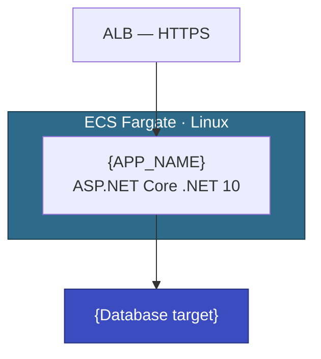

# Architecture Working Document

**Application:** {APP_NAME} ({APP_ID})
**Customer:** {CUSTOMER}
**Status:** Draft / Under Review / Agreed
**Last Updated:** {date}

---

## Draft Architecture

<!-- Use graph TD, ~10 nodes max. Update after each agreed decision. -->

Supporting services: ECR, Secrets Manager, SSM Parameter Store, CloudWatch.

---

## Technical Decisions

<!-- Status: 🟢 AGREED · 🟡 EXPLORING · 🔴 BLOCKED · ⚪ DEFERRED -->

### TD-001: {Title}

| | |
|---|---|
| Status | 🟡 EXPLORING |
| Proposed | {date} |
| Decided | — |

**Proposal:** {What AWS recommended and why}

**Customer position:** {Agreement, pushback, concerns}

**Alternatives explored:**
1. {Option} — {pros/cons}

**Decision:** {Agreed approach, or "pending PoC"}

---

## Meeting Log

### {date} — {Title}

**Attendees:** {names/roles}

**Discussed:**
- {topic}

**Decided:** {reference TD-###}

**Actions:**
- [ ] {action} — {owner} — {due}

**Open:** {questions}

---

## Observations

- {date}: {finding and architectural implication}

---

## PoC Tracker

| PoC | Decision | Status | Owner | Due | Outcome |
|-----|----------|--------|-------|-----|---------|
| {title} | TD-### | Not Started | {name} | {date} | — |