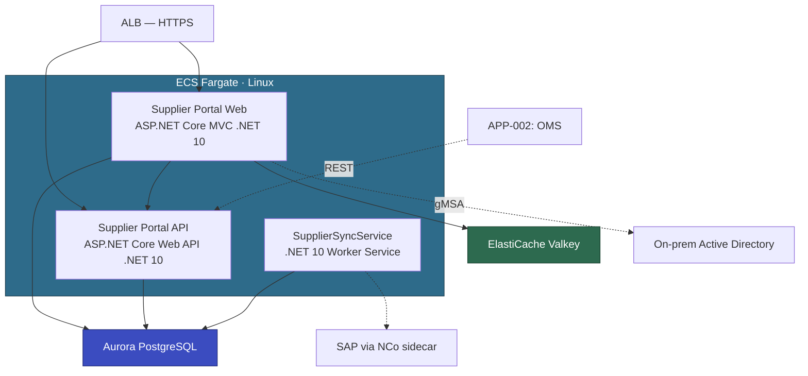

# Architecture Working Document

**Application:** Supplier Portal (APP-003)
**Customer:** ASEAN Digital Commerce Pte Ltd (ADC)
**Status:** Under Review
**Last Updated:** March 2026

---

## Draft Architecture

Supporting services: ECR, Secrets Manager, SSM Parameter Store, CloudWatch, EventBridge.

---

## Technical Decisions

### TD-001: Authentication — Windows Auth replacement

| | |
|---|---|
| Status | 🟡 EXPLORING |
| Proposed | 2026-03-10 |
| Decided | — (pending PoC) |

**Proposal:** Amazon Cognito with AD federation (SAML/OIDC). Standard approach for Windows Auth → Linux containers.

**Customer position:** Hard pushback. ADC security team rejects an additional auth middleware layer. Concerns: new attack surface, changed login UX (redirect to Cognito hosted UI instead of transparent SSO). They want direct AD authentication, same as today.

**Alternatives explored:**
1. Cognito with AD federation — cloud-native, supports internal + external users. Rejected: ADC won't accept the middleware layer.
2. gMSA on ECS Fargate Linux — container authenticates to AD directly via domainless gMSA. Transparent SSO preserved, no extra component. Requires AD DCs reachable from VPC (confirmed: ADC has DCs on EC2 in same VPC). Relatively new on Linux Fargate — needs PoC.
3. AWS Managed Microsoft AD — adds cost/complexity, still needs gMSA or Cognito on top.

**Decision:** Proceed with gMSA (option 2). PoC to validate before EBA. Cognito as fallback only. External supplier users (Forms Auth) handled separately via Cognito user pool — ADC accepted this since it's a standalone pool, not a middleware layer in front of AD.

### TD-002: SAP NCo Connector — Windows dependency

| | |
|---|---|
| Status | 🟢 AGREED |
| Proposed | 2026-03-10 |
| Decided | 2026-03-22 |

**Proposal:** SupplierSyncService uses SAP NCo which requires Windows. Proposed running it as a Windows container on ECS.

**Customer position:** Hard pushback. ADC enforces Linux-only container policy. "If we use containers, they will be Linux. No exceptions."

**Alternatives explored:**
1. Windows container for SupplierSyncService — NCo works as-is. Rejected: ADC won't run Windows containers.
2. Sidecar pattern — Linux worker + thin Windows container sidecar exposing gRPC API for NCo calls. Main app stays Linux, NCo dependency contained.
3. Replace NCo with SAP RFC over HTTP — no Windows dependency but requires SAP config changes, may not support all operations.
4. Keep SupplierSyncService on EC2 Windows — simple but doesn't align with container-first goal.

**Decision:** Sidecar pattern (option 2). After two rounds, ADC softened — agreed to a minimal Windows container limited to NCo wrapper only, with a documented exit path (eliminate when SAP provides Linux connector or ADC migrates off SAP). NCo usage is small: 4 RFC calls → 4 gRPC endpoints.

### TD-003: ASMX SOAP API — backward compatibility risk

| | |
|---|---|
| Status | 🟢 AGREED |
| Proposed | 2026-03-17 |
| Decided | 2026-03-22 |

**Proposal:** Supplier Portal exposes a legacy ASMX SOAP endpoint consumed by APP-002 (Order Management) for purchase order data. AWS recommended rewriting to ASP.NET Core Web API (REST) since ASMX cannot run on .NET 10.

**Customer position:** Concerned. OMS (APP-002) is a separate team's application and they cannot change their SOAP client on our timeline. Breaking this contract would cascade into the OMS modernization (Wave 2). ADC asked: "Can we guarantee the SOAP contract stays identical?"

**Alternatives explored:**
1. Rewrite to REST, require OMS team to update their client — clean but creates a cross-team dependency and blocks the pilot's independence.
2. SoapCore middleware — new REST API + SoapCore adapter that exposes the same WSDL at the same URL path. OMS continues calling SOAP, new consumers use REST. Both share the same business logic.
3. Keep ASMX on a separate Windows-hosted service — defeats the purpose of modernization.

**Decision:** SoapCore adapter (option 2). Capture the existing WSDL pre-EBA (`/SupplierApi.asmx?wsdl`). SoapCore exposes the identical contract at the same URL. OMS team migrates from SOAP to REST at their own pace during Wave 2. Validate with at least one test SOAP request from OMS dev environment during EBA.

### TD-004: Database — SQL Server → Aurora PostgreSQL

| | |
|---|---|
| Status | 🟢 AGREED |
| Proposed | 2026-03-10 |
| Decided | 2026-03-10 |

**Proposal:** Migrate SQL Server 2019 Standard (45 GB) to Aurora PostgreSQL via AWS Transform for SQL Server.

**Customer position:** Agreed immediately. ADC wants to eliminate SQL Server licensing. DB is standalone (no cross-DB joins, no linked servers, no shared DBs). DBA confirmed no Enterprise-only features.

**Decision:** Proceed with Aurora PostgreSQL. ATX SQL full-stack migration. No PoC needed.

---

## Meeting Log

### 2026-03-10 — Architecture Kickoff

**Attendees:** ADC (procurement eng lead, senior dev, DBA, infra lead), AWS (SA, mod lead)

**Discussed:**
- Confirmed Supplier Portal as pilot from Phase 200 wave plan
- Presented target architecture: ECS Fargate Linux + Aurora PG + Cognito
- Auth sparked most discussion — Cognito rejected as primary path
- SAP NCo identified as Windows blocker
- DB migration straightforward — agreed on the spot

**Decided:** TD-004 agreed. TD-001 gMSA PoC to be scoped. TD-002 Windows containers rejected (initially).

**Actions:**
- [ ] AWS SA to scope gMSA PoC — AWS — 2026-03-14
- [ ] ADC infra to confirm AD DC VPC connectivity — ADC — 2026-03-14
- [ ] ADC DBA to run SQL Server Enterprise feature diagnostic — ADC — 2026-03-17

**Open:** How will external supplier users authenticate if gMSA only covers AD users?

### 2026-03-17 — SAP NCo Deep Dive

**Attendees:** ADC (senior dev, infra lead), AWS (SA)

**Discussed:**
- NCo dependency confirmed limited to SupplierSyncService only (4 RFC calls)
- Explored all four alternatives for NCo on Linux
- ADC infra initially firm on no Windows containers
- Sidecar pattern proposed as compromise — thin Windows container isolated to NCo

**Decided:** TD-002 sidecar pattern agreed — Windows container limited to NCo wrapper only.

**Actions:**
- [ ] AWS to design sidecar gRPC interface spec — AWS — 2026-03-21
- [ ] ADC dev to inventory all NCo API calls — ADC — 2026-03-21

**Open:** Exit path for Windows sidecar — depends on SAP Linux connector roadmap.

### 2026-03-22 — Architecture Review & PoC Planning

**Attendees:** ADC (procurement eng lead, senior dev, DBA, infra lead), AWS (SA, mod lead)

**Discussed:**
- Reviewed updated architecture with gMSA and NCo sidecar decisions
- DBA confirmed: no Enterprise-only SQL features (diagnostic script clean)
- Scoped gMSA PoC: validate Negotiate auth from Linux Fargate to AD DC on EC2
- External supplier auth: Cognito user pool (standalone, not federated) — ADC accepted

**Decided:** gMSA PoC scope finalized. External supplier auth via Cognito user pool. Architecture status → Under Review pending PoC.

**Actions:**
- [ ] AWS to provision gMSA PoC environment — AWS — 2026-03-28
- [ ] ADC infra to create gMSA account in AD — ADC — 2026-03-26

**Open:** None — all items resolved or in PoC tracker.

---

## Observations

- 2026-03-10: AD Domain Controllers already on EC2 in same VPC as target ECS cluster. No VPN/Direct Connect needed for gMSA.
- 2026-03-17: NCo usage limited to 4 RFC calls. Sidecar gRPC interface will be small (~4 endpoints).
- 2026-03-17: ADC has documented "Linux containers only" policy. NCo sidecar is the only agreed exception. Document clearly to prevent scope creep.
- 2026-03-22: SQL Server Enterprise diagnostic clean. ADC should evaluate Standard Edition downgrade independently (outside EBA scope).

---

## PoC Tracker

| PoC | Decision | Status | Owner | Due | Outcome |
|-----|----------|--------|-------|-----|---------|
| gMSA on ECS Fargate Linux — Negotiate auth to AD DC on EC2 | TD-001 | In Progress | AWS SA + ADC infra | 2026-04-04 | Pending — env provisioned, gMSA account created, awaiting test container |