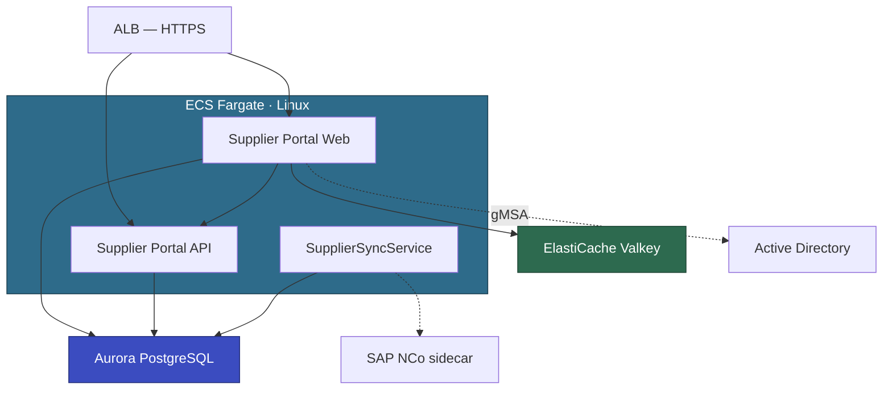

# ASEAN Digital Commerce — Detailed Assessment

**Customer:** ASEAN Digital Commerce Pte Ltd (ADC)
**Date:** March 2026
**Assessed by:** AWS Partner Team
**Applications assessed:** APP-001 (Customer Loyalty), APP-002 (Order Management), APP-003 (Supplier Portal)

---

## Portfolio Summary

Phase 200 identified 4 custom .NET applications for modernization. Phase 300 questionnaires were completed for the 3 highest-priority apps (Pilot + Wave 1 + Wave 2). APP-004 (Legacy Reporting) is deferred pending SSRS retirement decision.

| App ID | App Name | Complexity | Execution Path | Key Challenge |
|--------|----------|-----------|----------------|---------------|
| APP-003 | Supplier Portal | Low | 430-EBA (Pilot) | Windows Auth → gMSA PoC, SAP NCo sidecar |
| APP-001 | Customer Loyalty | Medium | 430-EBA (Wave 1) | 1.8 TB DB, Enterprise SQL features, Always On AG |
| APP-002 | Order Management | High | Full modernization project | WebForms + Telerik, 165K LoC, TFS, ASMX with 4 consumers |

### Updated Wave Plan (refined from Phase 200)

| Wave | App | Execution Path | Rationale |
|------|-----|---------------|-----------|
| Pilot | APP-003 Supplier Portal | 430-EBA | Isolated, low complexity, validates full-stack pathway |
| Wave 1 | APP-001 Customer Loyalty | 430-EBA | High value, moderate complexity. DB-heavy — needs DBA focus. Builds on pilot patterns. |
| Wave 2 | APP-002 Order Management | Full project (not EBA) | 165K LoC, WebForms + Telerik UI rewrite, ASMX with 4 downstream consumers. Too large for 6-week EBA. |
| Deferred | APP-004 Legacy Reporting | TBD | Pending SSRS retirement decision |

### Cross-Application Concerns

- **Windows Auth:** APP-001, APP-002, APP-003 all use Windows Auth via IIS. gMSA PoC (from APP-003 pilot) validates the pattern for all three. If PoC fails, Cognito fallback applies to all.
- **SAP NCo:** Only APP-003 uses NCo. Sidecar pattern is isolated to this app.
- **ASMX/SOAP:** APP-002 exposes ASMX consumed by APP-001, APP-003, and 2 external systems. This is the primary reason APP-002 is a full project, not EBA — backward compatibility across 4 consumers requires careful planning.
- **Shared SQL Server:** APP-001 and APP-002 share a SQL Server instance. Migration sequencing matters — APP-003 (standalone DB) goes first.

---

## APP-003: Supplier Portal (Pilot)

### Profile

| Attribute | Value |
|-----------|-------|
| Technology | ASP.NET MVC 5 (.NET Framework 4.8, C#) + REST API |
| Architecture | N-Tier (MVC → REST API → SQL Server) |
| LoC | ~42K (38K web + 4K SupplierSyncService) |
| Projects | Web App, API, SupplierSyncService (Windows Service), 2 Class Libraries |
| Database | SQL Server 2019 Standard, 45 GB, standalone, 62 tables, 35 SPs |
| Users | Internal (~120 avg) + External suppliers (~80 avg) |
| Auth | Windows Auth (internal) + Forms Auth (external suppliers) |
| Tests | xUnit, ~45% coverage |
| CI/CD | Azure DevOps (build + deploy to IIS) |
| Container experience | Docker basics (workshop completed, no production use) |

### Modernization Approach

| Component | Approach | Tool | Complexity |
|-----------|----------|------|-----------|
| ASP.NET MVC 5 web app | Port to ASP.NET Core MVC .NET 10 | ATX .NET | Low |
| REST API | Port to ASP.NET Core Web API .NET 10 | ATX .NET | Low |
| SupplierSyncService | Port to .NET Worker Service | ATX .NET + Kiro | Low-Medium |
| Class Libraries (2) | Port to .NET 10 | ATX .NET | Low |
| EF6 data access | Migrate to EF Core + Npgsql | ATX SQL | Medium |
| SQL Server → Aurora PG | Schema + data + SP conversion | ATX SQL + DMS | Medium |
| Windows Auth (internal) | gMSA on ECS Fargate Linux | Kiro | 🟡 Pending PoC |
| Forms Auth (external) | Amazon Cognito user pool | Kiro | Medium |
| SAP NCo connector | Windows container sidecar (gRPC) | Kiro | 🟢 Agreed |
| IIS URL Rewrite | ASP.NET Core middleware | Kiro | Low |
| Redis cache | Point to ElastiCache Valkey | Kiro | Low |

### Target Architecture

Supporting services: ECR, Secrets Manager, SSM Parameter Store, CloudWatch, EventBridge.

### Architecture Decisions

| ID | Decision | Status | Summary |
|----|----------|--------|---------|
| TD-001 | Windows Auth replacement | 🟡 EXPLORING | gMSA on Fargate Linux. PoC in progress. Cognito fallback. |
| TD-002 | SAP NCo Windows dependency | 🟢 AGREED | Sidecar pattern — thin Windows container for NCo, Linux worker calls via gRPC. |
| TD-003 | ASMX SOAP backward compat | 🟢 AGREED | SoapCore adapter preserves WSDL contract. OMS migrates to REST in Wave 2. |
| TD-004 | DB migration | 🟢 AGREED | ATX SQL full-stack. 45 GB, DMS full load, no CDC needed. |

### Risks

| Risk | Severity | Mitigation |
|------|----------|------------|
| gMSA PoC failure | High | PoC must complete before EBA. Cognito fallback if needed. |
| SAP NCo sidecar complexity | Medium | Only 4 RFC calls → 4 gRPC endpoints. Validate in EBA weeks 3–4. |
| EF6 → EF Core conversion edge cases | Medium | xUnit suite (45% coverage) validates. Run against Aurora PG in week 5. |

### Execution Path: 430-EBA (Pilot)

Suitable for EBA: 42K LoC, C#, Git, ATX eligible, isolated (only OMS depends on it via REST), existing test coverage. Validates the full-stack ATX two-step pathway and gMSA auth pattern for subsequent waves.

---

## APP-001: Customer Loyalty & Rewards Platform (Wave 1)

### Profile

| Attribute | Value |
|-----------|-------|
| Technology | ASP.NET MVC 5 (.NET Framework 4.8, C#) + REST API + 2 Windows Services |
| Architecture | N-Tier |
| LoC | ~95K |
| Database | SQL Server 2019 Enterprise, 1.8 TB, Always On AG, 180 SPs, columnstore indexes |
| Users | Internal + external (500 avg / 2000 peak) |
| Auth | Windows Auth (internal) + OIDC (external via existing IdP) |
| Tests | xUnit, ~35% coverage |
| CI/CD | GitHub Actions |

### Modernization Approach

| Component | Approach | Tool | Complexity |
|-----------|----------|------|-----------|
| ASP.NET MVC 5 + REST API | Port to ASP.NET Core .NET 10 | ATX .NET | Low-Medium |
| Windows Services (2) | Port to .NET Worker Services | ATX .NET + Kiro | Medium |
| EF6 data access | Migrate to EF Core + Npgsql | ATX SQL | Medium |
| SQL Server → Aurora PG | Schema + data + SP conversion | ATX SQL + DMS (CDC) | High |
| Windows Auth (internal) | gMSA (pattern from pilot) | Kiro | Medium |
| Always On AG | Aurora Multi-AZ (native replacement) | — | Low |
| Enterprise features | Aurora PG equivalents for columnstore, in-memory OLTP | Kiro + DBA | High |

### Key Challenges

- **1.8 TB database with Enterprise features.** Columnstore indexes and in-memory OLTP have no direct Aurora PG equivalent. Need DBA-led design for alternative indexing/caching strategies. DMS CDC required for near-zero-downtime cutover at this volume.
- **180 stored procedures.** ATX SQL handles bulk conversion but expect manual review of complex SPs. Allocate DBA time in weeks 3–4.
- **Always On AG → Aurora Multi-AZ.** Straightforward replacement but need to validate replica lag behavior under load.

### Architecture Decisions

| ID | Decision | Status | Summary |
|----|----------|--------|---------|
| TD-001 | Enterprise SQL feature equivalents | 🟡 EXPLORING | Need DBA workshop to map columnstore → PG alternatives |
| TD-002 | DMS CDC cutover strategy | 🟡 EXPLORING | 1.8 TB requires early replication start (week 2) |
| TD-003 | Windows Auth | 🟢 AGREED | gMSA — validated by pilot PoC |

### Execution Path: 430-EBA (Wave 1)

Suitable for EBA with caveats: 95K LoC is at the upper bound, but the app layer is straightforward (MVC + REST, ATX eligible). The complexity is concentrated in the DB layer (1.8 TB, Enterprise features). EBA should front-load DB migration prep in weeks 1–3. Builds on pilot patterns for auth and containerization.

---

## APP-002: Order Management System (Wave 2)

### Profile

| Attribute | Value |
|-----------|-------|
| Technology | ASP.NET WebForms (.NET Framework 4.5, C#) + ASMX SOAP API + AngularJS 1.x |
| Architecture | N-Tier |
| LoC | ~165K |
| Database | SQL Server 2019 Standard, 1.2 TB, 150 SPs, ADO.NET (raw SQL) |
| Users | Internal (200 avg / 800 peak) |
| Auth | Windows Auth |
| Tests | None (0% coverage, manual UAT only) |
| CI/CD | None (TFS, manual deployment) |
| Third-party UI | Telerik RadControls for ASP.NET AJAX |

### Modernization Approach

| Component | Approach | Tool | Complexity |
|-----------|----------|------|-----------|
| WebForms + Telerik UI | Full rewrite to ASP.NET Core MVC | Kiro + AI-DLC | High |
| ASMX SOAP API | Rewrite to REST + SoapCore backward compat | Kiro + ATX Custom | High |
| AngularJS 1.x | Replace with vanilla JS or htmx | Kiro | Medium |
| ADO.NET raw SQL | Rewrite data access layer (Dapper or EF Core) | Kiro | High |
| SQL Server → Aurora PG | Schema + data + SP conversion | SCT + DMS (CDC) | High |
| TFS → Git | Migrate source control | Pre-project task | Low |

### Why this is NOT an EBA

- **165K LoC** — well beyond the 100K EBA threshold
- **WebForms + Telerik** — ATX cannot port third-party UI controls. Full UI rewrite required.
- **ASMX with 4 downstream consumers** (APP-001, APP-003, 2 external systems) — backward compatibility adds significant scope
- **0% test coverage** — no automated validation, high regression risk
- **TFS** — needs Git migration before any tooling can be applied
- **ADO.NET raw SQL** — no ORM to leverage, data access layer needs full rewrite

### Architecture Decisions

| ID | Decision | Status | Summary |
|----|----------|--------|---------|
| TD-001 | UI approach | 🟡 EXPLORING | Rewrite to MVC (Kiro). Telerik license for ASP.NET Core available but ADC evaluating cost. |
| TD-002 | ASMX backward compat | 🟡 EXPLORING | SoapCore adapter proposed. Need to inventory all SOAP consumers and capture WSDL. |
| TD-003 | Data access layer | 🟡 EXPLORING | Dapper recommended (closest to current ADO.NET pattern). ADC reviewing. |

### Execution Path: Full modernization project

Scope as a dedicated modernization project with phased delivery. Recommended approach:
1. Pre-work: TFS → Git migration, WSDL capture, Telerik license decision
2. Phase A: Backend port (C# business logic) + REST API + SoapCore adapter
3. Phase B: UI rewrite (MVC, replace Telerik controls)
4. Phase C: DB migration (SCT + DMS CDC for 1.2 TB)
5. Phase D: Consumer migration from SOAP to REST (coordinate with APP-001, APP-003 teams)

---

## Proof of Value Metrics

Capture before/after for the pilot (APP-003) to demonstrate value for subsequent waves.

| Metric | Before | After (EBA Target) |
|--------|--------|-------------------|
| Modernization effort estimate | ADC: 6 months, 3 devs | 6 weeks, 2 devs + AWS |
| Deployment frequency | Weekly (manual) | On-demand (CI/CD) |
| Platform | Windows / IIS / SQL Server | Linux / ECS Fargate / Aurora PG |
| Scalability | Manual, vertical | Auto-scaling, horizontal |
| HA/DR | None (standalone SQL) | Multi-AZ (Aurora + ECS) |
