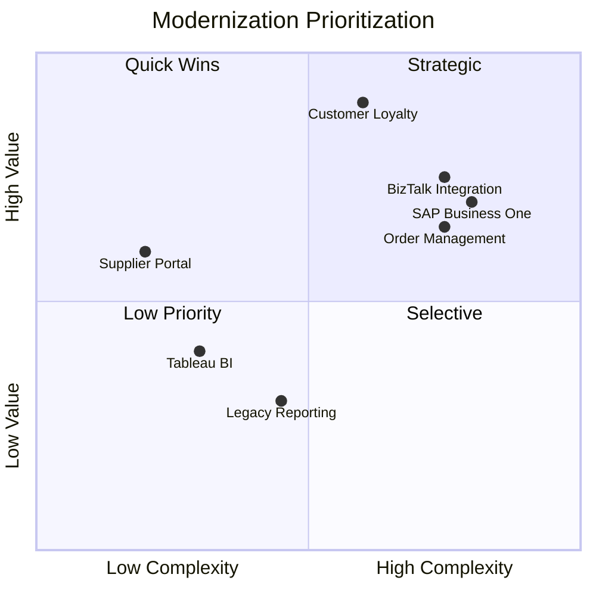

# ASEAN Digital Commerce — Modernization Feasibility Assessment

**Customer:** ASEAN Digital Commerce Pte Ltd (ADC)
**Date:** March 2026
**Assessed by:** Partner Assessment Tool

---

## Section 1 — 🔍 Windows Workload Classification

| App ID | App Name | Classification | Key Windows Signals | Notes |
|--------|----------|---------------|-------------------|-------|
| APP-001 | Customer Loyalty & Rewards Platform | CAT1 | .NET Framework 4.8, IIS (URL Rewrite), On-premises | Strong modernization candidate |
| APP-002 | Order Management System | CAT1 | .NET Framework 4.5, IIS (Custom Modules), On-premises, WebForms | Requires WebForms → Blazor conversion |
| APP-003 | Supplier Portal | CAT1 | .NET Framework 4.8, IIS (URL Rewrite), On-premises | Isolated app, moderate complexity |
| APP-004 | Legacy Reporting System | CAT1 | .NET Framework 4.5, Windows Services, On-premises, SSRS | SSRS needs manual remediation |
| APP-005 | SAP Business One ERP | CAT1 | .NET Framework 4.8, COM/DCOM, On-premises | COTS — not a .NET modernization candidate |
| APP-006 | BizTalk Integration Server | CAT1 | .NET Framework 4.8, COM/DCOM, WCF Workflow Service | Architectural replacement needed |
| APP-007 | Tableau BI Platform | CAT1 | .NET Framework 4.8, Windows Services, On-premises | COTS — replatform only |

**Summary:** 7 assessed, 7 Windows-bound (CAT1), 0 Linux-ready, 0 unclear. Only APP-001, APP-002, APP-003, APP-004 are custom .NET applications suitable for ATX-led modernization. APP-005, APP-006, APP-007 are COTS products requiring different approaches.

---

## Section 2 — 🛠️ Tool Feasibility & Modernization Pathways

### Eligibility

| App ID | App Name | ATX .NET | ATX SQL | Blockers | Prerequisites |
|--------|----------|----------|---------|----------|--------------|
| APP-001 | Customer Loyalty | GA ELIGIBLE | ELIGIBLE AFTER .NET PORTING | None | Port to .NET 10 first |
| APP-002 | Order Management | GA ELIGIBLE (IDE ONLY) | ELIGIBLE AFTER .NET PORTING | TFS repo | Use IDE experience for ATX .NET |
| APP-003 | Supplier Portal | GA ELIGIBLE | ELIGIBLE AFTER .NET PORTING | None | Port to .NET 10 first |
| APP-004 | Legacy Reporting | GA ELIGIBLE (IDE ONLY) | PARTIALLY ELIGIBLE | SSRS not handled | SSRS → QuickSight manually |
| APP-005 | SAP Business One | NOT ELIGIBLE | NOT ELIGIBLE | COTS, COM/DCOM | N/A |
| APP-006 | BizTalk Integration | NOT ELIGIBLE | NOT ELIGIBLE | COTS, WCF Workflow | N/A |
| APP-007 | Tableau BI | NOT ELIGIBLE | N/A | COTS, no source | N/A |

### Pathway Recommendations

| App ID | App Name | Pathway | Tools & Services | Steps | Manual/Kiro Work |
|--------|----------|---------|-----------------|-------|-----------------|
| APP-001 | Customer Loyalty | 1 — ATX-Led | ATX .NET → ATX SQL + Kiro | ATX .NET port → Kiro cleanup → ATX SQL migration → Kiro validation | Aurora PG equivalents for Enterprise features (columnstore, in-memory OLTP) |
| APP-002 | Order Management | 1 — ATX-Led + Manual | ATX .NET IDE (WebForms → Blazor) + ATX SQL + Kiro | ATX .NET via IDE → Kiro UI polish + SP review → ATX SQL → Kiro validation | WebForms → Blazor UI polish, 6000+ lines SP logic review. Consider CAST Imaging. |
| APP-003 | Supplier Portal | 1 — ATX-Led | ATX .NET → ATX SQL + Kiro | ATX .NET port → Kiro cleanup → ATX SQL migration → Kiro validation | Minimal. Good Pilot/PoC candidate. |
| APP-004 | Legacy Reporting | 1 — ATX-Led + Manual | ATX .NET IDE + ATX SQL (partial) + Kiro | ATX .NET port → ATX SQL schema/data → Kiro + QuickSight for SSRS | SSRS replacement (audit 250+ reports). Windows Services → BackgroundService. |
| APP-005 | SAP Business One | 7 — Replatform | MGN + DMS + RDS | Lift-and-shift to EC2 + DMS to RDS SQL Server | Minimal — vendor-managed. |
| APP-006 | BizTalk Integration | 6 — Architectural Replacement | Kiro + Step Functions + EventBridge + Lambda | Inventory orchestrations → design replacement → build with Kiro (strangler fig) | Full rebuild of 120 orchestrations. Evaluate B2B Data Interchange for EDI. |
| APP-007 | Tableau BI | 7 — Replatform | MGN + RDS | Replatform to EC2 + RDS PostgreSQL | Future: evaluate QuickSight (450+ dashboards). |

**Pathway summary:** ATX-Led: 4 apps, Architectural Replacement: 1 app, Replatform: 2 apps.

---

## Section 3 — 📊 Technical Complexity

All 7 applications are Windows-bound. Complexity concentrates in the database layer — even the simplest custom app (APP-003) has a SQL Server database. ATX tool eligibility significantly reduces effective app-layer complexity for the 4 custom .NET apps. The two COTS apps (APP-005, APP-006) score highest but require entirely different approaches.

| App ID | App Name | Technical Complexity | App Score (base→adj) | DB Score (base→adj) | Top Complexity Drivers |
|--------|----------|---------------------|---------------------|---------------------|----------------------|
| APP-001 | Customer Loyalty | **6** (Medium) | 4→2 | 10→9 | DB: 1.8TB, 180 SPs, Always On AG, Enterprise features |
| APP-002 | Order Management | **8** (High) | 10→8 | 9→8 | App: WebForms, Custom Modules, TFS. DB: 1.2TB, 150 SPs, ADO.NET |
| APP-003 | Supplier Portal | **2** (Low) | 3→1 | 4→3 | Minimal — cleanest candidate |
| APP-004 | Legacy Reporting | **5** (Medium) | 3→1 | 8→8 | DB: SSRS, 500GB, ADO.NET. SSRS blocks full ATX SQL. |
| APP-005 | SAP Business One | **9** (High) | 7→7 | 10→10 | COTS, COM/DCOM, 2.4TB, Always On AG |
| APP-006 | BizTalk Integration | **8** (High) | 10→10 | 6→6 | WCF Workflow, COM/DCOM, 120 orchestrations |
| APP-007 | Tableau BI | **3** (Low) | 5→5 | 0→0 | COTS, no source code. No DB complexity. |

---

## Section 4 — 🎯 Prioritization & Wave Plan

### Business Value & Prioritization

| App ID | App Name | Biz Value | Tech Complexity | Quadrant | Rationale |
|--------|----------|-----------|-----------------|----------|-----------|
| APP-001 | Customer Loyalty | **10** (High) | **6** (Medium) | Strategic | Highest business value, moderate complexity. DB-heavy — needs DBA focus. |
| APP-002 | Order Management | **7** (High) | **8** (High) | Strategic | High value but most complex custom app. WebForms + large DB. Phase carefully. |
| APP-003 | Supplier Portal | **6** (High) | **2** (Low) | Quick Win | High value, lowest complexity. Isolated. Ideal Pilot/PoC. |
| APP-004 | Legacy Reporting | **3** (Low) | **5** (Medium) | Selective | Low value, SSRS replacement is costly. Evaluate if app should be retired. |
| APP-005 | SAP Business One | **7** (High) | **9** (High) | Strategic | High value COTS. Replatform only — no code modernization. |
| APP-006 | BizTalk Integration | **7** (High) | **8** (High) | Strategic | High value but full architectural replacement. Dedicated team needed. |
| APP-007 | Tableau BI | **4** (Low) | **3** (Low) | Low-Priority | Low value COTS. Replatform opportunistically. |

### Prioritization Matrix

### 🚀 Pilot / PoC Recommendation

**APP-003 (Supplier Portal)** — Quick Win quadrant, GA ELIGIBLE, C#, source in Git, < 100K LOC, isolated with minimal upstream/downstream dependencies. Has a SQL Server database (DB-003) to validate the full-stack ATX two-step pathway.

### 🌊 Wave Plan

| Wave | Apps | Key Activities | Notes |
|------|------|---------------|-------|
| Pilot / PoC | APP-003 (Supplier Portal) | ATX .NET port → ATX SQL migration → validate on AWS | Isolated, low risk. Establishes patterns and team confidence. |
| Wave 1 — Quick Wins | APP-001 (Customer Loyalty) | ATX .NET port → ATX SQL migration | Builds on pilot. DB complexity (1.8TB, 180 SPs, Always On AG) needs DBA focus. |
| Wave 2 — Strategic | APP-002 (Order Management) | ATX .NET IDE (WebForms → Blazor) → ATX SQL | Most complex custom app. Consider CAST Imaging first. TFS repo uses IDE experience. |
| Selective | APP-004 (Legacy Reporting) | ATX .NET → ATX SQL (partial) → SSRS → QuickSight | Audit 250+ reports first. Evaluate if app should be retired entirely. |
| Separate tracks | APP-005 (SAP) — Replatform. APP-006 (BizTalk) — Architectural replacement. APP-007 (Tableau) — Replatform. | Not in scope for ATX. |

### ⚠️ Data Gaps for Phase 300

| App ID | Missing/Insufficient Data | Questions for ModAx EBA | Priority |
|--------|--------------------------|------------------------|----------|
| APP-001 | Entity Framework version | What exact EF version? Must be EF 6.3+ or EF Core for ATX SQL. What Enterprise SQL features are used? | Critical |
| APP-001 | Database HA details | Always On AG config? Replicas? Failover behavior? Affects Aurora PG Multi-AZ design. | Important |
| APP-002 | No architecture documentation | Full dependency map: what systems call OMS? Integrations? SP business logic scope? | Critical |
| APP-002 | WebForms page count | How many .aspx pages/controls? Any 3rd party UI components (Telerik, DevExpress)? | Critical |
| APP-004 | SSRS report inventory | Which of 250+ reports are used? Which can be retired? | Critical |
| ALL | Private NuGet packages | Any private NuGet feeds? Must be configured in ATX before starting. | Important |
| ALL | CI/CD pipeline details | Deployment Method is vague. Need full pipeline documentation. | Important |
| ALL | Network connectivity | Can SQL Server instances be accessed from VPC in us-east-1? Direct Connect/VPN? | Critical |

### 🔗 Cross-Application Dependencies
- APP-001 (Loyalty) ↔ APP-002 (OMS): Shared customer data model, both integrate with e-commerce and POS.
- APP-002 (OMS) → APP-003 (Supplier Portal): Purchase order data flow. API compatibility during migration.
- APP-004 (Reporting) → ALL: Queries production databases of APP-001, APP-002, APP-003, APP-005. DB migration breaks SSRS connections.

### 📅 Recommended ModAx EBA Agenda

**Day 1 — Application Deep Dives (4 hours)**
1. APP-002 (OMS) — 90 min: WebForms page inventory, 3rd party UI audit, SP walkthrough, TFS structure, dependencies
2. APP-001 (Loyalty) — 60 min: EF version, Enterprise SQL features, Always On AG config, POS/mobile integrations
3. APP-003 (Supplier Portal) — 30 min: SP review, supplier integrations, API requirements
4. APP-004 (Reporting) — 30 min: SSRS report audit, Windows Services inventory, report-to-DB dependencies

**Day 2 — Cross-Cutting Topics (3 hours)**
1. Network & Connectivity — 45 min: VPN/Direct Connect, SQL Server accessibility from us-east-1
2. CI/CD & DevOps — 45 min: Pipelines per app, TFS → Git plan for APP-002/APP-004
3. Security & Auth — 30 min: Windows Auth → Aurora PG alternatives, secrets management
4. NuGet & Dependencies — 30 min: Private feeds, 3rd party library compatibility with .NET 10

**Day 3 — Database Deep Dives (3 hours)**
1. DB-001 (Loyalty) — 60 min: Enterprise feature audit, SP complexity, archival strategy, Aurora PG sizing
2. DB-002 (OMS) — 60 min: SP business logic walkthrough, indexing, data volume projections
3. DB-004 (Reporting) — 30 min: SSRS replacement strategy, QuickSight data source design
4. Cross-DB dependencies — 30 min: Linked queries, shared reference data, migration sequencing

---

## Appendix — 📖 Definitions

### Workload Classifications (Section 1)

| Classification | Definition |
|---------------|-----------|
| CAT1 — Windows-Bound | Application is tied to Windows. .NET Framework < 5.0, Windows/IIS dependencies, or Windows-only project type. |
| CAT2 — Likely Linux-Ready (on Windows) | Modern .NET (5+) but still hosted on Windows infrastructure. May need infrastructure migration only. |
| CAT3 — Likely Linux-Ready | Already on containers (Kubernetes/OpenShift), no Windows dependencies. Minimal work needed. |
| CAT4 — Unclear | Insufficient data to classify. Needs verification in Phase 300. |

### Modernization Pathways (Section 2)

| Pathway | Description |
|---------|-----------|
| 1 — ATX-Led | Primary pathway for custom .NET apps. Uses ATX .NET and/or ATX SQL agents for automated porting and DB migration, with Kiro for post-transformation remediation. Covers app-only, DB-only, two-step, and manual remediation variants. |
| 2 — ATX Custom Only | For straightforward, repeatable transformations not covered by ATX .NET/SQL (< 100K LOC, well-scoped pattern changes). |
| 3 — ATX .NET + DMS | When ATX SQL is not eligible but DB still needs migrating. ATX .NET for app, DMS Schema Conversion + Data Migration for DB. |
| 4 — DMS Only | Database-only migration. Heterogeneous (SQL Server → Aurora PostgreSQL) or homogeneous (SQL Server → RDS SQL Server). |
| 5 — Kiro-Led | Complex one-off modernization, architectural judgment calls, or pilot applications. |
| 6 — Architectural Replacement | Ground-up redesign for platforms with no port path (BizTalk, WCF Workflow, Windows Workflow). Uses Kiro + AWS-native services. |
| 7 — Replatform | Lift-and-shift for COTS products, no source code, or retiring soon. MGN + DMS. |
| 8 — Retain/Defer | Keep as-is. SaaS replacement planned, low priority, or end-of-life. |

### Technical Complexity (Section 3)

Combined score (0–10) averaging application-layer and database-layer complexity, adjusted for ATX tool eligibility. Low (0–3), Medium (4–6), High (7–10).

### Business Value (Section 4)

Score (0–10) based on business criticality, change frequency, user count, and RTO/RPO sensitivity. Plotted against technical complexity to determine prioritization quadrant.

### Prioritization Quadrants (Section 4)

| Quadrant | Definition | Approach |
|----------|-----------|----------|
| Quick Wins | High value, low complexity | ✅ Prioritize for immediate modernization. Fast-track. Multiple execution streams. |
| Strategic | High value, high complexity | 🔶 Detailed planning. Break into phases. Dedicated team. Risk mitigation. |
| Selective | Low value, high complexity | 🔍 Evaluate alternatives: retire, replace with vendor, isolate, consolidate. Minimal investment. |
| Low-Priority | Low value, low complexity | ⏸️ Modernize in batch. Shared resources. Opportunistic. Consider retiring. |
