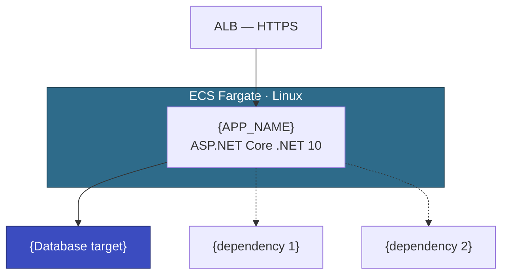

# {CUSTOMER} {APP_NAME} — ModAx EBA Plan

<!--
  TEMPLATE INSTRUCTIONS
  =====================
  This template produces an EBA execution plan from a completed Pre-EBA Discovery Questionnaire
  and the ModNet Playbook. Replace all {PLACEHOLDERS} with actual values. Delete any sections
  or rows that don't apply. Remove this instruction block before delivering to the customer.

  Inputs:
  - Phase 300 consolidated assessment (working/{CUSTOMER}/300-detailed-assessment/{CUSTOMER}-Detailed-Assessment.md)
  - Architecture working doc (working/{CUSTOMER}/300-detailed-assessment/{CUSTOMER}-{APP}-Architecture.md)
  - [Detailed Analysis Rules](../../300-Detailed-Assessment/detailed-analysis.md) — decision matrices
  - [EBA Preparation Checklist](EBA-Preparation-Checklist.md)

  Principles:
  - Be decisive: recommend ONE approach per decision point, not a menu of options.
    At most 2 alternatives only when the choice genuinely depends on unconfirmed customer input.
  - Use the customer's actual name, not "the customer".
  - The plan should read as a clear execution blueprint, not a consulting options paper.
  - Target state: .NET on Amazon ECS Fargate (Linux) + Aurora PostgreSQL (or SQL Server if DB is parked).
    Target the latest .NET LTS version — currently .NET 10.
-->

| | |
|---|---|
| Customer | {CUSTOMER} — {team/contact name} |
| Application | {APP_NAME} ({brief description}) |
| Criticality | {Critical / High / Medium / Low} |
| Prepared by | AWS Team |
| Revision | {e.g., "Initial draft" or "Updated post-meeting — ..."} |

---

## Executive Summary

<!--
  Summarize in 3–5 paragraphs:
  1. What the app is and what modernization approach is recommended (port / rewrite / hybrid)
  2. Database modernization decision (proceed with Aurora PostgreSQL or parked on SQL Server — and why)
  3. Authentication approach (if Windows Auth, reference gMSA PoC or Cognito)
  4. Development environment approach (local dev, sandbox, remote dependencies)
  5. Key finding — why the scope is (or isn't) realistic for a 6-week EBA
-->

{APP_NAME} is a {technology description} application running on {.NET Framework version} with {SQL Server version/edition} ({database size}). {CUSTOMER} has opted for a **{port / rewrite / hybrid}** approach, which aligns with the assessment findings — {brief rationale}.

**Database modernization {is proceeding / is parked}.** {If parked: explain why — e.g., cross-database joins, shared databases, complexity. If proceeding: state target is Aurora PostgreSQL and which migration tooling will be used per the Database Migration Tooling Decision Framework in the playbook.}

**Authentication:** {Describe auth approach — e.g., Windows Auth via gMSA PoC, Cognito with AD federation, ASP.NET Identity migration, etc.}

**Development environment approach:** {Describe how developers will work — local laptops connecting to remote dependencies, full sandbox, etc.}

**Key finding:** {Summarize why the scope is realistic for EBA, or flag concerns about scope size. Reference LoC, DB size, integration surface, main complexity drivers.}

---

## Application Profile Summary

| Attribute | Value |
|-----------|-------|
| Primary technology | {e.g., ASP.NET Web Forms (.NET Framework 4.8, C#)} |
| Architecture | {e.g., N-Tier, Monolithic, SOA, Microservices} |
| Lines of code | {total LoC and breakdown by major project} |
| .NET projects | {count and brief description of each} |
| Database | {SQL Server version/edition, size, workload type} — **{remains on SQL Server / migrating to Aurora PostgreSQL}** |
| Users | {count, internal/external, locations} |
| Downtime tolerance | {hours / zero tolerance} |
| Auth | {e.g., Windows Auth, OIDC, ASP.NET Identity} |
| Tests | {e.g., None (0% coverage), xUnit (60% coverage)} |
| CI/CD | {e.g., None, Azure DevOps, Jenkins} |
| Container/Linux experience | {Yes / None} |

---

## Modernization Approach: {Port / Rewrite / Hybrid} {(Application Layer Only — if DB parked)}

### Component-Level Approach

<!--
  Use the Decision Matrix in ModNet Playbook Section 2 to determine the approach per component.
  For projects with third-party UI components (Telerik, DevExpress, Infragistics, etc.),
  AWS Transform CANNOT be used — route through Kiro + AI-DLC per the Third-Party UI Component
  Decision Matrix in Playbook Section 4.
-->

| Component | Approach | Primary Tool | Complexity | Notes |
|-----------|----------|-------------|------------|-------|
| {component name} | {e.g., Port to ASP.NET Core .NET 10} | {e.g., AWS Transform for .NET} | {Low / Medium / High} | {brief notes} |
| {component name} | {e.g., Rewrite to ASP.NET Core MVC} | {e.g., Kiro + AI-DLC} | {High} | {e.g., Web Forms with Telerik controls — Transform cannot port third-party UI} |

<!--
  THIRD-PARTY UI COMPONENTS
  If the questionnaire (Q4.2) reveals Telerik, DevExpress, Infragistics, or similar:
  - AWS Transform for .NET CANNOT port these components or their proprietary NuGet packages
  - The entire UI layer for affected projects must go through Kiro + AI-DLC
  - Two paths: (1) Repurchase vendor's .NET Core edition + rewrite UI with new API,
    or (2) Full rewrite replacing vendor controls with standard ASP.NET Core MVC / SPA
  - Either way, the UI WILL look different from legacy — communicate this to the customer upfront
  - License procurement (if repurchasing) must complete before EBA
  - Functional spec with user stories is mandatory for the rewrite path
  See Playbook Section 4 "Third-Party UI Component Decision Matrix" for full guidance.
-->

### Why {Port / Rewrite / Hybrid}

<!--
  Justify the approach. Include a table if multiple components have different viability:
-->

| Component | Port Viable? | Reason |
|-----------|-------------|--------|
| {component} | {Yes / No} | {reason} |

### Why Database Modernization Is {Proceeding / Parked}

<!--
  If parked: list the reasons (cross-DB joins, shared DBs, replication, complexity).
  If proceeding: reference the Database Migration Tooling Decision Framework from the playbook
  and state which tooling combination was selected (Kiro only / SCT+DMS / Transform for SQL Server / SCT+DMS+Kiro).
-->

{Explanation}

### Target Architecture

<!--
  Include a mermaid diagram showing the target state. Keep it simple and readable:
  - Use `graph TD` (top-down) for vertical layout — avoids horizontal compression
  - Limit to ~10 nodes max — show core components only (app containers, database, cache, auth)
  - List supporting AWS services (ECR, Secrets Manager, SSM, CloudWatch) as a text note below the diagram, not as nodes
  - Use short labels — e.g., "ALB — HTTPS" not "Application Load Balancer (ALB) HTTPS termination"
  - Use subgraph only for the ECS cluster grouping, not for every service category
  - External dependencies use dotted lines (-.->)
  - Color-code: ECS=#ff9900, DB=#3b48cc, Cache=#3f8624, Auth=#dd344c
-->

Supporting AWS services (not shown): ECR, Secrets Manager, SSM Parameter Store, CloudWatch.

### Scope Boundaries

**In scope for EBA:**
- {list each in-scope work item}

**Out of scope for EBA:**
- {list each out-of-scope item with brief rationale}

---

## Tooling Plan

### Primary Tools

<!--
  Select tools based on the modernization approach:
  - Port → AWS Transform for .NET (backend) + AWS Transform Custom (ASMX, Web Forms→MVC) + Kiro (cleanup)
  - Rewrite → Kiro + AI-DLC (primary tool for everything)
  - Hybrid → combination of above
  - Third-party UI components → Kiro + AI-DLC only (AWS Transform cannot port these)
  - DB migration → per Database Migration Tooling Decision Framework in playbook
  
  AVOID decommissioned tools: App2Container, Porting Assistant for .NET, Microservice Extractor,
  Toolkit for .NET Refactoring. Use AWS Transform or Kiro instead.
-->

| Tool | Purpose |
|------|---------|
| **{tool name}** | {what it handles in this engagement} |

### Supporting Tools & Services

| Tool / Service | Purpose |
|---------------|---------|
| **Amazon ECS Fargate** | Container hosting (Linux). |
| **Amazon ECR** | Container image registry. |
| **AWS Systems Manager Parameter Store** | Application configuration (non-sensitive and sensitive via SecureString). |
| **Application Load Balancer (ALB)** | HTTPS termination, routing to ECS tasks. |
| **Amazon CloudWatch** | Logging and monitoring (stretch goal). |
<!-- Add/remove services as needed: EventBridge (batch scheduling), S3 (file uploads),
     ElastiCache (session/caching), Secrets Manager, RDS Proxy, etc. -->

---

## Technical Highlights

<!--
  Number each highlight. Common topics (include only those that apply):

  - Authentication & Authorization (Windows Auth → gMSA, OIDC migration, ASP.NET Identity → PostgreSQL)
  - ASMX → REST API with SoapCore backward compatibility (if ASMX services exist)
  - Web Forms UI approach (Blazor via Transform vs MVC via Kiro/Transform Custom)
  - Third-party UI components (Telerik/DevExpress/Infragistics — repurchase or rewrite, Transform cannot port)
  - Data access layer (EF Core / Dapper / raw SqlClient — pending customer confirmation if applicable)
  - Cross-database joins (if DB parked and cross-DB queries exist)
  - Large file upload (S3 multipart upload)
  - Session state (in-memory → ElastiCache for scaling)
  - Configuration management (web.config → appsettings.json + SSM Parameter Store)
  - Email (mock for EBA, abstract behind service interface)
  - Handlers/httpModules/machine key (delete, replace with build-time tooling + Data Protection API)
  - Batch jobs → ECS Scheduled Tasks via EventBridge
  - OLE/Office Interop → NPOI/ClosedXML
  - Windows file share access → S3/EFS/FSx
  - Reporting (Crystal Reports → replacement, SSRS → QuickSight)
  - Database migration approach (if DB is proceeding — tooling, cutover strategy, CDC)
-->

### 1. {Topic}

{Detailed explanation of the technical challenge and the chosen approach.}

### 2. {Topic}

{Detailed explanation.}

<!-- Continue numbering as needed -->

---

## Development Environment Setup

<!--
  This section is critical. The dev environment must be ready BEFORE the EBA Party.
  Adapt based on the customer's development approach (local laptops, shared dev VMs, cloud dev env).
-->

{CUSTOMER}'s development approach: {describe how developers will work — e.g., "developers load the application locally on their laptops and connect to shared remote dependencies"}.

### Local Development Environment (per developer laptop)

| Software | Purpose | Notes |
|----------|---------|-------|
| **.NET 10 SDK** | Build and run the ASP.NET Core application locally | Install from https://dotnet.microsoft.com |
| **Kiro** | AI-assisted IDE for the rewrite/porting work | Install from https://kiro.dev |
| **Git** | Source control | {Required after TFS → Git migration / Already in use} |
| **AWS CLI v2** | Interact with AWS services (ECR login, S3, etc.) | Install from https://aws.amazon.com/cli/ |
| **Docker Desktop** | Build and run Linux containers locally | Requires WSL 2. |
| **WSL 2** | Linux kernel for running containers | Run `wsl --install` from an elevated PowerShell. |
<!-- Add Visual Studio 2022 + AWS Toolkit if using AWS Transform for .NET via IDE -->

### Shared Remote Dependencies

<!--
  List every dependency the app needs during local development.
  For each: how to connect, and what to do if unavailable (mock it).
-->

| Dependency | Connection | Notes |
|-----------|-----------|-------|
| **{database}** | Remote connection to shared dev/test server | Connection string in `appsettings.Development.json` |
| **{external service}** | Remote connection to existing dev/test server | If unavailable, mock the interface |
| **SMTP Service** | Mocked during EBA | Log email content to console |

### Windows + Linux Container Gotchas

<!--
  Include these standard items. Add any customer-specific gotchas.
-->

- **Docker context:** Ensure Docker is using the WSL 2 backend (not Hyper-V). In Docker Desktop: Settings → General → "Use the WSL 2 based engine".
- **Line endings:** Configure `git config --global core.autocrlf input` and add `.gitattributes` with `* text=auto eol=lf`. CRLF in shell scripts or Dockerfiles causes cryptic container failures.
- **Port conflicts:** IIS or other Windows services may occupy ports 80/443. Use non-conflicting ports locally (e.g., 5000/5001).
- **Case sensitivity:** Windows filesystem is case-insensitive, Linux is case-sensitive. Enforce consistent casing from the start.
- **File system performance:** Clone repos inside WSL 2 filesystem (`~/projects/`), not on `/mnt/c/`. Docker volume mounts from WSL are significantly faster.

### Pre-EBA Validation Checklist (per developer)

<!--
  Every EBA participant must complete this checklist before the EBA Party.
  Adapt items based on the tooling and dependencies for this specific app.
-->

- [ ] .NET 10 SDK installed on Windows host (`dotnet --version`)
- [ ] Can build and run a sample ASP.NET Core .NET 10 app locally (`dotnet new web -o test-app` then `dotnet run --project test-app`)
- [ ] Can connect to shared dev/test database from local machine
- [ ] Can reach external dependencies from local machine (list each)
- [ ] Git configured with `core.autocrlf=input`
- [ ] Kiro installed and functional
- [ ] AWS CLI installed and configured with {CUSTOMER}'s AWS account credentials
- [ ] WSL 2 installed and running (`wsl --status`)
- [ ] Docker Desktop installed, using WSL 2 backend
- [ ] Can build and run a sample .NET 10 Linux container locally

This checklist must be completed by all EBA participants prior to the EBA Party.

---

## Risk Assessment & Mitigations

<!--
  List risks from highest to lowest severity.
  Common risks to consider (include only those that apply):
  - Large LoC rewrite/port scope
  - No test coverage
  - Third-party UI components (Transform can't port, significant rewrite effort)
  - Windows Auth gMSA PoC failure
  - ASMX backward compatibility (breaking downstream consumers)
  - No container/Linux experience on team
  - Remote dependency availability during local dev
  - ECS Fargate connectivity to on-prem dependencies (VPN/Direct Connect)
  - Database migration complexity (if DB is proceeding)
  - Single developer / limited team size
  - TFS source control (not Git)
  - Vendor-maintained code with no vendor participation
-->

| Risk | Severity | Mitigation |
|------|----------|------------|
| {risk description} | {Critical / High / Medium / Low} | {mitigation plan} |

---

## ⚠️ Pending Decisions ({CUSTOMER} to Confirm)

<!--
  List decisions that the customer must make before EBA.
  Common pending decisions:
  - UI approach (Blazor vs MVC)
  - Data access layer (EF Core / Dapper / raw SqlClient)
  - Third-party UI: repurchase modern license or full rewrite with standard controls
  - ORM choice
  - SQL Server edition downgrade
-->

| # | Decision | Options | Impact |
|---|----------|---------|--------|
| 1 | {decision} | {options} | {impact on EBA scope/effort} |

---

## ⚠️ Unvalidated Assumptions

<!--
  List assumptions made by the AWS team that have not been confirmed by the customer.
  These typically come from:
  - Inferences from architecture diagrams
  - Default assumptions for unanswered questionnaire questions
  - Technical assumptions about the codebase
-->

This plan is based on the pre-EBA discovery questionnaire responses. Several answers were inferred by the AWS team and have not yet been validated by {CUSTOMER}.

| # | Questionnaire Ref | Assumption | Impact if Incorrect |
|---|-------------------|-----------|-------------------|
| 1 | {Q#} | {what was assumed} | {what changes in the plan} |

Additionally, for any questionnaire questions that remain unanswered, the default assumption is "not used / not applicable" and therefore not factored into this plan. If any of these unanswered items turn out to be relevant, the plan will need to be revised accordingly.

{CUSTOMER} should provide corrections or confirmations for all unconfirmed questionnaire answers prior to EBA. Any material change will trigger a plan revision.
