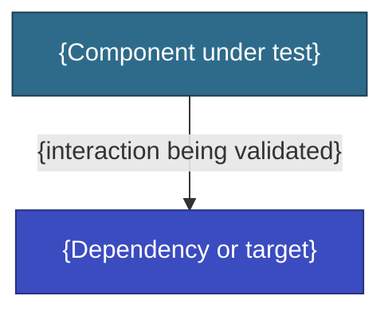

# {PROJECT} — PoC Plan: {PoC Title}

<!--
  Inputs:
  - Phase 300 detailed assessment
  - Architecture working doc with the 🟡 EXPLORING decision this PoC validates
  - Replace all {PLACEHOLDERS}. Remove this block before delivering.
-->

| | |
|---|---|
| Project | {PROJECT} |
| Application(s) | {APP_NAME(s)} |
| Related decision | {TD-### from architecture working doc} |
| Prepared by | AWS Team |
| Duration | {1–2 weeks} |

---

## Hypothesis

{What we're trying to prove. One sentence.}

## Conceptual Architecture

<!-- Diagram showing what the PoC validates. Keep it focused on the specific concern. -->

---

## Entry Criteria

What must be true before the PoC starts. The PoC cannot begin until all items are met.

| # | Criterion | Status |
|---|-----------|--------|
| 1 | {prerequisite} | {ready / pending} |

## Execution Plan

What happens during the PoC, in what order.

| Sno | Activity | Status |
|-----|---------|--------|
| {sno} | {activity} | {pending / done} |

## Exit Criteria

How we know the PoC is done. Each success criterion must be verified.

| # | Criterion | How to verify | Result |
|---|-----------|--------------|--------|
| 1 | {what must be true} | {test or measurement} | {pass / fail / pending} |

---

## Go / No-Go Decision

**If PoC succeeds:** {what happens next — update architecture docs, proceed with EBA, etc.}

**If PoC fails:** {fallback approach — update architecture docs, re-scope plans, etc.}

---

## Risks

| # | Risk | Mitigation |
|---|------|------------|
| R01 | {risk} | {mitigation} |