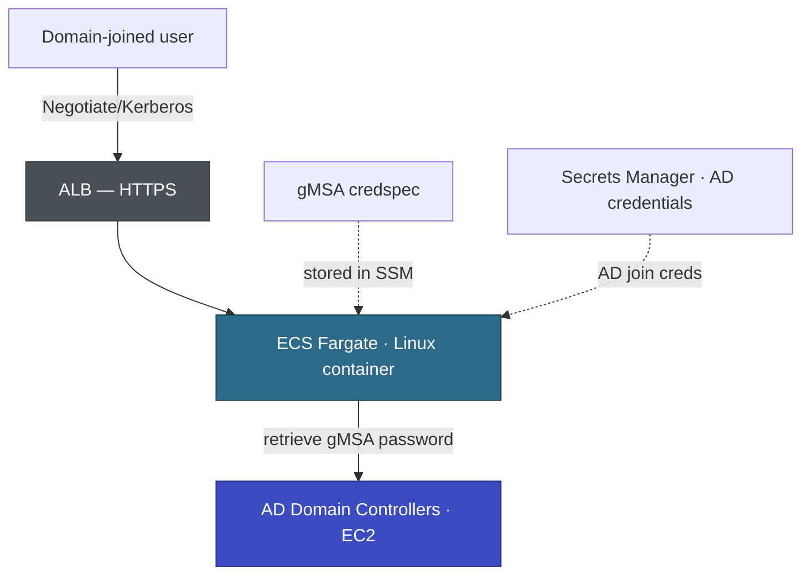

# ADC — PoC Plan: gMSA Authentication on ECS Fargate Linux

| | |
|---|---|
| Customer | ASEAN Digital Commerce Pte Ltd (ADC) |
| Application(s) | APP-003 (Supplier Portal), APP-001 (Customer Loyalty), APP-002 (Order Management) |
| Related decision | TD-001 from APP-003 Architecture Working Doc |
| Prepared by | AWS Partner Team |
| Duration | 2 weeks |

---

## Hypothesis

Linux containers on ECS Fargate can authenticate users against ADC's Active Directory via domainless gMSA, preserving transparent Negotiate/Kerberos SSO without an intermediate identity broker.

## Conceptual Architecture

The PoC validates the path from a domain-joined browser through ALB to a Linux Fargate container that authenticates via gMSA against AD Domain Controllers running on EC2 in the same VPC.

---

## Entry Criteria

What must be ready before the PoC starts.

| # | Criterion | Owner | Status |
|---|-----------|-------|--------|
| 1 | AD Domain Controllers reachable from ECS VPC (same VPC, confirmed) | ADC infra | ✅ Ready |
| 2 | gMSA account created in AD (`ECSgMSA`) | ADC infra | Pending |
| 3 | AD join credentials stored in AWS Secrets Manager | ADC infra + AWS | Pending |
| 4 | ECS Fargate Platform Version 1.4+ available in target region | AWS | ✅ Ready |
| 5 | Domain-joined Windows workstation available for testing | ADC | ✅ Ready |
| 6 | AWS account provisioned with ECS, ECR, ALB, Secrets Manager, SSM permissions | AWS | ✅ Ready |

## Execution Plan

| Day | Activity | Owner |
|-----|---------|-------|
| 1–2 | Create gMSA account in AD, grant ECS host permissions, store AD join creds in Secrets Manager | ADC infra |
| 2–3 | Create credspec JSON, store in SSM Parameter Store, configure ECS task definition with `credentialSpecs` | AWS |
| 3–4 | Build minimal ASP.NET Core .NET 10 test app: `/whoami` endpoint (returns `User.Identity.Name`), `/protected` endpoint (`[Authorize(Roles="...")]`). Push Docker image to ECR. | AWS |
| 4–5 | Deploy ECS Fargate service in ADC VPC. Configure ALB with HTTPS. | AWS + ADC infra |
| 5–7 | Run all exit criteria tests from a domain-joined workstation. Troubleshoot failures. | Joint |
| 7–8 | Restart ECS task, deploy new task revision — verify auth survives lifecycle events. | Joint |
| 8–10 | Document results, capture configuration gotchas, update architecture working docs. | AWS |

## Exit Criteria

The PoC is complete when all criteria are tested. Each must pass for a "Go" decision.

| # | Criterion | How to verify | Result |
|---|-----------|--------------|--------|
| 1 | Container obtains Kerberos ticket via gMSA on startup | Container logs show successful ticket acquisition | Pending |
| 2 | Transparent Negotiate auth works — no login prompt | From domain-joined workstation, hit `/whoami` → returns `ADC\testuser` | Pending |
| 3 | AD group-based authorization works | `/protected` with allowed user → 200, disallowed user → 403 | Pending |
| 4 | Auth survives ECS task restart | Stop task, wait for replacement, re-test `/whoami` | Pending |
| 5 | Auth works on fresh task deployment | Deploy new task revision, test `/whoami` | Pending |

---

## Go / No-Go Decision

**If PoC succeeds (all 5 criteria pass):**
- Update architecture working docs for APP-003, APP-001, APP-002: TD-001 → 🟢 AGREED (gMSA)
- Proceed with APP-003 EBA using gMSA auth pattern
- Credspec config and test app become reusable accelerators in `410-Accelerators/`

**If PoC fails (any criterion fails without workaround):**
- Update architecture working docs: TD-001 → 🟢 AGREED (Cognito fallback)
- Re-scope all EBA plans to include Amazon Cognito with AD federation (SAML/OIDC)
- ADC must accept changed login UX (redirect to Cognito hosted UI instead of transparent SSO)

---

## Risks

| Risk | Mitigation |
|------|------------|
| Credspec configuration is complex and documentation for Linux Fargate is limited | Follow [ECS domainless gMSA guide](https://docs.aws.amazon.com/AmazonECS/latest/developerguide/linux-gmsa.html). Allocate extra troubleshooting time in days 5–7. |
| Browser falls back to NTLM instead of Kerberos | Ensure SPN is registered for the ALB hostname. Verify with `klist` on the client workstation. |
| AD DC latency causes Kerberos ticket timeouts | DCs are in the same VPC — sub-millisecond latency expected. Monitor with CloudWatch. |