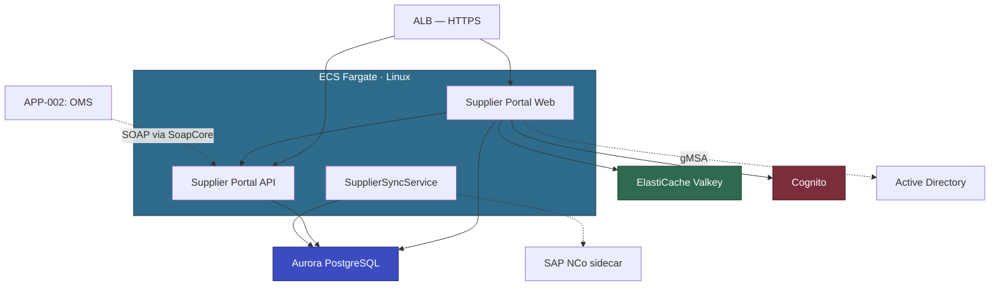

# ADC Supplier Portal (APP-003) — ModAx EBA Plan

| | |
|---|---|
| Customer | ADC — Procurement Engineering |
| Application | Supplier Portal — procurement and supplier catalog management |
| Criticality | High |
| Prepared by | AWS Partner Team |
| Prerequisite | PoC-gMSA-Auth must complete successfully before this EBA starts |

---

## Executive Summary

Supplier Portal is an ASP.NET MVC 5 application (.NET Framework 4.8, C#) with a REST API, a Windows Service (SupplierSyncService), and a SQL Server 2019 Standard database (45 GB). This is the pilot EBA — it validates the full-stack ATX two-step pathway (ATX .NET → ATX SQL) and the gMSA auth pattern for subsequent waves.

The app layer is straightforward: MVC + REST API + Worker Service, all C#, all ATX eligible. The complexity is in two cross-cutting concerns: Windows Auth (validated by the gMSA PoC) and the SAP NCo connector (resolved via Windows container sidecar).

Database modernization proceeds to Aurora PostgreSQL — the DB is standalone (no cross-DB joins, no shared DBs), 45 GB, 35 SPs, EF6. Well within ATX SQL capabilities.

---

## Application Profile

| Attribute | Value |
|-----------|-------|
| Technology | ASP.NET MVC 5 (.NET Framework 4.8, C#) + REST API |
| Architecture | N-Tier |
| LoC | ~42K (38K web + 4K SupplierSyncService) |
| Projects | Web App, API, SupplierSyncService, 2 Class Libraries |
| Database | SQL Server 2019 Standard, 45 GB, 62 tables, 35 SPs |
| Users | Internal (~120) + External suppliers (~80) |
| Auth | gMSA (internal, validated by PoC) + Cognito (external suppliers) |
| Tests | xUnit, ~45% coverage |
| CI/CD | Azure DevOps |
| Container experience | Docker basics |

---

## Modernization Approach

| Component | Approach | Tool | Complexity |
|-----------|----------|------|-----------|
| ASP.NET MVC 5 web app | Port to ASP.NET Core MVC .NET 10 | ATX .NET | Low |
| REST API | Port to ASP.NET Core Web API .NET 10 | ATX .NET | Low |
| SupplierSyncService | Port to .NET Worker Service | ATX .NET + Kiro | Low-Medium |
| Class Libraries (2) | Port to .NET 10 | ATX .NET | Low |
| EF6 → EF Core + Npgsql | Full-stack migration | ATX SQL | Medium |
| SQL Server → Aurora PG | Schema + data + 35 SPs | ATX SQL + DMS full load | Medium |
| Windows Auth (internal) | gMSA on Fargate Linux | Kiro (pattern from PoC) | Low |
| Forms Auth (external) | Cognito user pool | Kiro | Medium |
| SAP NCo | Windows sidecar (gRPC, 4 endpoints) | Kiro | Medium |
| IIS URL Rewrite | ASP.NET Core middleware | Kiro | Low |
| Redis → ElastiCache Valkey | Update connection string | Kiro | Low |
| ASMX SOAP endpoint | SoapCore adapter + REST | Kiro | Medium |

### Target Architecture

Supporting services: ECR, Secrets Manager, SSM Parameter Store, CloudWatch, EventBridge.

### Scope Boundaries

**In scope:**
- Port all 5 .NET projects to .NET 10 (ATX .NET)
- Migrate SQL Server → Aurora PostgreSQL (ATX SQL + DMS)
- gMSA auth for internal users (pattern from PoC)
- Cognito user pool for external suppliers
- SAP NCo Windows sidecar (gRPC, 4 endpoints)
- SoapCore adapter for OMS backward compatibility
- IIS URL Rewrite → ASP.NET Core middleware
- Redis → ElastiCache Valkey
- Containerize on ECS Fargate (Linux)
- SupplierSyncService as long-running ECS service
- Basic CI/CD (CodePipeline + CodeBuild)

**Out of scope:**
- OMS (APP-002) consumer migration from SOAP to REST — Wave 2
- External supplier onboarding workflow redesign
- Performance optimization beyond baseline
- Multi-region deployment

---

## Tooling

| Tool | Purpose |
|------|---------|
| ATX .NET | Port all 5 projects from .NET Framework 4.8 → .NET 10 |
| ATX SQL | Full-stack DB modernization: schema + EF6 → EF Core + data migration |
| Kiro + AI-DLC | Post-Transform cleanup, auth migration, NCo sidecar, SoapCore adapter |

| AWS Service | Purpose |
|-------------|---------|
| ECS Fargate | Container hosting (Linux) |
| Aurora PostgreSQL | Target database |
| ElastiCache Valkey | Distributed cache |
| Amazon Cognito | External supplier authentication |
| ECR | Container images |
| Secrets Manager | Connection strings, AD credentials |
| SSM Parameter Store | Application config |
| ALB | HTTPS termination, routing |
| EventBridge | SupplierSyncService scheduling (if converted from 24/7 to scheduled) |
| CloudWatch | Logging and monitoring |

---

## Technical Highlights

### 1. gMSA Authentication (from PoC)

Pattern validated in PoC-gMSA-Auth. Apply the same credspec configuration and `Microsoft.AspNetCore.Authentication.Negotiate` setup to the Supplier Portal. The PoC test app and credspec become reusable accelerators.

For external suppliers: Cognito user pool with email/password. Lazy migration from the SQL-backed Forms Auth user store via Cognito Lambda trigger on first login.

### 2. SAP NCo Sidecar

SupplierSyncService calls 4 SAP RFC functions via NCo. NCo requires Windows. Solution: thin Windows container sidecar exposing a gRPC API with 4 endpoints. The Linux Worker Service calls the sidecar instead of NCo directly.

### 3. SoapCore SOAP Adapter

APP-002 (OMS) consumes the Supplier Portal's ASMX SOAP endpoint. Capture the WSDL pre-EBA. SoapCore middleware exposes the same contract at the same URL path. OMS continues calling SOAP unchanged. New consumers use REST.

### 4. Database Migration

45 GB, 35 SPs, EF6, standalone. ATX SQL handles the full stack: schema conversion, EF6 → EF Core + Npgsql, SP conversion (T-SQL → PL/pgSQL). DMS full load for data (no CDC needed — 1-hour cutover window is acceptable). SQL Agent Jobs (2) → EventBridge + Lambda.

---

## EBA Timeline (6 Weeks)

### Weeks 1–2: Assessment & Planning
- Run ATX .NET assessment on all 5 projects
- Run ATX SQL assessment on the database
- Set up AWS account, VPC, Aurora PG dev instance, ElastiCache Valkey
- Configure Cognito user pool for external suppliers
- Apply gMSA credspec from PoC to the Supplier Portal ECS task definition
- All developers complete pre-EBA validation checklist

### Weeks 3–4: Pre-EBA Preparation
- Run ATX .NET — port all 5 projects to .NET 10
- Address NextSteps.md items with Kiro (URL Rewrite, config externalization)
- Run ATX SQL — schema + SP conversion + EF6 → EF Core
- DMS full load to Aurora PG dev instance
- Build SAP NCo sidecar (gRPC, 4 endpoints)
- Build SoapCore adapter, capture and validate WSDL
- Prepare Dockerfile and ECS task definitions
- Dry-run containerized app locally

### Week 5: Final Prep
- Run xUnit suite against Aurora PG — fix conversion issues
- Validate gMSA auth end-to-end
- Validate Cognito external supplier login flow
- Validate NCo sidecar with SAP dev environment
- Validate SoapCore WSDL matches original
- Prepare EBA backlog and demo script
- Confirm all SMEs available

### Week 6: EBA Party (2 Days)

**Day 1 — Build & Deploy**

| Time | Activity | Owner |
|------|----------|-------|
| 09:00 | Kickoff — architecture, backlog, success criteria | AWS + ADC |
| 09:30 | Fix remaining ATX issues, Kiro cleanup | App devs |
| 09:30 | Validate Aurora PG data, test SP conversions | DBA |
| 12:00 | Lunch | |
| 13:00 | Containerization — Dockerfile, ECS deploy to dev | DevOps + AWS |
| 14:00 | Integration — app → Aurora PG + ElastiCache Valkey | App dev + DBA |
| 15:00 | Auth — gMSA (internal) + Cognito (external) | AWS + App dev |
| 16:00 | Smoke testing — xUnit + manual validation | All |
| 17:00 | Day 1 retro | All |

**Day 2 — Validate & Demo**

| Time | Activity | Owner |
|------|----------|-------|
| 09:00 | Fix Day 1 issues, remaining backlog | All |
| 10:00 | CI/CD — CodePipeline + CodeBuild + ECR | DevOps + AWS |
| 11:00 | Observability — CloudWatch logs, Serilog sink | AWS |
| 12:00 | Lunch | |
| 13:00 | End-to-end testing, OMS SOAP integration test | All |
| 14:00 | Demo prep | All |
| 15:00 | Demo to stakeholders | All |
| 16:00 | Retro, next steps, Wave 1 planning | All |
| 17:00 | Close | |

---

## Risk Assessment

| Risk | Severity | Mitigation |
|------|----------|------------|
| gMSA config issues in production (vs PoC) | Medium | PoC validated the pattern. Reuse exact credspec. AWS SA on standby. |
| SAP NCo sidecar — gRPC interface mismatch | Medium | Only 4 endpoints. Validate against SAP dev in week 5. |
| SoapCore WSDL drift from original | Medium | Capture WSDL pre-EBA. Automated comparison in week 5. |
| EF6 → EF Core edge cases | Medium | xUnit suite (45%) catches most. Run full suite against Aurora PG. |
| Team limited Docker experience | Low | Docker workshop done. AWS leads containerization. Pre-EBA checklist validates setup. |

---

## Proof of Value

| Metric | Before | After (EBA Target) |
|--------|--------|-------------------|
| Modernization effort | ADC estimate: 6 months, 3 devs | 6 weeks, 2 devs + AWS |
| Deployment frequency | Weekly (manual) | On-demand (CI/CD) |
| Platform | Windows / IIS / SQL Server | Linux / ECS Fargate / Aurora PG |
| Scalability | Manual, vertical | Auto-scaling, horizontal |
| HA/DR | None (standalone SQL) | Multi-AZ (Aurora + ECS) |

---

## Pending Decisions

| # | Decision | Options | Impact |
|---|----------|---------|--------|
| 1 | Supplier user migration | Lazy migration (Lambda trigger) vs bulk import (CSV) | Lazy is simpler but suppliers reset password once. |
| 2 | Aurora PG instance size | db.r6g.large (2 vCPU, 16 GB) vs db.r6g.xlarge | Start small, scale if needed. |

---

## Unvalidated Assumptions

| # | Assumption | Impact if Incorrect |
|---|-----------|-------------------|
| 1 | IIS URL Rewrite rules are limited to HTTPS redirect, clean URLs, static file blocking | Complex regex routing increases conversion effort |
| 2 | SupplierSyncService polls a REST API (not SOAP or file-based) | Different sync mechanism needs different sidecar design |
| 3 | Redis usage is caching + session only (no pub/sub, no Lua) | Pub/sub or complex data structures need additional ElastiCache work |
| 4 | 35 SPs are CRUD without complex T-SQL (cursors, dynamic SQL) | Complex SPs flagged by ATX SQL for manual review |

ADC should confirm all assumptions before EBA starts. Material changes trigger a plan revision.