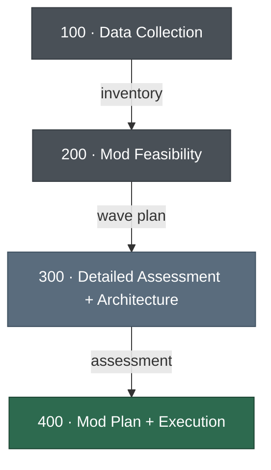

# ModNet — .NET & SQL Server Modernization Framework

Framework for assessing, planning, and executing modernization of Windows workloads (.NET + SQL Server) to AWS.

## Framework Flow

## Getting Started

Describe what you want to do in natural language. For example:

- "I want to modernize my .NET applications"
- "I have a portfolio of apps I want to assess for modernization"
- "I have a specific application I want to migrate to AWS"
- "I just want an assessment and recommendations"

The framework will guide you through the appropriate phases based on your needs.

## Available Skills

Skills guide you through each phase with step-by-step instructions. Templates, analysis rules, and sample outputs are embedded in each skill's `references/` folder.

| Skill | Phase | Description |
|-------|-------|-------------|
| `start-project` | Setup | Create the working folder structure, copy templates, determine project scope |
| `data-collection` | 100 | Guide portfolio inventory collection using the App Inventory spreadsheet |
| `feasibility-analysis` | 200 | Classify, score, and prioritize applications into modernization waves |
| `detailed-assessment` | 300 | Per-application deep dive: questionnaires, architecture workshops, iterative refinement |
| `generate-plans` | 400 | Produce PoC, EBA, and full modernization project plans for all applications |
| `excel-analysis` | Utility | Read and analyze Excel spreadsheets (used by other skills for inventory data) |

You do not need to invoke skills by name. Simply describe what you want to do and the appropriate skill will be activated automatically.

## Target State

| Layer | Primary | Alternatives |
|-------|---------|-------------|
| Application | ECS Fargate (Linux), .NET 10 | EKS, Lambda, EC2 Linux |
| Database | Aurora PostgreSQL | RDS SQL Server Standard, DynamoDB |
| Caching | ElastiCache Valkey | ElastiCache Redis |
| Stretch | CI/CD (CodePipeline), Observability (OpenTelemetry + CloudWatch) | |

## Key Tools

| Tool | Role |
|------|------|
| [AWS Transform for .NET](https://docs.aws.amazon.com/transform/latest/userguide/dotnet.html) | .NET Framework to cross-platform .NET |
| [AWS Transform for SQL Server](https://docs.aws.amazon.com/transform/latest/userguide/sql-server-modernization.html) | SQL Server to Aurora PostgreSQL |
| [AWS Transform Custom](https://docs.aws.amazon.com/transform/latest/userguide/custom.html) | Web Forms to MVC, repeatable patterns at scale |
| [Kiro](https://kiro.dev/docs/) | AI IDE for analysis, porting, and complex rewrites |

Note: This playbook is meant to be a reference guide - not intended for production use.

## License

[MIT License](LICENSE)

THE SOFTWARE IS PROVIDED "AS IS", WITHOUT WARRANTY OF ANY KIND, EXPRESS OR
IMPLIED, INCLUDING BUT NOT LIMITED TO THE WARRANTIES OF MERCHANTABILITY,
FITNESS FOR A PARTICULAR PURPOSE AND NONINFRINGEMENT. IN NO EVENT SHALL THE
AUTHORS OR COPYRIGHT HOLDERS BE LIABLE FOR ANY CLAIM, DAMAGES OR OTHER
LIABILITY, WHETHER IN AN ACTION OF CONTRACT, TORT OR OTHERWISE, ARISING FROM,
OUT OF OR IN CONNECTION WITH THE SOFTWARE OR THE USE OR OTHER DEALINGS IN THE
SOFTWARE.
