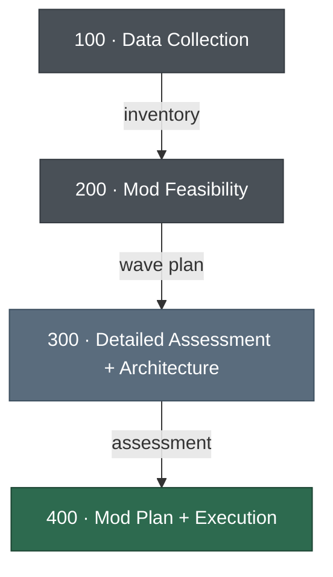

# ModNet — .NET & SQL Server Modernization Framework

Structured framework for AWS partners to assess, plan, and execute modernization of Windows workloads (.NET + SQL Server) to AWS.

## Framework Flow



| Phase | What happens | Framework docs |
|:-----:|-------------|---------------|
| 100 | Portfolio inventory | [README](framework/100-Data-Collection/README.md) |
| 200 | Classify, score, prioritize | [README](framework/200-Mod-Feasibility/README.md) |
| 300 | Per-app deep dive + architecture | [README](framework/300-Detailed-Assessment/README.md) |
| 400 | PoC, EBA, and project plans | [README](framework/400-Mod-Plan/README.md) |

## Workspace Structure

```
framework/                        # Read-only. Templates, rules, samples. Never modified per-customer.
  100-Data-Collection/            # Inventory template
  200-Mod-Feasibility/            # Feasibility analysis rules and sample output
  300-Detailed-Assessment/        # Questionnaire, analysis rules, architecture template, samples
  400-Mod-Plan/                   # PoC template, EBA template + checklist, samples
  engagement-template.md          # Template for customer engagement runbook

working/                          # Per-customer work. All modifications happen here.
  {CUSTOMER}/
    engagement.md                 # The runbook — prompts, status, links
    reference/                    # Customer-provided artefacts
    100-data-collection/          # Completed inventory
    200-mod-feasibility/          # Feasibility output
    300-detailed-assessment/      # Questionnaires, architecture docs, assessment
      meetings/                   # Raw meeting notes
    400-mod-plan/                 # PoC plans, EBA plans, project plans
```

## Getting Started

To start a new customer engagement, invoke the `start-engagement` skill and provide the customer name. The skill will create the folder structure, copy templates, ask about the engagement type, and guide you on next steps.

Once the engagement is set up, open `working/{CUSTOMER}/engagement.md` and follow the phase instructions.

## Target State

| Layer | Primary | Alternatives |
|-------|---------|-------------|
| Application | ECS Fargate (Linux), .NET 10 | EKS, Lambda, EC2 Linux |
| Database | Aurora PostgreSQL | RDS SQL Server Standard, DynamoDB |
| Caching | ElastiCache Valkey | ElastiCache Redis |
| Stretch | CI/CD (CodePipeline), Observability (OpenTelemetry + CloudWatch) | |

## Key Tools

| Tool | Role |
|------|------|
| [AWS Transform for .NET](https://docs.aws.amazon.com/transform/latest/userguide/dotnet.html) | .NET Framework → cross-platform .NET |
| [AWS Transform for SQL Server](https://docs.aws.amazon.com/transform/latest/userguide/sql-server-modernization.html) | SQL Server → Aurora PostgreSQL |
| [AWS Transform Custom](https://docs.aws.amazon.com/transform/latest/userguide/custom.html) | Web Forms → MVC, repeatable patterns at scale |
| [Kiro](https://kiro.dev/docs/) | AI IDE for analysis, porting, and complex rewrites |

Note: This playbook is meant to be a reference guide — not intended for production use.

## License

[MIT License](LICENSE)

THE SOFTWARE IS PROVIDED "AS IS", WITHOUT WARRANTY OF ANY KIND, EXPRESS OR
IMPLIED, INCLUDING BUT NOT LIMITED TO THE WARRANTIES OF MERCHANTABILITY,
FITNESS FOR A PARTICULAR PURPOSE AND NONINFRINGEMENT. IN NO EVENT SHALL THE
AUTHORS OR COPYRIGHT HOLDERS BE LIABLE FOR ANY CLAIM, DAMAGES OR OTHER
LIABILITY, WHETHER IN AN ACTION OF CONTRACT, TORT OR OTHERWISE, ARISING FROM,
OUT OF OR IN CONNECTION WITH THE SOFTWARE OR THE USE OR OTHER DEALINGS IN THE
SOFTWARE.