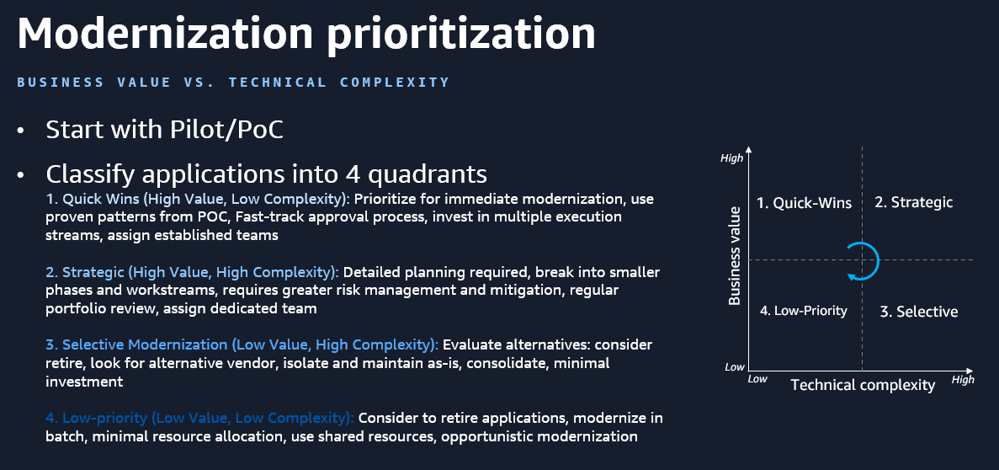

# Feasibility Analysis Rules

This document defines the complete analysis methodology for Phase 200 — Modernization Feasibility. It is consumed by the agent when running the feasibility prompt.

## Inventory Reference

The input is the customer's completed `App-Inventory.xlsx` from Phase 100. It contains two data worksheets (row 1 = headers, row 2 onward = data). The columns and their example values are listed below so the analysis steps can reference them precisely.

### Applications Worksheet

| Column | Description / Example |
|--------|----------------------|
| App ID | Auto-generated (e.g. APP-001) |
| App Name | Customer Portal |
| Application Type | See Application Type Platform Mapping below |
| Functional Description | Customer-facing e-commerce portal handling order processing |
| Business Criticality | 1 - Critical, 2 - High, 3 - Medium, 4 - Low |
| Source Code Available | Yes - in Git, Yes - TFS/SVN, Yes - file share, Partial, No |
| Change Frequency | Daily, Weekly, Monthly, Quarterly, Rarely, No longer maintained |
| User Count - Average | 500 |
| User Count - Peak | 2000 |
| Programming Language | C#, VB.NET, F#, C++, Mixed |
| Major .NET Version | Older than 3.5,3.5,4,5,6,7,8,9,10 |
| Lines of Code | e.g. 35,711, 165,976 |
| Current Hosting | On-premises, Azure VM, AWS EC2, Other cloud, Hybrid |
| Container Usage | No, Docker, Kubernetes, OpenShift, ECS |
| Deployment Method | e.g. CI/CD pipeline via Azure DevOps deploying to IIS |
| Architecture Docs | Yes - comprehensive, Yes - partial, No |
| Source Repository | Azure DevOps, GitHub, GitLab, Bitbucket, TFS, SVN, File share |
| Windows Dependencies | None, Registry, Windows Services, COM/DCOM, MSMQ, Multiple |
| IIS Dependencies | None, URL Rewrite, ISAPI Filters, Custom Modules, Multiple |
| RTO | e.g. 10 mins, 1 hour, 4 hours |
| RPO | e.g. 30 mins, 1 hour |
| Discovery Method | Automated Discovery, Manual Entry |

### Databases Worksheet

| Column | Description / Example |
|--------|----------------------|
| DB ID | Auto-generated (e.g. DB-001) |
| Linked App ID | APP-001 (links to Applications worksheet) |
| App Name | Customer Portal DB |
| Data Store Type | MS SQL Server, PostgreSQL, MySQL, File-based, None |
| Database Access Method | Entity Framework, EF Core, Dapper, ADO.NET, Direct SQL, Other ORM |
| SQL Server Version | 2008 R2, 2012, 2014, 2016, 2017, 2019, 2022 |
| SQL Server Edition | Express, Standard, Enterprise |
| Table Count | 150 |
| View Count | 45 |
| Stored Procedure Count | 200 |
| Function Count | 30 |
| Trigger Count | 12 |
| Database Size (GB) | 250.5 |
| HA Setup | Standalone, Log Shipping, Always On Availability Groups, FCI, Replication |
| Workload Type | OLTP, OLAP, Mixed |
| Component Services | None, SSIS, SSRS, SSAS, Multiple |
| Advanced Features | None, SQL Agent Jobs, TDE, CLR Assemblies, Linked Servers, Replication/CDC, Multiple |
| Authentication Method | SQL Authentication, Windows Authentication, Mixed Mode |
| Discovery Method | Automated Discovery, Manual Entry |

### Application Type Platform Mapping

The Application Type dropdown is ordered legacy-first, then modern. Use this mapping in Step 1 to infer platform affinity from the project type alone (before considering .NET version or dependencies).

| Application Type | Platform | Notes |
|-----------------|----------|-------|
| ASP.NET Web Site | Windows-only | Older file-based compilation model, no .csproj, always .NET Framework |
| ASP.NET WebForms | Windows-only | Server-rendered, ViewState/postback, System.Web. Can be converted to Blazor via AWS Transform if no 3rd party UI components |
| ASP.NET MVC (.NET Framework) | Windows-only | System.Web-based MVC. Distinct from ASP.NET Core MVC |
| COM+ / Serviced Component | Windows-only | Enterprise Services, distributed transactions, deep Windows coupling |
| Console App (.NET Framework) | Windows-only | Runs on .NET Framework only. Often used for batch jobs, scheduled tasks |
| Class Library (.NET Framework) | Windows-only | Shared code targeting .NET Framework. Cannot run cross-platform without porting |
| Office VSTO Add-in | Windows-only | Excel/Word/Outlook plugins, COM-based, tightly coupled to Windows Office |
| Web API (.NET Framework) | Windows-only | System.Web-hosted HTTP APIs. Distinct from ASP.NET Core Web API |
| WCF Service | Windows-only | SOAP/TCP services (BasicHttpBinding, NetTcpBinding, etc.). No cross-platform equivalent — replace with gRPC or REST |
| WCF Workflow Service | Windows-only | WCF + Windows Workflow Foundation combined. Requires architectural replacement |
| Windows Service | Windows-only | Long-running background process via ServiceBase. Modern equivalent: Worker Service |
| Windows Workflow (WF) | Windows-only | Visual workflow engine. Requires architectural replacement (Step Functions, etc.) |
| WinForms | Windows-only | Windows desktop, GDI+. Preview support in AWS Transform |
| WPF | Windows-only | Windows desktop, XAML/DirectX. Preview support in AWS Transform |
| ASP.NET Core MVC | Cross-platform | Modern MVC on Microsoft.AspNetCore. Runs on Linux |
| ASP.NET Core Web API | Cross-platform | Modern HTTP APIs. Runs on Linux |
| Blazor Server | Cross-platform | Server-side interactive UI over SignalR. Runs on Linux |
| Blazor WebAssembly | Cross-platform | Client-side SPA running in browser via WebAssembly |
| Class Library (.NET 6+) | Cross-platform | Shared code targeting modern .NET. Runs anywhere |
| Console App (.NET 6+) | Cross-platform | Modern console app. Runs on Linux |
| gRPC Service | Cross-platform | Modern RPC framework, cross-platform replacement for WCF |
| MAUI | Cross-platform* | Cross-platform UI (replaces Xamarin.Forms). *Desktop targets still need Windows/macOS host |
| Worker Service | Cross-platform | Modern replacement for Windows Service, uses IHostedService. Runs on Linux |
| Other | Unknown | Requires manual assessment to determine platform affinity |

---

## Step 1: Identify Windows Workloads

Classify each application from the inventory into one of these categories:

### CAT1 - WINDOWS-BOUND
Tied to Windows. Meets ONE OR MORE of:
- Application Type has Platform = "Windows-only" in the mapping above
- .NET Version is a .NET Framework version (< 5) — these can only run on Windows
- Windows Dependencies is anything other than "None"
- IIS Dependencies is anything other than "None"
- Programming Language is "Visual Basic", "C++", or "F#"


### CAT2 - LIKELY LINUX-READY BUT MAY STILL BE ON WINDOWS
- .NET version is modern (5 or newer) regardless of Windows Dependencies and IIS dependencies
- Current Hosting is "On-premises", "Elastic Beanstalk"
- Container Usage is "No", "Docker" or "ECS"

### CAT3 - LIKELY LINUX-READY
- Container Usage is "Kubernetes" or "OpenShift"
- Windows Dependencies = "None" AND IIS Dependencies = "None"

### CAT4 - UNCLEAR — NEEDS VERIFICATION
Not enough data:
- Key fields are empty or ambiguous
- .NET version is modern (5 or newer) but Windows dependencies are listed
- Hosting is "Azure VM", "Other cloud" or "Hybrid" without further detail

Only CAT1 and CAT2 applications move to next steps.
CAT3 is likely already on Linux, flag those in CAT4.

---

## Step 2: AWS Transform Eligibility & Modernization Pathways

Read `210-Tool-Feasibility/aws-tools-analysis.md` for the AWS tool eligibility checks, modernization pathways, and manual remediation mappings. For ISV tool guidance (CAST Imaging, Mobilize.Net, vFunction), read `210-Tool-Feasibility/isv-tools-analysis.md`. The AWS tools file also includes instructions for verifying the latest AWS service capabilities via the AWS Knowledge MCP Server — use it to validate eligibility criteria before finalizing recommendations.

Apply those rules to each Windows-bound application.

This step runs BEFORE complexity scoring because tool eligibility directly affects complexity. For example:
- A C# .NET Framework 4.x Class Library is low complexity if AWS Transform can port it automatically.
- An ASP.NET WebForms app is moderate complexity if AWS Transform can convert it to Blazor, but high complexity if it uses 3rd party UI components (Telerik, DevExpress, Infragistics, etc.) that block Transform.

---

## Step 3: Technical Complexity Scoring

Score each Windows-bound application's overall technical complexity. Use the tool eligibility results from Step 2 to inform scoring — tool coverage reduces complexity, tool blockers increase it.

The technical complexity score combines application-layer and database-layer factors into a single score used for prioritization in Step 4.

### Application Complexity Factors (0–10)

Base scoring:

| Factor | Low (0) | Medium (+1–2) | High (+3–4) |
|--------|---------|----------------|--------------|
| App Type | Web API, Console App, Class Library | ASP.NET MVC, Windows Service, Worker Service | WebForms (+3), WCF Service (+3), WCF Workflow Service (+4), Windows Workflow (WF) (+4), WinForms/WPF (+4), COM+ (+4), Office VSTO (+4) |
| .NET Version | 5+ | 4,3.5 | 3.5 or earlier (+3) |
| Codebase Size | < 50K LOC | 50K–200K LOC | 200K+ LOC (+3) |
| Windows Deps | None | Registry, Windows Services | COM/DCOM (+3), MSMQ (+2), Multiple (+4) |
| IIS Deps | None | URL Rewrite | ISAPI Filters (+3), Custom Modules (+3), Multiple (+4) |
| Source Code | Yes — in Git | Yes — TFS/SVN, file share | Partial (+2), No (+4) |
| Language | C# | F# (+1) | Visual Basic (+2), C++ (+3), Mixed (+2) |

Tool-aware adjustments (apply after base scoring):

| Condition | Adjustment |
|-----------|------------|
| GA ELIGIBLE for ATX .NET and no blockers | −2 (tool handles the heavy lifting) |
| PREVIEW ELIGIBLE for ATX .NET | −1 (tool helps but preview risk) |
| WebForms with 3rd party UI components (Telerik, DevExpress, Infragistics, ComponentOne, Syncfusion, etc.) | +2 (blocks ATX WebForms → Blazor conversion, requires manual UI rewrite or vendor upgrade) |
| MVC with 3rd party UI components (Kendo UI, DevExtreme, Infragistics MVC helpers, etc.) | +2 (blocks automated MVC Razor porting, requires manual upgrade to vendor's ASP.NET Core version or replacement) |
| NOT ELIGIBLE for ATX .NET | no adjustment (base score already reflects inherent complexity) |

Floor at 0, cap at 10.

### Database Complexity Factors (0–10)

Base scoring:

| Factor | Low (0) | Medium (+1–2) | High (+3–4) |
|--------|---------|----------------|--------------|
| Data Store | None, File-based, PostgreSQL, MySQL | MS SQL Server (+2) | — |
| Stored Procs | 0–10 | 11–100 (+1) | 100–500 (+2), 500+ (+3) |
| Triggers | 0–5 | 6–20 (+1) | 20+ (+2) |
| Advanced Features | None | SQL Agent Jobs (+1), TDE (+1) | CLR Assemblies (+3), Linked Servers (+2), Replication/CDC (+2), Multiple (+4) |
| Component Services | None | One of SSIS/SSRS/SSAS (+2) | Multiple (+3) |
| HA Setup | Standalone | Log Shipping (+1) | Always On AG (+2), FCI (+2), Replication (+2) |
| DB Size | < 50 GB | 50–500 GB (+1) | 500+ GB (+2) |
| DB Access Method | Entity Framework | Dapper, Other ORM (+1) | ADO.NET (+1), Direct SQL (+2) |

If no linked database, set DB complexity to 0.

Tool-aware adjustments:

| Condition | Adjustment |
|-----------|------------|
| ELIGIBLE for ATX SQL and no blockers | −2 (tool handles schema + data access conversion) |
| ELIGIBLE AFTER .NET PORTING | −1 (tool helps once prerequisite met) |
| PARTIALLY ELIGIBLE (has SSIS/SSRS/CLR/etc.) | no adjustment (manual work offsets tool benefit) |
| NOT ELIGIBLE or NOT APPLICABLE | no adjustment |

Floor at 0, cap at 10.

### Combined Technical Complexity Score

Calculate the combined score as the average of the two axes, rounded to the nearest integer:

**Technical Complexity = round((App Complexity + DB Complexity) / 2)**

This produces a single 0–10 score per application used in the prioritization matrix (Step 4).

Classification:
- Low Complexity (0–3): Straightforward modernization, minimal manual work expected
- Medium Complexity (4–6): Moderate effort, some manual remediation needed
- High Complexity (7–10): Significant effort, multiple blockers or unsupported components

### Output Table

| App ID | App Name | App Score (base → adjusted) | DB Score (base → adjusted) | Technical Complexity | Top Complexity Drivers |
|--------|----------|-----------------------------|----------------------------|---------------------|----------------------|

Include a key insight on where complexity concentrates across the portfolio (app layer vs DB layer vs both).

---

## Step 4: Prioritization — Business Value vs Technical Complexity

Plot each application on two axes — Business Value (Y-axis) and Technical Complexity (X-axis) — to determine modernization priority. Start with a Pilot/PoC to validate the approach before scaling.

### Business Value Score (0–10)

| Factor | Score |
|--------|-------|
| Business Criticality | Critical = 3, Important = 2, Back-Office = 1, Low = 0 |
| Change Frequency | Daily/Weekly = 3, Monthly/Quarterly = 2, Rarely = 1, No longer maintained = 0 |
| User Count | Peak > 500 = 3, 100–500 = 2, 10–100 = 1, < 10 = 0 |
| RTO/RPO Sensitivity | RTO < 1hr or RPO < 15min = 2, RTO < 4hr or RPO < 1hr = 1, Otherwise = 0 |

### Prioritization Matrix

```
                    Technical Complexity
                   Low (0-4)     High (6-10)
              ┌──────────────┬──────────────┐
  Biz    High │ 1. QUICK     │ 2. STRATEGIC │
  Value (6-10)│    WINS      │              │
              ├──────────────┼──────────────┤
         Low  │ 4. LOW-      │ 3. SELECTIVE │
        (0-4) │    PRIORITY  │              │
              └──────────────┴──────────────┘
```

**Score 5 on either axis is a boundary case.** When plotting the quadrant chart, nudge score-5 values into the nearest quadrant based on context:
- Business Value = 5 → treat as Low (0.45) unless the app has strong strategic importance, then High (0.55)
- Technical Complexity = 5 → treat as Low (0.45) if ATX eligible, High (0.55) if manual remediation dominates

**Coordinate mapping for Mermaid quadrantChart:**

| Score | Coordinate |
|-------|-----------|
| 0 | 0.10 |
| 1 | 0.15 |
| 2 | 0.20 |
| 3 | 0.30 |
| 4 | 0.40 |
| 5 | 0.45 or 0.55 (see nudge rule above) |
| 6 | 0.60 |
| 7 | 0.65 |
| 8 | 0.75 |
| 9 | 0.80 |
| 10 | 0.90 |



### Quadrant Definitions

**1. Quick Wins (High Value, Low Complexity)**
Prioritize for immediate modernization. Use proven patterns from PoC. Fast-track approval process. Invest in multiple execution streams. Assign established teams.

**2. Strategic (High Value, High Complexity)**
Detailed planning required. Break into smaller phases and workstreams. Requires greater risk management and mitigation. Regular portfolio review. Assign dedicated team.

**3. Selective Modernization (Low Value, High Complexity)**
Evaluate alternatives: consider retire, look for alternative vendor, isolate and maintain as-is, consolidate. Minimal investment.

**4. Low-Priority (Low Value, Low Complexity)**
Consider to retire applications. Modernize in batch. Minimal resource allocation. Use shared resources. Opportunistic modernization.

### Pilot / PoC Selection

The pilot MUST come from the Quick Wins quadrant (high value, low complexity). Do not select Low-Priority or Selective quadrant applications as pilots — even if they are simpler or more isolated. The pilot's purpose is to deliver early business value while validating the modernization tooling and process. A low-value pilot delays ROI and fails to demonstrate the business case.

Selection criteria (in priority order):
1. **Must be in the Quick Wins quadrant** — this is non-negotiable
2. GA ELIGIBLE for ATX .NET, C#, source in Git, < 100K LOC
3. Include at least one application with a SQL Server database to validate the full-stack pathway
4. Prefer applications with fewer upstream/downstream dependencies where possible, but do not sacrifice quadrant placement for isolation
5. Use the pilot to establish before/after patterns for ATX Custom definitions (if applicable)

If no Quick Win applications exist, select the lowest-complexity application from the Strategic quadrant.

### Wave Assignment

Waves follow the quadrant order — Quick Wins first, Strategic second, then the rest:

- **Pilot / PoC (1–2 apps):** Selected from the Quick Wins quadrant per the rules above. Validates tooling and process. Establishes patterns for subsequent waves.
- **Wave 1 — Quick Wins:** Remaining Quick Win quadrant applications. Apply proven patterns from pilot. Multiple execution streams.
- **Wave 2 — Strategic:** High-value, high-complexity applications. Phased approach, dedicated teams, risk mitigation plans.
- **Wave 3 — Low-Priority / Batch:** Low-value, low-complexity applications. Batch modernization, shared resources, opportunistic.
- **Selective Modernization:** Evaluated case-by-case. Some may be deferred, retired, or replaced with vendor alternatives.

### Data Gaps for Phase 300

Flag what's MISSING or INSUFFICIENT per app:

- Application: functional description, business criticality, user counts, LOC, deployment method, specific dependency lists, RTO/RPO
- Database: object counts, size, specific component services, specific advanced features, cross-DB deps
- AWS Transform readiness: Git migration plan, EF version, DB hosting/connectivity, private NuGet feeds

---

## Expected Output

The analysis should produce a single markdown file with four sections corresponding to Steps 1–4 above. See `sample-output/analysis-output.md` for a complete example of the expected format and level of detail.
