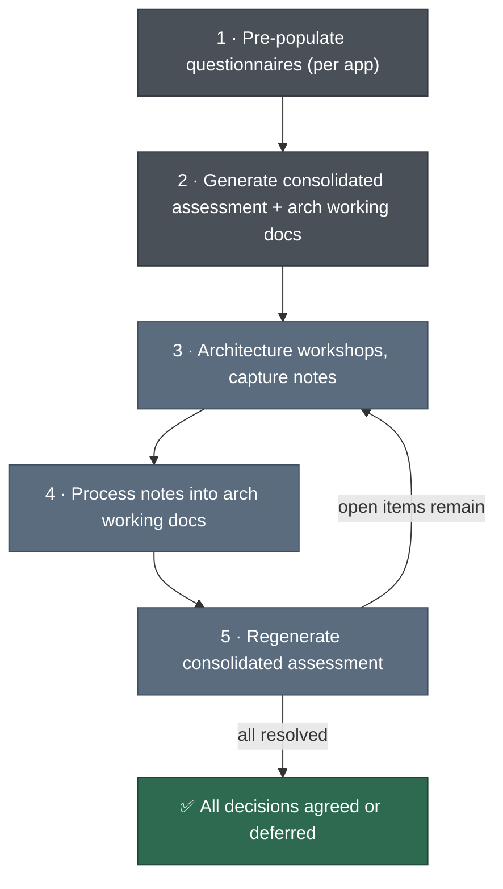

# Phase 300 — Detailed Assessment & Architecture

Per-application deep dive for workloads selected in Phase 200. The questionnaire is filled once per app, but the output is a single consolidated assessment covering the entire portfolio of apps being modernized.

## Workflow



Steps 1–2 run once. Steps 3–5 repeat until all architecture decisions are 🟢 or ⚪.

## Artefacts

| Document | For | What it does |
|----------|-----|-------------|
| [300-App-Questionnaire.md](300-App-Questionnaire.md) | Customer | 85 questions across 12 sections. Filled once per application. Superset of Phase 100 inventory. |
| [300-Architecture.md](300-Architecture.md) | Joint | Architecture working doc (one per app). Draft diagram, technical decisions, meeting log, PoC tracker. |
| [detailed-analysis.md](detailed-analysis.md) | Internal | Interpretation rules for every questionnaire answer. Decision matrices for project types, dependencies, DB migration, pilot selection. |

Sample outputs: [Detailed assessment](sample-output/detailed-assessment-output.md) · [Architecture working doc](sample-output/architecture-working-doc.md)

## What Phase 300 produces

A single consolidated assessment document per customer — a refined, deeper version of Phase 200's feasibility output. Where Phase 200 scored and prioritized from inventory data, Phase 300 adds the detail needed to build execution plans in Phase 400.

Per application, the assessment covers:
- Application profile (from questionnaire — architecture, dependencies, DB internals, team readiness)
- Modernization approach and tooling (from detailed-analysis.md decision matrices)
- Target architecture (collaboratively designed with customer — from architecture working doc)
- Architecture decisions with status (🟢 agreed, 🟡 exploring, ⚪ deferred)
- Risks, blockers, and open items
- Recommended execution path: PoC (420), EBA (430), or full modernization project

The consolidated assessment feeds directly into Phase 400 where per-application plans are produced (EBA plans, PoC plans, or full project plans).

## Step 1 — Pre-populate questionnaires

Skip this step if Phase 100/200 haven't been run (see Path B below).

**Select applications and pre-populate:**

```
Using #File:working/{CUSTOMER}/200-mod-feasibility/{CUSTOMER}-Feasibility.md
and #File:working/{CUSTOMER}/100-data-collection/{CUSTOMER}-App-Inventory.xlsx,
suggest which applications to assess first, then pre-populate questionnaires
using #File:framework/300-Detailed-Assessment/300-App-Questionnaire.md.

Output each as working/{CUSTOMER}/300-detailed-assessment/{CUSTOMER}-{APP}-Questionnaire.md.
```

**Pre-populate for a specific app:**

```
Pre-populate #File:framework/300-Detailed-Assessment/300-App-Questionnaire.md
for {APP_NAME} using #File:working/{CUSTOMER}/100-data-collection/{CUSTOMER}-App-Inventory.xlsx
and #File:working/{CUSTOMER}/200-mod-feasibility/{CUSTOMER}-Feasibility.md.

Output as working/{CUSTOMER}/300-detailed-assessment/{CUSTOMER}-{APP}-Questionnaire.md.
```

**Pre-populate using ATX Comprehensive Codebase Analysis output (recommended):**

If `AWS/comprehensive-codebase-analysis` was run in Phase 200 or as an EBA prerequisite, the output provides high-confidence answers for many questionnaire sections (architecture, dependencies, code quality, DB access patterns, integration points). Use it as primary source:

```
Pre-populate #File:framework/300-Detailed-Assessment/300-App-Questionnaire.md
for {APP_NAME} using:
- #File:working/{CUSTOMER}/200-mod-feasibility/{APP_NAME}-codebase-analysis/ (all output files)
- #File:working/{CUSTOMER}/100-data-collection/{CUSTOMER}-App-Inventory.xlsx
- #File:working/{CUSTOMER}/200-mod-feasibility/{CUSTOMER}-Feasibility.md

Mark answers derived from codebase analysis with 📋 (carried forward from analysis).
Mark remaining gaps with ⚠️ for customer follow-up.

Output as working/{CUSTOMER}/300-detailed-assessment/{CUSTOMER}-{APP}-Questionnaire.md.
```

When codebase analysis output is available, expect significantly fewer ⚠️ gaps — the analysis provides measured complexity metrics, actual dependency maps, specific 3rd party component identification, and business logic descriptions that would otherwise require customer interviews.

Walk the customer through each questionnaire. Focus on ⚠️ items and blanks. Let them complete async over 1–2 weeks.

## Step 2 — Generate the initial consolidated assessment

Once questionnaires come back, generate the consolidated assessment. This covers all assessed apps in one document and surfaces architecture decisions that need customer input.

```
Using all completed questionnaires in #Folder:working/{CUSTOMER}/300-detailed-assessment/
(files matching *-Questionnaire.md),
the feasibility analysis in #File:working/{CUSTOMER}/200-mod-feasibility/{CUSTOMER}-Feasibility.md,
and the analysis rules in #File:framework/300-Detailed-Assessment/detailed-analysis.md:

For each application:
1. Interpret every questionnaire answer using the decision matrices.
2. Determine modernization approach, tooling, and target architecture.
3. Flag high-risk, high-complexity, or multi-option decisions as 🔍 Discussion Points.
4. Recommend execution path: PoC (if high-risk unknowns), EBA (if suitable), or
   full modernization project (if too large/complex for EBA).
5. Flag unanswered questions as assumptions with impact-if-incorrect.

Produce a single consolidated document with:
- Portfolio summary (updated from Phase 200 with new detail)
- Per-app sections: profile, approach, target architecture, risks, execution path
- Cross-app concerns (shared dependencies, auth patterns, DB migration sequencing)
- Consolidated discussion points across all apps

Output as working/{CUSTOMER}/300-detailed-assessment/{CUSTOMER}-Detailed-Assessment.md.
```

Then initialize architecture working docs (one per app that has 🔍 discussion points):

```
Using the assessment in #File:working/{CUSTOMER}/300-detailed-assessment/{CUSTOMER}-Detailed-Assessment.md
and the template in #File:framework/300-Detailed-Assessment/300-Architecture.md:

For each app with discussion points, create an architecture working doc.
Populate the Draft Architecture diagram and create TD-### entries (🟡 EXPLORING)
for each discussion point.

Output as working/{CUSTOMER}/300-detailed-assessment/{CUSTOMER}-{APP}-Architecture.md.
```

## Step 3 — Architecture workshops *(repeat)*

Walk through 🟡 decisions with the customer. Can be per-app or grouped by theme (e.g., auth workshop covering all apps that use Windows Auth). Capture raw notes — typed notes, photos, chat logs, anything.

Save as `working/{CUSTOMER}/300-detailed-assessment/meetings/{CUSTOMER}-{APP}-Meeting-{DATE}.md`.

## Step 4 — Process notes into architecture working docs *(repeat)*

```
Using the meeting notes in #File:working/{CUSTOMER}/300-detailed-assessment/meetings/{CUSTOMER}-{APP}-Meeting-{DATE}.md
and the architecture working doc in #File:working/{CUSTOMER}/300-detailed-assessment/{CUSTOMER}-{APP}-Architecture.md:

1. Add a Meeting Log entry: date, attendees, discussed, decided (TD-###), actions, open items.
2. Update each Technical Decision discussed:
   - Customer position, new alternatives, status change (🟢/🔴/🟡).
3. Add new observations and any new TD-### entries that surfaced.
4. Update the Draft Architecture diagram if agreed decisions changed it.

Save in place.
```

## Step 5 — Regenerate the consolidated assessment *(repeat)*

```
Using all questionnaires in #Folder:working/{CUSTOMER}/300-detailed-assessment/ (*-Questionnaire.md),
all architecture working docs in #Folder:working/{CUSTOMER}/300-detailed-assessment/ (*-Architecture.md),
the feasibility analysis in #File:working/{CUSTOMER}/200-mod-feasibility/{CUSTOMER}-Feasibility.md,
and the analysis rules in #File:framework/300-Detailed-Assessment/detailed-analysis.md:

1. Incorporate all 🟢 (GREEN) decisions from architecture working docs.
2. For 🟡 (YELLOW) decisions, note both options as pending.
3. For 🔴 (RED) decisions, flag prominently in risks.
4. Update per-app architecture diagrams and execution path recommendations.
5. Update cross-app concerns, discussion points, and assumptions.

Output as working/{CUSTOMER}/300-detailed-assessment/{CUSTOMER}-Detailed-Assessment.md (overwrite).
```

Repeat steps 3–5 until no 🔴 (RED) items remain. 🟡 (YELLOW) items are ok if they are tracked as PoC or have plans to be clarified prior to execution. 
The finalized assessment feeds into [Phase 400 — Modernization Plan](../400-Mod-Plan/README.md). The finalized assessment feeds into Phase 400.


## Path B — EBA front-loaded (no prior phases)

Skip step 1. Use the questionnaire as-is:

1. Copy `300-App-Questionnaire.md` → `working/{CUSTOMER}/300-detailed-assessment/{CUSTOMER}-{APP}-Questionnaire.md` (per app)
2. (Recommended) Run `AWS/comprehensive-codebase-analysis` on each candidate application and save output to `working/{CUSTOMER}/200-mod-feasibility/{APP-NAME}-codebase-analysis/`. Use the output to pre-populate questionnaire answers where possible, reducing customer interview time.
3. Walk the customer through each questionnaire (focus on ⚠️ gaps not covered by codebase analysis), let them complete async
4. Follow steps 2–5 above

## Appendix — Field Mapping (Phase 100/200 → Questionnaire)

Reference for the pre-population prompt.

| Questionnaire Section | Source | Fields |
|-----------------------|--------|--------|
| 1. App Overview | Inventory (Apps) | App Name, Description, Criticality, Users, RTO/RPO |
| 2. Architecture | Inventory (Apps) | App Type, Language, .NET Version, LoC, Windows/IIS Deps, Containers |
| 2. Architecture | Feasibility §1–2 | Classification, ATX eligibility, blockers, pathway |
| 4. Dependencies | Inventory (Apps) | Deployment Method |
| 7. Hosting | Inventory (Apps) | Current Hosting, RTO/RPO |
| 9. DevOps | Inventory (Apps) | Source Repo, Deployment, Change Frequency |
| 12. Database | Inventory (DBs) | Version/Edition, Object Counts, Size, HA, Workload, Features, Auth, Access Method |
| 12. Database | Feasibility §2 | ATX SQL eligibility, blockers |
| Data gaps | Feasibility §4 | Targeted follow-up questions per app |
