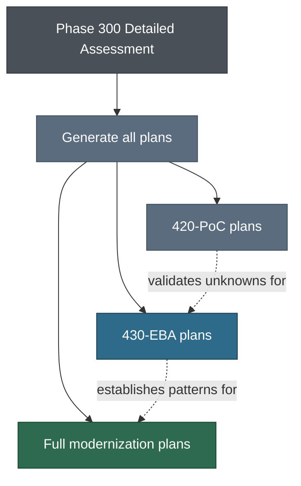

# Phase 400 — Modernization Plan

Per-application execution plans built from the Phase 300 consolidated assessment.

## Plan Types

The Phase 300 assessment recommends an execution path per app. Phase 400 produces the corresponding plans — all in one pass.



| Type | When | Duration | Template |
|------|------|----------|----------|
| PoC (420) | 🟡 decisions need validation before committing | 1–2 weeks | [PoC-Plan-Template.md](420-PoC/PoC-Plan-Template.md) |
| EBA (430) | < 100K LoC, ATX eligible, isolated, manageable complexity | 6 weeks | [EBA-Plan-Template.md](430-EBA/EBA-Plan-Template.md) |
| Full project | > 100K LoC, heavy rewrite, ASMX with many consumers, 0% tests | Varies | Phased delivery — no fixed template |

PoCs come before EBAs (they validate unknowns the EBA depends on). EBAs come before full projects (they establish patterns the full projects reuse).

## Subfolders

| Folder | What's in it |
|--------|-------------|
| [410-Accelerators/](410-Accelerators/) | Reusable IaC/CDK templates, application blueprints, starter Kiro prompts |
| [420-PoC/](420-PoC/) | PoC plan template + [sample](420-PoC/sample-output/ADC-PoC-gMSA-Auth.md) |
| [430-EBA/](430-EBA/) | EBA plan template + checklist + [sample](430-EBA/sample-output/ADC-Supplier-Portal-EBA-Plan.md) |

## Generate all plans

One prompt produces all plan types for the customer's portfolio.

```
Using the detailed assessment in #File:working/{CUSTOMER}/300-detailed-assessment/{CUSTOMER}-Detailed-Assessment.md,
all architecture working docs in #Folder:working/{CUSTOMER}/300-detailed-assessment/ (*-Architecture.md),
the analysis rules in #File:framework/300-Detailed-Assessment/detailed-analysis.md,
the PoC template in #File:framework/400-Mod-Plan/420-PoC/PoC-Plan-Template.md,
the PoC sample in #File:framework/400-Mod-Plan/420-PoC/sample-output/ADC-PoC-gMSA-Auth.md,
the EBA template in #File:framework/400-Mod-Plan/430-EBA/EBA-Plan-Template.md,
and the EBA sample in #File:framework/400-Mod-Plan/430-EBA/sample-output/ADC-Supplier-Portal-EBA-Plan.md:

For each application in the detailed assessment, generate the plan matching its
recommended execution path:

1. PoC plans (for apps/decisions with 🟡 EXPLORING items needing validation):
   - One PoC plan per hypothesis to validate.
   - Define hypothesis, success criteria, scope, timeline (1–2 weeks), go/no-go.
   - Cross-cutting PoCs (e.g., gMSA auth shared across apps) get a single plan.
   - Output as working/{CUSTOMER}/400-mod-plan/{CUSTOMER}-PoC-{TOPIC}.md.

2. EBA plans (for apps recommended for EBA):
   - Full 6-week execution plan from the EBA template.
   - Pull profile, approach, and architecture from the detailed assessment.
   - Incorporate all 🟢 decisions from the architecture working doc.
   - Note any PoC prerequisites that must complete before EBA starts.
   - Output as working/{CUSTOMER}/400-mod-plan/{CUSTOMER}-{APP}-EBA-Plan.md.

3. Full modernization plans (for apps exceeding EBA scope):
   - Phased delivery plan: pre-work → Phase A–N → cross-team coordination.
   - Reference patterns established by the EBA pilot where applicable.
   - Output as working/{CUSTOMER}/400-mod-plan/{CUSTOMER}-{APP}-Mod-Plan.md.

Generate all plans in one pass. The plans should cross-reference each other
where dependencies exist (e.g., "PoC-gMSA must complete before APP-003 EBA starts",
"APP-002 full project reuses auth pattern validated in APP-003 EBA").
```

## After plan generation

1. Review all plans for consistency — PoC → EBA → Full project dependencies should be clear
2. Walk through plans with the customer for sign-off
3. Use the [EBA Preparation Checklist](430-EBA/EBA-Preparation-Checklist.md) to track readiness for each EBA
