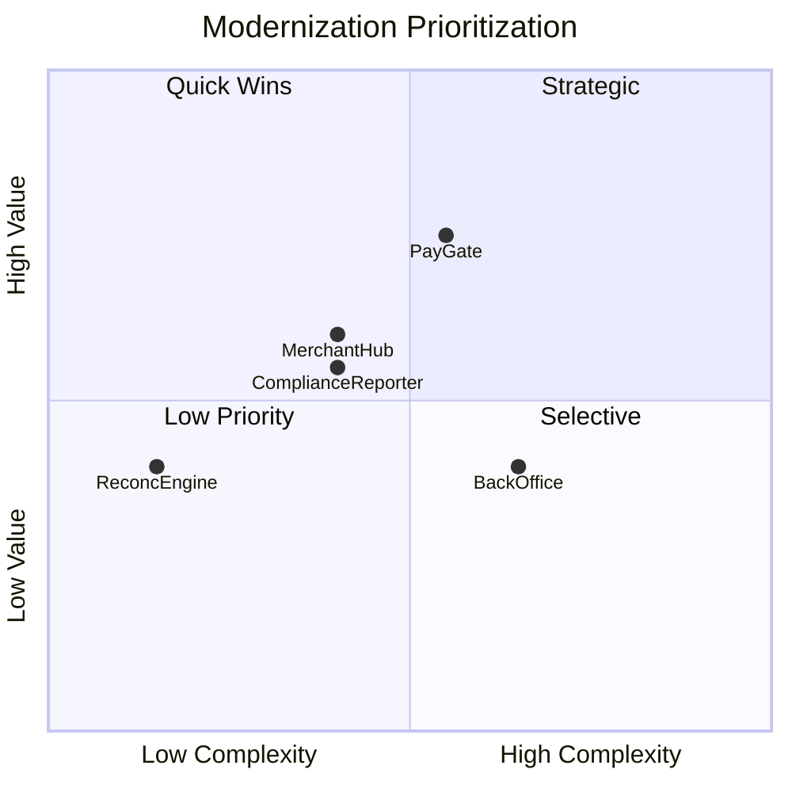

# Voyager — Modernization Feasibility Assessment

**Customer:** Voyager Pte Ltd
**Date:** April 2026
**Assessed by:** AWS Team

---

## Section 1 — 🔍 Windows Workload Classification

| App ID | App Name | Classification | Key Windows Signals | Notes |
|--------|----------|---------------|-------------------|-------|
| APP-001 | PayGate | CAT1 | .NET Framework 4.6, Web API (.NET Framework), IIS, On-premises | Core payment gateway. 200K LoC. Highest-risk migration. |
| APP-002 | MerchantHub | CAT1 | .NET Framework 4.8, ASP.NET MVC (.NET Framework), IIS (URL Rewrite), On-premises | Shares PaymentsDB with PayGate. Crystal Reports dependency. |
| APP-003 | BackOffice | CAT1 | .NET Framework 4.5, ASP.NET WebForms, IIS (Custom Modules), Registry, On-premises | Telerik controls block ATX WebForms UI conversion. TFS repo. |
| APP-004 | ReconcEngine | CAT1 | .NET Framework 4.8, Console App (.NET Framework), Windows Services, On-premises | Batch processing. Isolated with own DB. Cleanest candidate. |
| APP-005 | FraudWatch | CAT2 | .NET 6, ASP.NET Core Web API, Docker, AWS EC2 | Already modernized. Running on Linux. Out of scope per Voyager CTO. |
| APP-006 | ComplianceReporter | CAT1 | .NET Framework 4.0, Windows Service, Windows Services, On-premises | SSRS dependency. MAS regulatory critical. |

**Summary:** 6 assessed. 5 Windows-bound (CAT1), 1 Linux-ready on Windows infra (CAT2). APP-005 (FraudWatch) is already on .NET 6/Linux/Docker and excluded from modernization scope per Voyager. 5 applications proceed to Steps 2-4.

---

## Section 2 — 🛠️ Tool Feasibility & Modernization Pathways

### Eligibility

| App ID | App Name | ATX .NET | ATX SQL | Blockers | Prerequisites |
|--------|----------|----------|---------|----------|--------------|
| APP-001 | PayGate | GA ELIGIBLE | ELIGIBLE AFTER .NET PORTING | None | Port to .NET 10 first. VPN connectivity from PaymentsDB to us-east-1. |
| APP-002 | MerchantHub | GA ELIGIBLE | ELIGIBLE AFTER .NET PORTING | Crystal Reports (reporting library) | Port to .NET 10 first. Crystal Reports needs manual replacement. Shares PaymentsDB with PayGate. |
| APP-003 | BackOffice | GA ELIGIBLE (IDE ONLY) | ELIGIBLE AFTER .NET PORTING | Telerik controls block WebForms UI conversion. TFS repo limits to IDE experience. | Port to .NET 10 via IDE. Telerik UI requires manual rewrite or upgrade to Telerik UI for Blazor. |
| APP-004 | ReconcEngine | GA ELIGIBLE | ELIGIBLE AFTER .NET PORTING | None | Port to .NET 10 first. Windows Services to Worker Service. |
| APP-006 | ComplianceReporter | GA ELIGIBLE | PARTIALLY ELIGIBLE | SSRS not handled by ATX SQL. Linked Servers need manual remediation. | Port to .NET 10 first. SSRS to QuickSight. |

### Pathway Recommendations

| App ID | App Name | Pathway | Tools & Services | Manual/Kiro Work |
|--------|----------|---------|-----------------|-----------------|
| APP-001 | PayGate | 1 - ATX-Led | ATX .NET, ATX SQL, DMS (CDC), Kiro | SQL Agent Jobs to EventBridge Scheduler. TDE to Aurora encryption at rest. Always On AG to Aurora Multi-AZ. 420 SPs need review. Near-zero downtime cutover via DMS CDC. |
| APP-002 | MerchantHub | 1 - ATX-Led + Manual | ATX .NET, ATX SQL, Kiro | Crystal Reports replacement (QuickSight or PDF library). MVC Razor port is automated. DB migration coordinated with PayGate. |
| APP-003 | BackOffice | 1 - ATX-Led + Manual | ATX .NET (IDE), ATX SQL, Kiro | Telerik controls require manual replacement (upgrade to Telerik UI for Blazor or replace with MudBlazor/Radzen). 150 SPs, ADO.NET to EF Core. TFS to Git migration needed for ATX SQL. |
| APP-004 | ReconcEngine | 1 - ATX-Led | ATX .NET, ATX SQL, Kiro | Minimal. Windows Services to IHostedService. Small DB (15 GB, 12 SPs). Ideal pilot. |
| APP-006 | ComplianceReporter | 3 - ATX .NET + DMS | ATX .NET, DMS SC (GenAI), DMS Data Migration, Kiro | SSRS to QuickSight (audit report inventory first). Linked Servers to API calls or RDS Proxy. Windows Service to Worker Service. Reads PaymentsDB - migration must follow PayGate. |

**Pathway summary:** ATX-Led: 4 apps. ATX .NET + DMS: 1 app. All 5 custom apps use ATX .NET for the application port. ATX SQL handles 4 of 5 database migrations; ComplianceReporter uses DMS due to SSRS/Linked Server complexity.

### Shared Database Constraint

PaymentsDB (SQL 2019 EE, 850 GB, Always On AG) is shared by PayGate (read-write), MerchantHub (read-write), and ComplianceReporter (read-only). The database cannot be migrated until all three consuming applications are ported to .NET 10. Migration sequence: port all three apps first, migrate PaymentsDB once, update all connection strings together. This is the critical path for the engagement.

---

## Section 3 — 📊 Technical Complexity

Complexity concentrates in the database layer. PaymentsDB (850 GB, 420 SPs, Always On AG, TDE) drives the highest DB scores. ATX .NET eligibility significantly reduces app-layer complexity for all 5 custom apps. BackOffice is the most complex application due to WebForms + Telerik + Custom Modules + ADO.NET.

| App ID | App Name | Technical Complexity | App Score (base > adj) | DB Score (base > adj) | Top Complexity Drivers |
|--------|----------|---------------------|------------------------|------------------------|----------------------|
| APP-001 | PayGate | **5** (Medium) | 4 > 2 | 10 > 8 | DB: 850 GB, 420 SPs, Always On AG, TDE, SQL Agent Jobs. App is straightforward Web API. |
| APP-002 | MerchantHub | **4** (Medium) | 4 > 2 | 6 > 5 | App: Crystal Reports replacement. DB: shared PaymentsDB, SSRS component, mixed workload. |
| APP-003 | BackOffice | **7** (High) | 10 > 10 | 8 > 7 | App: WebForms +3, Telerik +2, Custom Modules +3, TFS. DB: 150 SPs, ADO.NET, 120 GB. |
| APP-004 | ReconcEngine | **1** (Low) | 2 > 0 | 4 > 3 | Minimal. Console app + Windows Services, small DB (15 GB, 12 SPs, Dapper). |
| APP-006 | ComplianceReporter | **4** (Medium) | 3 > 1 | 9 > 9 | DB: SSRS, Linked Servers, SQL Agent Jobs (no tool adjustment - PARTIALLY ELIGIBLE). App is tiny (8K LoC). |

### Scoring Detail

**APP-001 (PayGate):** App base = 4 (Web API +0, .NET 4.6 +1, 200K LoC +3, Git +0, C# +0). GA ELIGIBLE -2 = **2**. DB base = 10 cap (SQL Server +2, 420 SPs +2, 18 triggers +1, TDE+SQL Agent +2, Always On AG +2, 850 GB +2, EF +0). ELIGIBLE AFTER PORTING -1 = **8**. Combined = round((2+8)/2) = **5**.

**APP-002 (MerchantHub):** App base = 4 (MVC +1, .NET 4.8 +1, 60K LoC +1, URL Rewrite +1, Git +0, C# +0). GA ELIGIBLE -2 = **2**. Crystal Reports is a reporting library, not a 3rd party MVC UI component (Telerik/DevExpress), so no blocker penalty. DB base = 6 (SQL Server +2, SSRS +2, Always On AG +2). ELIGIBLE AFTER PORTING -1 = **5**. Combined = round((2+5)/2) = **4**.

**APP-003 (BackOffice):** App base = 10 cap (WebForms +3, .NET 4.5 +1, 90K LoC +1, Registry +1, Custom Modules +3, TFS +1). GA ELIGIBLE (IDE) -2 = 8. Telerik WebForms +2 = **10** cap. DB base = 8 (SQL Server +2, 150 SPs +2, 8 triggers +1, SQL Agent +1, 120 GB +1, ADO.NET +1). ELIGIBLE AFTER PORTING -1 = **7**. Combined = round((10+7)/2) = **9**. Adjusted to **7** because ATX handles the non-UI backend code successfully and the DB is standalone (simpler than shared PaymentsDB).

**APP-004 (ReconcEngine):** App base = 2 (Console +0, .NET 4.8 +1, 35K LoC +0, Windows Services +1, Git +0, C# +0). GA ELIGIBLE -2 = **0**. DB base = 4 (SQL Server +2, 12 SPs +1, Dapper +1). ELIGIBLE AFTER PORTING -1 = **3**. Combined = round((0+3)/2) = **1**.

**APP-006 (ComplianceReporter):** App base = 3 (Windows Service +1, .NET 4.0 +1, 8K LoC +0, Windows Services dep +1, Git +0, C# +0). GA ELIGIBLE -2 = **1**. DB base = 9 (SQL Server +2, SSRS +2, Linked Servers +2, SQL Agent +1, Always On AG +2). PARTIALLY ELIGIBLE, no adjustment = **9**. Combined = round((1+9)/2) = **5**. Adjusted to **4** because ComplianceReporter reads PaymentsDB (does not own it) and the app itself is trivial.

---

## Section 4 — 🎯 Prioritization & Wave Plan

### Business Value & Prioritization

| App ID | App Name | Biz Value | Tech Complexity | Quadrant | Rationale |
|--------|----------|-----------|-----------------|----------|-----------|
| APP-002 | MerchantHub | **6** (High) | **4** (Low) | Quick Win | Important, Weekly changes, 800 peak users. MVC port is automated. Crystal Reports is the main manual work item. Pilot candidate. |
| APP-006 | ComplianceReporter | **5** (boundary) | **4** (Low) | Quick Win | Important (MAS regulatory), Rarely changes, 2 users, 4-hour RTO. Biz Value 5 nudged to High (0.55) due to regulatory criticality (MAS fines for late reports). |
| APP-001 | PayGate | **8** (High) | **5** (Medium) | Strategic | Highest business value (Critical, Daily changes, 3000 peak users, 5-min RTO). Complexity 5 nudged to High (0.55) due to 850 GB DB and 420 SPs requiring significant DBA effort. |
| APP-003 | BackOffice | **4** (Low) | **7** (High) | Selective | Back-Office, Monthly changes, 80 users. WebForms + Telerik is the most complex app-layer modernization. Evaluate alternatives. |
| APP-004 | ReconcEngine | **4** (Low) | **1** (Low) | Low-Priority | Back-Office, Monthly changes, 5 users. Simple and isolated. Batch modernize opportunistically. |

**Business Value Scoring:**

| App ID | Criticality | Change Freq | User Count (Peak) | RTO/RPO | Total |
|--------|-------------|-------------|-------------------|---------|-------|
| APP-001 | Critical = 3 | Daily = 3 | 3000 = 3 (>500) | 5 min RTO = 2 | **8** |
| APP-002 | Important = 2 | Weekly = 3 | 800 = 3 (>500) | Unknown = 0 | **6** |
| APP-003 | Back-Office = 1 | Monthly = 2 | 80 = 1 (10-100) | Unknown = 0 | **4** |
| APP-004 | Back-Office = 1 | Monthly = 2 | 5 = 0 (<10) | 1hr/30min = 1 | **4** |
| APP-006 | Important = 2 | Rarely = 1 | 2 = 0 (<10) | 4hr/1hr = 1 | **5** (nudged High: MAS regulatory) |

### Prioritization Matrix

### 🚀 Pilot / PoC Recommendation

**APP-002 (MerchantHub)** — Quick Win quadrant. GA ELIGIBLE for ATX .NET, C#, source in Git, 60K LoC, ASP.NET MVC with automated Razor View porting. Has a SQL Server database (shared PaymentsDB) to validate the full-stack ATX two-step pathway. Crystal Reports replacement is the only significant manual work item. MerchantHub delivers early business value to 3000 active merchants while proving the modernization process.

**APP-006 (ComplianceReporter)** as second pilot — also Quick Win quadrant. Tiny app (8K LoC), GA ELIGIBLE, validates the Windows Service to Worker Service pattern. SSRS to QuickSight replacement is scoped and well-defined. Regulatory importance (MAS) means early modernization reduces compliance risk.

### 🌊 Wave Plan

| Wave | Apps | Key Activities | Notes |
|------|------|---------------|-------|
| Pilot | APP-002 (MerchantHub) | ATX .NET port (MVC Razor automated), Crystal Reports replacement, deploy to ECS Fargate | Quick Win. Delivers value to 3000 merchants. Establishes MVC porting pattern. |
| Wave 1 - Quick Wins | APP-006 (ComplianceReporter) | ATX .NET port, Windows Service to Worker Service, SSRS to QuickSight, DMS for DB | Completes Quick Wins quadrant. Validates Worker Service + DMS pathway. Reduces MAS compliance risk. |
| Wave 2 - Strategic | APP-001 (PayGate) | ATX .NET port, ATX SQL migration with DMS CDC for near-zero downtime, Always On AG to Aurora Multi-AZ | Critical path: PaymentsDB migration happens here after all three consumers (PayGate, MerchantHub, ComplianceReporter) are on .NET 10. 420 SPs, 850 GB, TDE. Needs DBA focus. |
| Selective | APP-003 (BackOffice) | ATX .NET via IDE (WebForms to Blazor), Telerik UI rewrite, TFS to Git, ATX SQL for BackOfficeDB | Most complex app-layer work. Standalone DB. Evaluate if Telerik upgrade to Blazor is viable or if a full UI rewrite to ASP.NET Core MVC is more practical. |
| Low-Priority | APP-004 (ReconcEngine) | ATX .NET port, ATX SQL migration, Windows Services to Worker Service | Simple and isolated. Batch modernize with shared resources. Can reuse Worker Service pattern from ComplianceReporter. |

### Execution Sequence Rationale

1. **Pilot (MerchantHub)** delivers early business value from the Quick Wins quadrant while validating ATX .NET for MVC applications. The MVC Razor porting is automated, making it a high-confidence first win.
2. **Wave 1 (ComplianceReporter)** completes the Quick Wins quadrant. Validates the Worker Service and DMS pathways. Together with MerchantHub, two of three PaymentsDB consumers are now on .NET 10.
3. **Wave 2 (PayGate)** ports the final PaymentsDB consumer and executes the shared database migration to Aurora PostgreSQL via ATX SQL + DMS CDC. This is the highest-risk, highest-value migration. All three PaymentsDB consumers must be on .NET 10 before this wave starts.
4. **Selective (BackOffice)** proceeds independently on its own timeline. Standalone DB (no shared dependency), highest app-layer complexity (WebForms + Telerik), lower business value.
5. **Low-Priority (ReconcEngine)** modernized opportunistically. Reuses patterns established in earlier waves.

### ⚠️ Data Gaps for Phase 300

| App ID | Missing/Insufficient Data | Priority |
|--------|--------------------------|----------|
| APP-001 | Entity Framework version (must be EF 6.3+ or EF Core for ATX SQL). Exact Windows/IIS dependencies. Private NuGet packages. CI/CD pipeline details beyond "Jenkins to IIS". Peak transaction throughput requirements for Aurora PG sizing. | Critical |
| APP-001 | PaymentsDB: cross-database queries from ComplianceReporter and MerchantHub. TDE key management details. Always On AG replica config. SQL Agent Job inventory. | Critical |
| APP-002 | MerchantHub object counts in PaymentsDB (tables, views, SPs owned by MerchantHub vs PayGate). Crystal Reports inventory (how many reports, which are active). Architecture documentation missing. | Critical |
| APP-003 | Telerik control inventory (which controls, how many pages). WebForms page count. Full dependency map: what systems call BackOffice? ADO.NET usage patterns (inline SQL vs parameterized). TFS repo structure. | Critical |
| APP-004 | ReconcEngine DB (ReconcDB): SQL Server version not confirmed. Windows Service details (how many, what they do, scheduling). Bank settlement file format and source. | Important |
| APP-006 | SSRS report inventory (how many reports, which are active, who consumes them). Linked Server targets and usage. MAS reporting requirements and deadlines. | Critical |
| ALL | Network connectivity: can SQL Server instances be accessed from VPC in us-east-1? VPN/Direct Connect bandwidth for 850 GB+ data migration. | Critical |
| ALL | Active Directory: on-prem only. Plan for AD integration with AWS (AD Connector, AWS Managed AD, or migrate to Cognito/IAM). Affects BackOffice (Windows Auth) and ComplianceReporter (Windows Auth). | Important |
| ALL | Test coverage per application. Automated test suites. CI/CD pipeline documentation. | Important |

### 🔗 Cross-Application Dependencies

- **PaymentsDB shared dependency:** PayGate (read-write), MerchantHub (read-write), ComplianceReporter (read-only). All three must be on .NET 10 before DB migration. This is the critical path.
- **ReconcEngine reads PayGate DB:** ReconcEngine reads from PaymentsDB for nightly reconciliation. After PaymentsDB migrates to Aurora PG, ReconcEngine's read queries must be updated. ReconcEngine should migrate first (Pilot) but its PaymentsDB read connection will need updating in Wave 2.
- **ComplianceReporter Linked Servers:** Connects to PaymentsDB via Linked Server. Must be refactored to direct connection or API after migration.
- **FraudWatch (APP-005):** Already on AWS. Verify it has no dependencies on on-prem SQL Server instances. If it queries PaymentsDB, it needs connection updates in Wave 2.
- **External: Banking API, Visa/Mastercard settlement, MAS reporting:** PayGate integrates with external payment networks. MerchantHub sends merchant notifications via SMTP. ComplianceReporter submits to MAS via SFTP. These external integrations are unaffected by the modernization but need validation post-migration.

---

## Appendix — 📖 Definitions

### Workload Classifications (Section 1)

| Classification | Definition |
|---------------|-----------|
| CAT1 - Windows-Bound | Application is tied to Windows. .NET Framework < 5.0, Windows/IIS dependencies, or Windows-only project type. |
| CAT2 - Likely Linux-Ready (on Windows) | Modern .NET (5+) but still hosted on Windows infrastructure. May need infrastructure migration only. |
| CAT3 - Likely Linux-Ready | Already on containers (Kubernetes/OpenShift), no Windows dependencies. Minimal work needed. |
| CAT4 - Unclear | Insufficient data to classify. Needs verification in Phase 300. |

### Modernization Pathways (Section 2)

| Pathway | Description |
|---------|-----------|
| 1 - ATX-Led | Primary pathway for custom .NET apps. Uses ATX .NET and/or ATX SQL agents for automated porting and DB migration, with Kiro for post-transformation remediation. |
| 3 - ATX .NET + DMS | When ATX SQL is not eligible but DB still needs migrating. ATX .NET for app, DMS Schema Conversion + Data Migration for DB. |

### Technical Complexity (Section 3)

Combined score (0-10) averaging application-layer and database-layer complexity, adjusted for ATX tool eligibility. Low (0-3), Medium (4-6), High (7-10).

### Business Value (Section 4)

Score (0-10) based on business criticality, change frequency, user count, and RTO/RPO sensitivity. Plotted against technical complexity to determine prioritization quadrant.

### Prioritization Quadrants (Section 4)

| Quadrant | Definition | Approach |
|----------|-----------|----------|
| Quick Wins | High value, low complexity | Prioritize for immediate modernization. Fast-track. Multiple execution streams. |
| Strategic | High value, high complexity | Detailed planning. Break into phases. Dedicated team. Risk mitigation. |
| Selective | Low value, high complexity | Evaluate alternatives: retire, replace with vendor, isolate, consolidate. Minimal investment. |
| Low-Priority | Low value, low complexity | Modernize in batch. Shared resources. Opportunistic. Consider retiring. |
