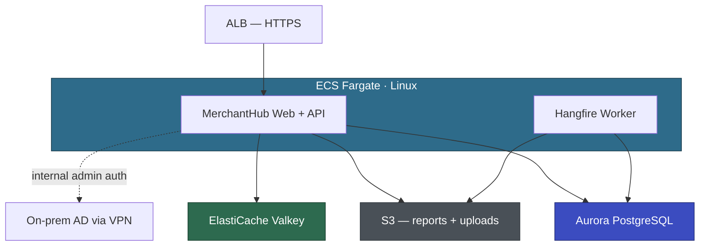

# Voyager — Detailed Assessment

| | |
|---|---|
| Customer | Voyager Pte Ltd |
| Date | April 2026 |
| Assessed by | AWS Team |
| Questionnaires completed | APP-002 (MerchantHub) |
| Pending questionnaires | APP-001 (PayGate), APP-003 (BackOffice), APP-004 (ReconcEngine), APP-006 (ComplianceReporter) |

---

## Portfolio Summary

Phase 200 identified 5 Windows-bound applications for modernization (APP-005 FraudWatch excluded — already on .NET 6/Linux). Phase 300 questionnaire completed for MerchantHub (Pilot). Remaining apps assessed at feasibility level only — questionnaires pending.

| App ID | App Name | Complexity | Execution Path | Key Challenge |
|--------|----------|-----------|----------------|---------------|
| APP-002 | MerchantHub | 4 (Medium) | 430-EBA (Pilot) | Crystal Reports replacement, shared PaymentsDB, dual auth model |
| APP-006 | ComplianceReporter | 4 (Medium) | 430-EBA (Wave 1) | SSRS → QuickSight, Linked Servers, reads PaymentsDB |
| APP-001 | PayGate | 5 (Medium) | Strategic — 430-EBA (Wave 2) | 850 GB DB, 420 SPs, Always On AG, TDE, near-zero downtime |
| APP-004 | ReconcEngine | 1 (Low) | Low-Priority — batch modernize | Isolated, simple. Reuse patterns from earlier waves. |
| APP-003 | BackOffice | 7 (High) | Full modernization project | WebForms + Telerik, 90K LoC, TFS, Custom Modules, 0% tests |

### Updated Wave Plan (refined from Phase 200)

| Wave | App | Execution Path | Rationale |
|------|-----|---------------|-----------|
| Pilot | APP-002 MerchantHub | 430-EBA | Quick Win. 58K LoC, MVC port automated, Crystal Reports is scoped. Delivers value to 3000 merchants. |
| Wave 1 | APP-006 ComplianceReporter | 430-EBA | Quick Win. 8K LoC, Worker Service pattern. Reduces MAS compliance risk. |
| Wave 2 | APP-001 PayGate | 430-EBA | Strategic. Critical path — PaymentsDB migration happens here after all consumers are on .NET 10. |
| Low-Priority | APP-004 ReconcEngine | Batch modernize | Isolated, 35K LoC. Reuse Worker Service pattern from Wave 1. |
| Selective | APP-003 BackOffice | Full project | 90K LoC, WebForms + Telerik rewrite, TFS → Git, standalone DB. Evaluate alternatives. |

### Cross-Application Concerns

- **PaymentsDB (shared):** PayGate (read-write), MerchantHub (read-write own tables, read-only PayGate tables), ComplianceReporter (read-only via Linked Server). All three must be on .NET 10 before PaymentsDB migrates to Aurora PG. MerchantHub has its own MerchantHubDB (45 GB) that can migrate independently.
- **Windows Auth:** BackOffice uses Windows Auth today. MerchantHub plans to add AD auth for internal admin staff post-modernization. PayGate admin endpoints use Windows Auth. AD DCs are on-prem, reachable from AWS VPC via VPN (confirmed). 🔍 gMSA vs Cognito decision needed.
- **Crystal Reports:** MerchantHub only. 12 report templates, ~150 reports/day (800/day month-end). Replace with QuestPDF for PDF generation.
- **SSRS:** ComplianceReporter only. Separate concern from Crystal Reports.
- **TDE:** Enabled on both PayGateDB and MerchantHubDB. Aurora PG handles encryption at rest via KMS natively.

---

## APP-002: MerchantHub (Pilot) — Detailed

### Profile

| Attribute | Value |
|-----------|-------|
| Technology | ASP.NET MVC 5 (.NET Framework 4.8, C#) + Web API + jQuery/Bootstrap |
| Architecture | N-Tier monolith (MVC → API → EF6 → SQL Server) |
| LoC | ~58K (22K web, 8K API, 12K core, 9K data, 4K reports, 2K common, 1K tests) |
| Projects | 7 (Web, Api, Core, Data, Reports, Common, Tests) |
| Database | MerchantHubDB: 45 GB, 42 tables, 35 SPs, 2 triggers. Also reads PayGateDB (15 tables, read-only via EF). |
| Users | ~200 avg / ~800 peak merchants + ~5 internal ops. Month-end spike 3-4x. |
| Auth | Forms Auth (merchants, SQL-backed) + planned AD auth (internal ops) |
| Tests | MSTest, ~15% coverage (Core layer ~40%, everything else 0%) |
| CI/CD | Jenkins build, manual deploy via RDP + PowerShell |
| Container experience | Minimal (Sarah did Docker course, Wei Lin experimented locally) |

### Modernization Approach

| Component | Approach | Tool | Complexity |
|-----------|----------|------|-----------|
| MerchantHub.Web (MVC) | Port to ASP.NET Core MVC .NET 10 | ATX .NET | Low |
| MerchantHub.Api (Web API) | Port to ASP.NET Core Web API .NET 10 | ATX .NET | Low |
| MerchantHub.Core (business logic) | Port to .NET 10 | ATX .NET | Low |
| MerchantHub.Data (EF6) | Port EF6 → EF Core + Npgsql | ATX SQL | Medium |
| MerchantHub.Reports (Crystal Reports) | Replace with QuestPDF | Kiro | Medium |
| MerchantHub.Common (utilities) | Port to .NET 10 | ATX .NET | Low |
| MerchantHub.Tests (MSTest) | Port to .NET 10 (MSTest → xUnit optional) | ATX .NET | Low |
| MerchantHubDB → Aurora PG | Schema + data + 35 SPs | ATX SQL + DMS | Medium |
| Merchant auth (Forms Auth) | Migrate to ASP.NET Core Identity | Kiro | Medium |
| Internal admin auth | AD integration via gMSA or Cognito | Kiro | 🔍 Discussion Point |
| InProc session → distributed | Move to ElastiCache Valkey | Kiro | Low |
| IIS URL Rewrite | ASP.NET Core middleware | Kiro | Low |
| Crystal Reports COM/GAC deps | Eliminated when Crystal Reports is replaced | — | — |
| Machine key | Deleted — Data Protection API replaces it | — | — |
| Hangfire background jobs | Port to .NET 10 Hangfire (runs in ECS) | ATX .NET + Kiro | Low |
| Local disk I/O (reports, uploads, logs) | S3 (reports + uploads), CloudWatch (logs) | Kiro | Low |
| log4net | Replace with Serilog + CloudWatch sink | Kiro | Low |
| SMTP (System.Net.Mail) | Mock for EBA, abstract behind service interface | Kiro | Low |

### Target Architecture

Supporting services: ECR, Secrets Manager, SSM Parameter Store, CloudWatch, EventBridge (SQL Agent job replacement).

### 🔍 Architecture Discussion Points

| # | Topic | AWS Recommendation | Alternatives | Customer Input Needed |
|---|-------|-------------------|-------------|----------------------|
| 1 | Internal admin auth | gMSA on ECS Fargate Linux — direct AD auth via VPN, no middleware layer. Validated by VPN connectivity test. | Cognito with AD federation (SAML/OIDC). Simpler but adds auth middleware. | Voyager security team preference. David wants AD integration — does he accept gMSA complexity or prefer Cognito simplicity? PoC needed either way. |
| 2 | MerchantHubDB migration timing | Migrate MerchantHubDB independently (45 GB, standalone). PayGateDB stays on SQL Server until Wave 2. | Defer all DB migration to Wave 2 (migrate everything together). | Marcus to confirm MerchantHubDB has no cross-DB dependencies beyond the read-only EF queries to PayGateDB. If MerchantHubDB moves to Aurora PG, the PayGateDB read connection stays on SQL Server. |
| 3 | Crystal Reports replacement | QuestPDF for server-side PDF generation. Match existing statement format. | SSRS (but that's Windows-only). QuickSight (but merchants expect downloadable PDFs, not dashboards). | Wei Lin to provide sample statement PDF and data schema. Confirm 4 of 12 reports are unused and can be retired. |
| 4 | Session state externalization | ElastiCache Valkey. Replace InProc session + MemoryCache with distributed cache. | DynamoDB session store (simpler, no cluster to manage). | Cost/complexity tradeoff. Valkey is recommended since MerchantHub already uses MemoryCache patterns that map cleanly to Redis/Valkey commands. |
| 5 | Merchant bank account encryption | Encrypt at rest in Aurora PG using column-level encryption or application-level encryption. Marcus flagged plain-text bank details as PCI concern. | Rely on Aurora's TDE-equivalent (KMS encryption at rest) for the entire DB — simpler but less granular. | Voyager security/compliance team to confirm PCI-DSS requirement for field-level encryption of bank account details. |

### Risks

| Risk | Severity | Mitigation |
|------|----------|------------|
| Crystal Reports replacement — 12 templates, 800/day month-end | High | Start with the monthly merchant statement (most used). QuestPDF can match the format. Retire 4 unused reports. Validate with David before EBA. |
| Shared PaymentsDB — MerchantHub reads PayGate tables via EF | High | MerchantHubDB migrates independently. PayGateDB read connection stays on SQL Server (dual-DB config during transition). ATX SQL handles the MerchantHubDB migration; PayGateDB EF context stays on SqlClient until Wave 2. |
| 15% test coverage — no controller/API/data tests | High | Run existing 120 MSTest tests after port. Use Kiro to generate integration tests for critical merchant workflows (statement download, dispute submission) during weeks 3–4. |
| InProc session → distributed — potential data loss during migration | Medium | Session data is transient (login state, report params). Acceptable to invalidate sessions during cutover — merchants re-login. |
| Dual auth model (merchants + internal ops) | Medium | Merchants: ASP.NET Core Identity (straightforward migration from Forms Auth). Internal: gMSA or Cognito (🔍 pending). Both can coexist in ASP.NET Core auth pipeline. |
| Team capacity — 2 devs, Wei Lin shared with PayGate | Medium | Wei Lin dedicated to MerchantHub for EBA duration. Aisha handles front-end. AWS team leads containerization and DB migration. |
| Month-end traffic spike (3-4x) during EBA | Low | Schedule EBA to avoid month-end (not 1st-3rd of month). ECS auto-scaling handles post-migration peaks. |

### Execution Path: 430-EBA (Pilot)

MerchantHub is suitable for EBA: 58K LoC, C#, Git, ATX eligible (MVC + Web API + EF6), no third-party UI components (Crystal Reports is a reporting library, not UI controls), existing tests (15%), isolated downstream (no apps depend on it). The Crystal Reports replacement is the largest manual work item but is well-scoped (12 templates, QuestPDF). MerchantHubDB (45 GB) can migrate independently from PayGateDB, validating the ATX SQL pathway for Wave 2.

---

## APP-006: ComplianceReporter (Wave 1) — Feasibility Level

Questionnaire not yet completed. Assessment based on Phase 200 feasibility data.

### Profile

| Attribute | Value |
|-----------|-------|
| Technology | Windows Service (.NET Framework 4.0, C#) |
| LoC | ~8K |
| Database | Reads PayGateDB (read-only via Linked Server). No own DB. |
| Auth | Runs as Windows Service account |
| Key dependency | SSRS for MAS regulatory reports |

### Preliminary Approach

| Component | Approach | Tool |
|-----------|----------|------|
| Windows Service | Port to .NET Worker Service | ATX .NET |
| SSRS reports | Replace with QuickSight or QuestPDF | Kiro |
| Linked Server to PayGateDB | Refactor to direct connection or API | Kiro |
| MAS SFTP upload | Retain as-is (SFTP client works on .NET 10) | — |

### Execution Path: 430-EBA (Wave 1)

8K LoC, GA ELIGIBLE, straightforward Worker Service port. SSRS replacement is the main work item — need to audit report inventory first. Validates Worker Service + DMS pathway. Reduces MAS compliance risk.

**Questionnaire needed before EBA planning can proceed.**

---

## APP-001: PayGate (Wave 2) — Feasibility Level

Questionnaire not yet completed. Assessment based on Phase 200 feasibility data.

### Profile

| Attribute | Value |
|-----------|-------|
| Technology | ASP.NET Web API (.NET Framework 4.6, C#) |
| LoC | ~200K |
| Database | PayGateDB: 850 GB, 420 SPs, Always On AG, TDE, SQL Agent Jobs |
| Auth | API keys (merchant-facing) + Windows Auth (internal admin) |
| Key constraint | Near-zero downtime required. 50K transactions/hour at peak. |

### Preliminary Approach

| Component | Approach | Tool |
|-----------|----------|------|
| Web API | Port to ASP.NET Core Web API .NET 10 | ATX .NET |
| PayGateDB → Aurora PG | Full migration with DMS CDC | ATX SQL + DMS |
| Always On AG | Aurora Multi-AZ | — |
| TDE | Aurora encryption at rest (KMS) | — |
| 420 SPs | ATX SQL bulk conversion + manual review | ATX SQL + Kiro |

### Execution Path: 430-EBA (Wave 2 — Strategic)

200K LoC is at the upper bound for EBA but the app layer is straightforward (Web API, ATX eligible). Complexity is concentrated in the DB layer (850 GB, 420 SPs, TDE, Always On AG). Critical path: all three PaymentsDB consumers (PayGate, MerchantHub, ComplianceReporter) must be on .NET 10 before this wave. DMS CDC required for near-zero downtime cutover.

**Questionnaire needed before EBA planning can proceed.**

---

## APP-004: ReconcEngine (Low-Priority) — Feasibility Level

Questionnaire not yet completed. Assessment based on Phase 200 feasibility data.

### Profile

| Attribute | Value |
|-----------|-------|
| Technology | Console App + 2 Windows Services (.NET Framework 4.8, C#) |
| LoC | ~35K |
| Database | ReconcDB: SQL Express, 15 GB, 12 SPs, Dapper |
| Auth | Windows Service account, SQL Auth to DB |

### Execution Path: Low-Priority — batch modernize

Isolated, simple, own DB. Reuse Worker Service pattern from ComplianceReporter (Wave 1). Modernize opportunistically with shared resources.

---

## APP-003: BackOffice (Selective) — Feasibility Level

Questionnaire not yet completed. Assessment based on Phase 200 feasibility data.

### Profile

| Attribute | Value |
|-----------|-------|
| Technology | ASP.NET WebForms (.NET Framework 4.5, C#) + Telerik RadControls |
| LoC | ~90K |
| Database | BackOfficeDB: SQL Server 2016 Standard, 120 GB, 150 SPs, ADO.NET |
| Auth | Windows Auth via IIS |
| Source control | TFS (not Git) |

### Why this is NOT an EBA

- 90K LoC with WebForms + Telerik — ATX cannot port Telerik controls, full UI rewrite required
- TFS needs Git migration before any tooling
- Custom IIS Modules + Registry dependencies
- 0% test coverage (assumed — questionnaire pending)
- ADO.NET raw SQL — data access layer needs rewrite

### Execution Path: Full modernization project

Scope as dedicated project with phased delivery. Standalone DB (no shared dependency). Evaluate: Telerik upgrade to ASP.NET Core Blazor edition vs full rewrite to MVC with standard controls.

---

## Proof of Value Metrics

Capture before/after for the pilot (MerchantHub) to demonstrate value for subsequent waves.

| Metric | Before | After (EBA Target) |
|--------|--------|-------------------|
| Modernization effort | Voyager estimate: 6–9 months, 2 devs | 6 weeks, 2 devs + AWS |
| Deployment frequency | Weekly (manual RDP + PowerShell) | On-demand (CI/CD → ECS) |
| Availability | Single server, no HA | Multi-AZ (Aurora + ECS), target 99.9% |
| Platform | Windows / IIS / SQL Server | Linux / ECS Fargate / Aurora PG |
| Scalability | Single server, manual vertical | Auto-scaling, horizontal (ECS + Aurora read replicas) |
| Crystal Reports | 12 templates, COM/GAC dependency, untestable | QuestPDF, no Windows deps, unit-testable |
