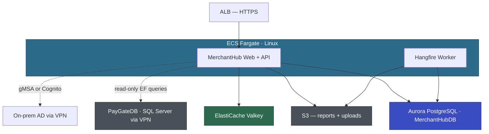

# Voyager — Detailed Assessment

| | |
|---|---|
| Customer | Voyager Pte Ltd |
| Date | April 15, 2026 (v2 — post-workshops) |
| Assessed by | AWS Team |
| Questionnaires completed | APP-002 (MerchantHub) |
| Architecture workshops | 2 completed (April 8, April 15) |
| Pending questionnaires | APP-001 (PayGate), APP-003 (BackOffice), APP-004 (ReconcEngine), APP-006 (ComplianceReporter) |

---

## Portfolio Summary

Phase 200 identified 5 Windows-bound applications. Phase 300 questionnaire and 2 architecture workshops completed for MerchantHub (Pilot). Three decisions agreed, two pending (gMSA PoC + encryption). EBA kickoff target: May 5, 2026.

| App ID | App Name | Complexity | Execution Path | Key Challenge | Status |
|--------|----------|-----------|----------------|---------------|--------|
| APP-002 | MerchantHub | 4 (Medium) | 430-EBA (Pilot) | Telerik Reporting replacement, dual-DB config, dual auth | 3/5 decisions 🟢, 2 🟡 |
| APP-006 | ComplianceReporter | 4 (Medium) | 430-EBA (Wave 1) | SSRS → QuickSight, Linked Servers | Questionnaire pending |
| APP-001 | PayGate | 5 (Medium) | Strategic — 430-EBA (Wave 2) | 850 GB DB, 420 SPs, near-zero downtime | Questionnaire pending |
| APP-004 | ReconcEngine | 1 (Low) | Low-Priority — batch modernize | Isolated, simple | Questionnaire pending |
| APP-003 | BackOffice | 7 (High) | Full modernization project | WebForms + Telerik, TFS, 90K LoC | Questionnaire pending |

### Wave Plan

| Wave | App | Execution Path | Target Date | Rationale |
|------|-----|---------------|-------------|-----------|
| Pilot | APP-002 MerchantHub | 430-EBA | May 5 – Jun 13, 2026 | 58K LoC, MVC port automated, Telerik Reporting scoped. gMSA PoC must complete first. |
| Wave 1 | APP-006 ComplianceReporter | 430-EBA | After pilot | 8K LoC, Worker Service pattern. MAS compliance risk reduction. |
| Wave 2 | APP-001 PayGate | 430-EBA | After Wave 1 | Critical path — PaymentsDB migration after all consumers on .NET 10. |
| Low-Priority | APP-004 ReconcEngine | Batch modernize | Opportunistic | Reuse Worker Service pattern from Wave 1. |
| Selective | APP-003 BackOffice | Full project | TBD | WebForms + Telerik rewrite. Standalone DB. Evaluate alternatives. |

### Cross-Application Concerns (updated post-workshops)

- **PaymentsDB (shared):** PayGate (read-write), MerchantHub (read-write own tables, read-only PayGate tables), ComplianceReporter (read-only via Linked Server). 🟢 Confirmed: MerchantHubDB is a separate database and can migrate independently. PayGateDB migration deferred to Wave 2 after all consumers are on .NET 10.
- **Windows Auth / AD integration:** BackOffice uses Windows Auth today. MerchantHub adding AD auth for internal ops. PayGate admin endpoints use Windows Auth. AD DCs on-prem, reachable from VPC via VPN (confirmed). 🟡 gMSA PoC must validate before EBA — Cognito is accepted fallback.
- **Crystal Reports → Telerik Reporting:** MerchantHub only. 🟢 Agreed: Telerik Reporting (Voyager already licensed for BackOffice). Prototype validated. 8 active reports, 4 retired.
- **SSRS:** ComplianceReporter only. Separate concern. Questionnaire pending.
- **TDE:** Enabled on PayGateDB and MerchantHubDB. Aurora PG handles encryption at rest via KMS. 🟡 Field-level encryption for bank account details pending compliance decision.
- **Direct Connect bandwidth:** 500 Mbps, ~80 Mbps current utilization. MerchantHub PayGateDB reads add ~10–20 Mbps. No upgrade needed for pilot. PayGate migration (Wave 2) may need reassessment.
- **Telerik licensing:** Voyager already pays for Telerik (BackOffice). Consolidating on Telerik Reporting across portfolio for Crystal Reports replacement. Telerik UI for BackOffice WebForms rewrite is a separate decision (Selective wave).

---

## APP-002: MerchantHub (Pilot) — Detailed

### Profile

| Attribute | Value |
|-----------|-------|
| Technology | ASP.NET MVC 5 (.NET Framework 4.8, C#) + Web API + jQuery/Bootstrap |
| Architecture | N-Tier monolith (MVC → API → EF6 → SQL Server) |
| LoC | ~58K (22K web, 8K API, 12K core, 9K data, 4K reports, 2K common, 1K tests) |
| Projects | 7 (Web, Api, Core, Data, Reports, Common, Tests) |
| Database | MerchantHubDB: 45 GB, 42 tables, 35 SPs, 2 triggers. Also reads PayGateDB (15 tables, read-only via EF). |
| Users | ~200 avg / ~800 peak merchants + ~5 internal ops. Month-end spike 3-4x. |
| Auth | Forms Auth (merchants, SQL-backed) + planned AD auth (internal ops) |
| Tests | MSTest, ~15% coverage (Core layer ~40%, everything else 0%) |
| CI/CD | Jenkins build, manual deploy via RDP + PowerShell |
| Container experience | Minimal (Sarah did Docker course, Wei Lin experimented locally) |

### Modernization Approach (updated post-workshops)

| Component | Approach | Tool | Complexity | Status |
|-----------|----------|------|-----------|--------|
| MerchantHub.Web (MVC) | Port to ASP.NET Core MVC .NET 10 | ATX .NET | Low | Ready |
| MerchantHub.Api (Web API) | Port to ASP.NET Core Web API .NET 10 | ATX .NET | Low | Ready |
| MerchantHub.Core (business logic) | Port to .NET 10 | ATX .NET | Low | Ready |
| MerchantHub.Data (EF6) | EDMX → Code First + Fluent API, EF Core + Npgsql | ATX SQL + Kiro | Medium | EDMX→Fluent ~2–3 days manual (Wei Lin) |
| MerchantHub.Reports | Replace Crystal Reports with Telerik Reporting | Kiro | Medium | 🟢 Prototype validated. 7 reports remaining. |
| MerchantHub.Common (utilities) | Port to .NET 10 | ATX .NET | Low | Ready |
| MerchantHub.Tests (MSTest) | Port to .NET 10 | ATX .NET | Low | Ready |
| MerchantHubDB → Aurora PG | Schema + data + 35 SPs | ATX SQL + DMS | Medium | 🟢 DMS: 95% automated, 4+1 flagged items |
| PayGateDB read access | Dual-DB: SqlClient to SQL Server via VPN | — | Low | 🟢 VPN + bandwidth confirmed |
| Merchant auth | Forms Auth → ASP.NET Core Identity (Aurora PG) | Kiro | Medium | 🟢 Straightforward |
| Internal admin auth | gMSA on Fargate Linux or Cognito | Kiro | Medium | 🟡 Pending PoC |
| Session + cache | ElastiCache Valkey | Kiro | Low | 🟢 Cluster running in dev |
| Bank account encryption | Encryption-ready abstraction, implement TBD | Kiro | Low-Medium | 🟡 Decision EBA week 1 |
| Hangfire | Separate ECS worker service | ATX .NET + Kiro | Low | 🟢 Agreed |
| IIS URL Rewrite | ASP.NET Core middleware (~20 regex patterns) | Kiro | Low | 🟢 Straightforward |
| Local disk → S3 + CloudWatch | Reports + uploads → S3, logs → CloudWatch | Kiro | Low | 🟢 Agreed |
| log4net → Serilog | Serilog + CloudWatch sink | Kiro | Low | 🟢 Agreed |
| SMTP | Mock for EBA (IEmailService), SES post-EBA | Kiro | Low | 🟢 Agreed |
| Machine key | Deleted — Data Protection API + Valkey key storage | — | — | 🟢 No action |
| Crystal Reports COM/GAC | Eliminated with Telerik Reporting replacement | — | — | 🟢 No action |

### Target Architecture (updated post-workshops)

Supporting services: ECR, Secrets Manager, SSM Parameter Store, CloudWatch, EventBridge, CodePipeline + CodeBuild.

Dual-DB config: Aurora PG for MerchantHubDB (own tables), SQL Server via VPN for PayGateDB (read-only). Temporary until Wave 2 migrates PayGateDB.

### Architecture Decisions Summary

| ID | Decision | Status | Summary |
|----|----------|--------|---------|
| TD-001 | Internal admin auth | 🟡 EXPLORING | gMSA preferred, PoC required before EBA. Cognito fallback accepted. |
| TD-002 | MerchantHubDB migration | 🟢 AGREED | Migrate independently. DMS 95% automated. Dual-DB config. |
| TD-003 | Crystal Reports replacement | 🟢 AGREED | Telerik Reporting. Prototype validated. 8 active, 4 retired. |
| TD-004 | Session + cache | 🟢 AGREED | ElastiCache Valkey. Single cluster. Running in dev. |
| TD-005 | Bank account encryption | 🟡 EXPLORING | Encryption-ready abstraction now. Final decision EBA week 1. |

### Remaining Discussion Points

| # | Topic | Status | Next Step |
|---|-------|--------|-----------|
| 1 | gMSA PoC | 🟡 | Phase 400 PoC plan. Must complete before May 5. |
| 2 | Field-level encryption | 🟡 | Wei Lin designs abstraction. Decision during EBA week 1. |

### Risks (updated post-workshops)

| Risk | Severity | Mitigation |
|------|----------|------------|
| gMSA PoC failure — blocks EBA auth approach | High | PoC scoped for Phase 400 (1–2 weeks). Cognito fallback accepted by Priya. Must complete before May 5. |
| Telerik Reporting — 7 remaining reports to port | Medium | Prototype validated (6 hours for statement). Wei Lin ports during EBA week 1. Data layer unchanged. |
| DMS flagged items — 4 SPs + 1 function | Medium | Marcus reviews during EBA week 1. "Nothing scary" — PIVOT, CROSS APPLY, windowing functions. 2–4 hours. |
| 15% test coverage | High | Run existing 120 MSTest tests after port. Kiro generates integration tests for critical workflows during weeks 3–4. |
| Dual-DB config complexity | Medium | Temporary. Two EF Core DbContexts (Npgsql + SqlClient). Clean separation. Resolves when PayGateDB migrates in Wave 2. |
| Team capacity — 2 devs, Wei Lin shared with PayGate | Medium | Wei Lin dedicated to MerchantHub for EBA. Aisha handles front-end. AWS leads containerization + DB migration. |
| EF6 EDMX → Code First manual work | Low | ~2–3 days. 3 raw SQL repos. MonthlyStatementRepo PIVOT goes away with Telerik rewrite. |

### Execution Path: 430-EBA (Pilot)

MerchantHub is confirmed suitable for EBA. 58K LoC, C#, Git, ATX eligible, no third-party UI components, existing tests (15%), isolated downstream. Architecture workshops resolved 3 of 5 decisions. Remaining 2 (gMSA PoC, encryption) have clear paths — PoC before EBA, encryption decision during EBA week 1.

EBA kickoff: May 5, 2026. Pre-EBA prep in progress. gMSA PoC must complete first.

---

## APP-006: ComplianceReporter (Wave 1) — Feasibility Level

Questionnaire not yet completed. Assessment based on Phase 200 feasibility data.

| Attribute | Value |
|-----------|-------|
| Technology | Windows Service (.NET Framework 4.0, C#) |
| LoC | ~8K |
| Database | Reads PayGateDB (read-only via Linked Server). No own DB. |
| Auth | Runs as Windows Service account |
| Key dependency | SSRS for MAS regulatory reports |

Execution path: 430-EBA (Wave 1). 8K LoC, Worker Service port, SSRS replacement. Questionnaire needed.

---

## APP-001: PayGate (Wave 2) — Feasibility Level

Questionnaire not yet completed. Assessment based on Phase 200 feasibility data.

| Attribute | Value |
|-----------|-------|
| Technology | ASP.NET Web API (.NET Framework 4.6, C#) |
| LoC | ~200K |
| Database | PayGateDB: 850 GB, 420 SPs, Always On AG, TDE, SQL Agent Jobs |
| Auth | API keys (merchant-facing) + Windows Auth (internal admin) |
| Key constraint | Near-zero downtime. 50K txn/hour peak. |

Execution path: 430-EBA (Wave 2 — Strategic). Critical path: PaymentsDB migration after all consumers on .NET 10. DMS CDC for near-zero downtime. Questionnaire needed.

---

## APP-004: ReconcEngine (Low-Priority) — Feasibility Level

| Attribute | Value |
|-----------|-------|
| Technology | Console App + 2 Windows Services (.NET Framework 4.8, C#) |
| LoC | ~35K |
| Database | ReconcDB: SQL Express, 15 GB, 12 SPs, Dapper |

Execution path: Low-Priority. Isolated, simple. Reuse Worker Service pattern from Wave 1.

---

## APP-003: BackOffice (Selective) — Feasibility Level

| Attribute | Value |
|-----------|-------|
| Technology | ASP.NET WebForms (.NET Framework 4.5, C#) + Telerik RadControls |
| LoC | ~90K |
| Database | BackOfficeDB: SQL Server 2016 Standard, 120 GB, 150 SPs, ADO.NET |
| Source control | TFS |

Execution path: Full modernization project. WebForms + Telerik rewrite, TFS → Git, standalone DB.

---

## Proof of Value Metrics

| Metric | Before | After (EBA Target) |
|--------|--------|-------------------|
| Modernization effort | Voyager: 6–9 months, 2 devs | 6 weeks, 2 devs + AWS |
| Deployment frequency | Weekly (manual RDP + PowerShell) | On-demand (CI/CD → ECS) |
| Availability | Single server, no HA | Multi-AZ (Aurora + ECS), target 99.9% |
| Platform | Windows / IIS / SQL Server | Linux / ECS Fargate / Aurora PG |
| Scalability | Single server, vertical | Auto-scaling, horizontal |
| Reporting | Crystal Reports, COM/GAC, untestable | Telerik Reporting, cross-platform, testable |
