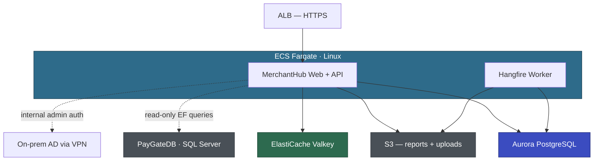

# Architecture Working Document

| | |
|---|---|
| Application | MerchantHub (APP-002) |
| Customer | Voyager Pte Ltd |
| Status | Draft |
| Last Updated | April 2026 |

---

## Draft Architecture

Supporting services: ECR, Secrets Manager, SSM Parameter Store, CloudWatch, EventBridge.

Note: MerchantHubDB migrates to Aurora PG. PayGateDB stays on SQL Server until Wave 2 — MerchantHub maintains a dual-DB config (Aurora PG for own tables, SQL Server for PayGate read-only queries).

---

## Technical Decisions

### TD-001: Internal admin authentication — gMSA vs Cognito

| | |
|---|---|
| Status | 🟡 EXPLORING |
| Proposed | April 2026 |
| Decided | — |

**Proposal:** gMSA on ECS Fargate Linux for internal ops staff (~5 users). Direct Kerberos auth to on-prem AD via existing VPN. No middleware layer. Merchant auth (Forms Auth → ASP.NET Core Identity) is unaffected — this decision only covers the internal admin area.

**Customer position:** —

**Alternatives explored:**
1. gMSA — transparent SSO, no extra component. Requires PoC to validate Fargate Linux + VPN + on-prem AD DCs.
2. Cognito with AD federation (SAML) — simpler setup, but adds an auth middleware layer. Internal users redirected to Cognito hosted UI.
3. Keep Forms Auth for internal users too (status quo) — simplest, but David explicitly wants AD integration.

**Decision:** —

### TD-002: MerchantHubDB migration timing — independent vs deferred

| | |
|---|---|
| Status | 🟡 EXPLORING |
| Proposed | April 2026 |
| Decided | — |

**Proposal:** Migrate MerchantHubDB (45 GB) to Aurora PG independently during the pilot EBA. PayGateDB stays on SQL Server. MerchantHub runs dual-DB: Aurora PG for its own 42 tables, SQL Server for the 15 read-only PayGate tables (via a separate EF DbContext with SqlClient provider).

**Customer position:** —

**Alternatives explored:**
1. Migrate independently — validates ATX SQL pathway early. Dual-DB config adds complexity but is temporary (until Wave 2 migrates PayGateDB).
2. Defer all DB migration to Wave 2 — simpler pilot (app-only containerization), but delays DB validation and doesn't prove the full-stack pathway.

**Decision:** —

### TD-003: Crystal Reports replacement approach

| | |
|---|---|
| Status | 🟡 EXPLORING |
| Proposed | April 2026 |
| Decided | — |

**Proposal:** Replace Crystal Reports with QuestPDF for server-side PDF generation. Match existing merchant statement format. Retire 4 unused reports (Wei Lin to confirm which ones). Remaining 8 active reports rewritten as QuestPDF templates.

**Customer position:** —

**Alternatives explored:**
1. QuestPDF — modern, .NET native, no Windows deps, unit-testable. Open source.
2. SSRS — Windows-only, would require a separate Windows server. Defeats the purpose.
3. QuickSight — dashboard-oriented, not suitable for downloadable PDF statements.

**Decision:** —

### TD-004: Session state and caching — ElastiCache Valkey vs DynamoDB

| | |
|---|---|
| Status | 🟡 EXPLORING |
| Proposed | April 2026 |
| Decided | — |

**Proposal:** ElastiCache Valkey for both session state and application caching. Replaces InProc session + MemoryCache. Single cache layer for both concerns.

**Customer position:** —

**Alternatives explored:**
1. ElastiCache Valkey — wire-compatible with Redis, maps cleanly to existing MemoryCache patterns. Handles both session and cache.
2. DynamoDB for session, ElastiCache for cache — simpler session store (no cluster), but two services to manage.

**Decision:** —

### TD-005: Merchant bank account field-level encryption

| | |
|---|---|
| Status | 🟡 EXPLORING |
| Proposed | April 2026 |
| Decided | — |

**Proposal:** Application-level encryption for merchant bank account details (account numbers, routing numbers) using AWS Encryption SDK. Encrypted before writing to Aurora PG, decrypted on read. KMS key for encryption. This addresses Marcus's PCI concern about plain-text bank details.

**Customer position:** —

**Alternatives explored:**
1. Application-level encryption (AWS Encryption SDK + KMS) — granular, PCI-compliant, but adds code complexity.
2. Aurora storage encryption only (KMS at rest) — simpler, encrypts entire DB at rest, but data is plain-text in memory and in query results. May not satisfy PCI auditors for sensitive financial data.

**Decision:** —

---

## Meeting Log

_No meetings conducted yet. Architecture workshops to be scheduled._

---

## Observations

- April 2026: MerchantHubDB is a separate database on the shared SQL Server instance. It can be migrated independently — confirmed by the questionnaire (no cross-DB stored procs, no Linked Servers from MerchantHubDB). The read-only access to PayGateDB is via EF LINQ queries, not DB-level joins.
- April 2026: Crystal Reports COM interop and GAC dependencies are eliminated entirely when Crystal Reports is replaced — no need for a separate mitigation plan for these Windows deps.
- April 2026: Machine key in web.config is used for Forms Auth ticket encryption. ASP.NET Core Data Protection API replaces this automatically — no action needed.
- April 2026: Hangfire runs in-process in IIS. It can continue running in-process in the ECS container (Hangfire supports .NET 10). No need to extract to a separate service for the pilot.
- April 2026: Wei Lin estimates 6–9 months for internal modernization. The EBA target is 6 weeks — the gap is the proof of value.

---

## PoC Tracker

| PoC | Decision | Status | Owner | Due | Outcome |
|-----|----------|--------|-------|-----|---------|
| gMSA on ECS Fargate Linux via VPN to on-prem AD | TD-001 | Not Started | AWS + Sarah (DevOps) | TBD | — |