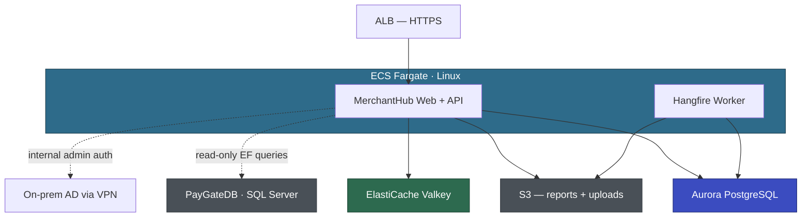

# Architecture Working Document

| | |
|---|---|
| Application | MerchantHub (APP-002) |
| Customer | Voyager Pte Ltd |
| Status | Under Review |
| Last Updated | April 8, 2026 |

---

## Draft Architecture

Supporting services: ECR, Secrets Manager, SSM Parameter Store, CloudWatch, EventBridge.

Note: MerchantHubDB migrates to Aurora PG. PayGateDB stays on SQL Server until Wave 2 — MerchantHub maintains a dual-DB config (Aurora PG for own tables, SQL Server for PayGate read-only queries).

---

## Technical Decisions

### TD-001: Internal admin authentication — gMSA vs Cognito

| | |
|---|---|
| Status | 🟡 EXPLORING |
| Proposed | April 2026 |
| Decided | — (pending PoC) |

**Proposal:** gMSA on ECS Fargate Linux for internal ops staff (~5 users). Direct Kerberos auth to on-prem AD via existing VPN. No middleware layer. Merchant auth (Forms Auth → ASP.NET Core Identity) is unaffected — this decision only covers the internal admin area.

**Customer position:** Priya's security team will push back on Cognito ("don't want another auth layer") but also won't sign off on unproven technology. Sarah confirmed VPN routing works from EC2 but hasn't tested from Fargate specifically. Nobody comfortable deciding without a PoC.

**Alternatives explored:**
1. gMSA — transparent SSO, no extra component. Requires PoC to validate Fargate Linux + VPN + on-prem AD DCs.
2. Cognito with AD federation (SAML) — simpler setup, but adds an auth middleware layer. Internal users redirected to Cognito hosted UI. Security team dislikes this.
3. Keep Forms Auth for internal users too (status quo) — simplest, but David explicitly wants AD integration.

**Decision:** Pending PoC. gMSA PoC scoped for Phase 400 (must complete before EBA starts). Cognito is the fallback if PoC fails.

### TD-002: MerchantHubDB migration timing — independent vs deferred

| | |
|---|---|
| Status | 🟢 AGREED |
| Proposed | April 2026 |
| Decided | April 8, 2026 |

**Proposal:** Migrate MerchantHubDB (45 GB) to Aurora PG independently during the pilot EBA. PayGateDB stays on SQL Server. MerchantHub runs dual-DB: Aurora PG for its own 42 tables, SQL Server for the 15 read-only PayGate tables (via a separate EF DbContext with SqlClient provider).

**Customer position:** Marcus confirmed PayGateDB and MerchantHubDB are separate databases on the same instance — no cross-DB stored procs, no Linked Servers between them. "45 gig is nothing. 850 is the scary one and we don't touch it yet." Sarah confirmed Direct Connect routing works.

**Decision:** Migrate MerchantHubDB to Aurora PG independently. PayGateDB stays on SQL Server via VPN until PayGate wave. Dual-DB config: Npgsql for MerchantHubDB, SqlClient for PayGateDB. When PayGate migrates in Wave 2, swap the PayGateDB connection string.

### TD-003: Crystal Reports replacement approach

| | |
|---|---|
| Status | 🟢 AGREED |
| Proposed | April 2026 |
| Decided | April 8, 2026 |

**Proposal:** Replace Crystal Reports with QuestPDF for server-side PDF generation.

**Customer position:** Priya pointed out Voyager already pays for Telerik (BackOffice uses it). Telerik Reporting runs on .NET 6+ and Linux, has a visual designer, PDF/Excel export, and ASP.NET Core viewer widget. Consolidating on one vendor across the portfolio makes more sense than introducing a new tool. Wei Lin confirmed 4 of 12 reports are unused — pending David's approval to retire them.

**Alternatives explored:**
1. QuestPDF — open source, .NET native. Originally proposed by AWS.
2. Telerik Reporting — Voyager already licensed. Cross-platform, visual designer, matches existing team skills.
3. SSRS — Windows-only. Defeats the purpose.

**Decision:** Telerik Reporting replaces Crystal Reports. Wei Lin to prototype the monthly merchant statement before EBA. 4 unused reports to be retired (pending David confirmation). 8 active reports to port.

### TD-004: Session state and caching — ElastiCache Valkey

| | |
|---|---|
| Status | 🟢 AGREED |
| Proposed | April 2026 |
| Decided | April 8, 2026 |

**Proposal:** ElastiCache Valkey for both session state and application caching.

**Customer position:** Priya rejected sticky sessions ("feels like a hack"). Wei Lin noted session data is tiny (2–5 KB per merchant, ~4 MB total at peak). Already need a cache layer to replace MemoryCache, so single cluster for both concerns. Priya on Redis vs Valkey: "whatever, just make it work."

**Decision:** ElastiCache Valkey. Single cluster, sessions + cache.

### TD-005: Merchant bank account field-level encryption

| | |
|---|---|
| Status | 🟡 EXPLORING |
| Proposed | April 2026 |
| Decided | — |

**Proposal:** Application-level encryption for merchant bank account details using AWS Encryption SDK + KMS.

**Customer position:** Marcus raised the concern (plain-text bank details in DB). Wei Lin scoped the impact: 3 repositories, ~8 queries — "manageable but not trivial." Priya questioned whether Aurora's built-in encryption is sufficient. Checking with Voyager compliance team on PCI requirements for field-level encryption.

**Alternatives explored:**
1. Application-level encryption (AWS Encryption SDK + KMS) — granular, PCI-compliant, but adds code complexity across 3 repos.
2. Aurora storage encryption only (KMS at rest) — simpler, encrypts entire DB at rest, but data is plain-text in memory and query results. May not satisfy PCI auditors.

**Decision:** Pending. Priya checking with compliance team.

---

## Meeting Log

### April 8, 2026 — Architecture Workshop 1

**Attendees:** Priya (eng lead), Wei Lin (senior dev), Aisha (dev), Marcus (DBA), Sarah (DevOps), AWS team

**Discussed:**
- TD-001: gMSA vs Cognito for internal admin auth. Long debate — security team dislikes Cognito, but nobody comfortable with unproven gMSA. Need PoC.
- TD-002: Shared DB clarified — MerchantHubDB and PayGateDB are separate databases, not shared tables. Can migrate independently.
- TD-003: Crystal Reports replacement. AWS proposed QuestPDF, Voyager counter-proposed Telerik Reporting (already licensed). Agreed on Telerik.
- TD-004: Session + cache. Valkey agreed quickly. Sticky sessions rejected.
- TD-005: Bank account encryption. Marcus raised PCI concern. Priya checking with compliance.
- Also covered: merchant auth (ASP.NET Core Identity), URL Rewrite (straightforward), email (mock for EBA), file uploads (S3), Hangfire (separate ECS worker).

**Decided:** TD-002 🟢, TD-003 🟢, TD-004 🟢

**Actions:**
- [ ] AWS: scope gMSA PoC (TD-001) — Phase 400
- [ ] Wei Lin: Telerik Reporting prototype for monthly statement (TD-003)
- [ ] Wei Lin: confirm dead reports with David (TD-003)
- [ ] Priya: check with compliance on field-level encryption (TD-005)
- [ ] Marcus: DMS Schema Conversion on MerchantHubDB (TD-002)
- [ ] Sarah: Valkey cluster in dev VPC (TD-004)
- [ ] Sarah: check Direct Connect bandwidth for PayGateDB read traffic
- [ ] Priya: SES domain verification
- [ ] Wei Lin: IEmailService + mock implementation

**Open:**
- TD-001: gMSA PoC scope and timeline
- TD-005: compliance team response on field-level encryption requirement

---

## Observations

- April 2026: MerchantHubDB is a separate database on the shared SQL Server instance. It can be migrated independently — confirmed by the questionnaire (no cross-DB stored procs, no Linked Servers from MerchantHubDB). The read-only access to PayGateDB is via EF LINQ queries, not DB-level joins.
- April 2026: Crystal Reports COM interop and GAC dependencies are eliminated entirely when Crystal Reports is replaced — no need for a separate mitigation plan for these Windows deps.
- April 2026: Machine key in web.config is used for Forms Auth ticket encryption. ASP.NET Core Data Protection API replaces this automatically — no action needed.
- April 8: Hangfire to be extracted to a separate ECS worker service (Wei Lin's preference — don't compete with web requests). Not in-process as originally assumed. EventBridge triggers nightly/daily jobs, hourly cache refresh stays as Hangfire recurring job in the worker.
- April 8: Voyager already has Telerik license (used by BackOffice). Consolidating on Telerik Reporting across portfolio instead of introducing QuestPDF. This changes the original AWS recommendation.
- April 8: Wei Lin estimates 6–9 months for internal modernization. The EBA target is 6 weeks — the gap is the proof of value.
- April 8: VPN routing from VPC to on-prem AD DCs confirmed working (Sarah tested from EC2). Fargate-specific test still needed (gMSA PoC).

---

## PoC Tracker

| PoC | Decision | Status | Owner | Due | Outcome |
|-----|----------|--------|-------|-----|---------|
| gMSA on ECS Fargate Linux via VPN to on-prem AD | TD-001 | Not Started | AWS + Sarah (DevOps) | TBD | — |