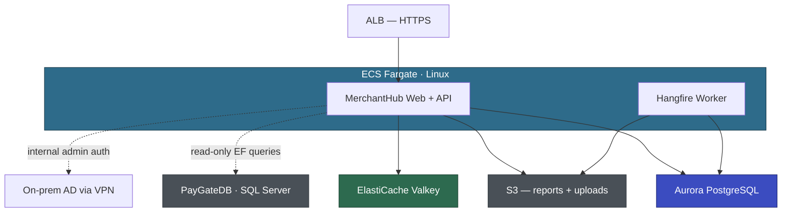

# Architecture Working Document

| | |
|---|---|
| Application | MerchantHub (APP-002) |
| Customer | Voyager Pte Ltd |
| Status | Under Review |
| Last Updated | April 15, 2026 |

---

## Draft Architecture

Supporting services: ECR, Secrets Manager, SSM Parameter Store, CloudWatch, EventBridge.

Note: MerchantHubDB migrates to Aurora PG. PayGateDB stays on SQL Server until Wave 2 — MerchantHub maintains a dual-DB config (Aurora PG for own tables, SQL Server for PayGate read-only queries).

---

## Technical Decisions

### TD-001: Internal admin authentication — gMSA vs Cognito

| | |
|---|---|
| Status | 🟡 EXPLORING |
| Proposed | April 2026 |
| Decided | — (pending PoC) |

**Proposal:** gMSA on ECS Fargate Linux for internal ops staff (~5 users). Direct Kerberos auth to on-prem AD via existing VPN. No middleware layer. Merchant auth (Forms Auth → ASP.NET Core Identity) is unaffected — this decision only covers the internal admin area.

**Customer position:** Priya's security team will push back on Cognito ("don't want another auth layer") but also won't sign off on unproven technology. Sarah confirmed VPN routing works from EC2 and Kerberos ticket acquisition works from a Windows EC2 — but hasn't tested from a Linux Fargate container. Priya in Workshop 2: "ok do the PoC. if it fails we live with Cognito."

**Alternatives explored:**
1. gMSA — transparent SSO, no extra component. Requires PoC to validate Fargate Linux + VPN + on-prem AD DCs.
2. Cognito with AD federation (SAML) — simpler setup, but adds an auth middleware layer. Internal users redirected to Cognito hosted UI. Security team dislikes this.
3. Keep Forms Auth for internal users too (status quo) — simplest, but David explicitly wants AD integration.

**Decision:** Pending PoC. gMSA PoC scoped for Phase 400 (1–2 weeks, must complete before EBA May 5). Cognito is the accepted fallback if PoC fails.

### TD-002: MerchantHubDB migration timing — independent vs deferred

| | |
|---|---|
| Status | 🟢 AGREED |
| Proposed | April 2026 |
| Decided | April 8, 2026 |

**Proposal:** Migrate MerchantHubDB (45 GB) to Aurora PG independently during the pilot EBA. PayGateDB stays on SQL Server. MerchantHub runs dual-DB: Aurora PG for its own 42 tables, SQL Server for the 15 read-only PayGate tables (via a separate EF DbContext with SqlClient provider).

**Customer position:** Marcus confirmed PayGateDB and MerchantHubDB are separate databases on the same instance — no cross-DB stored procs, no Linked Servers between them. "45 gig is nothing. 850 is the scary one and we don't touch it yet." Sarah confirmed Direct Connect routing works.

**Decision:** Migrate MerchantHubDB to Aurora PG independently. PayGateDB stays on SQL Server via VPN until PayGate wave. Dual-DB config: Npgsql for MerchantHubDB, SqlClient for PayGateDB. When PayGate migrates in Wave 2, swap the PayGateDB connection string. DMS Schema Conversion validated: 95% automated (31/35 SPs, 7/8 functions, all tables/views/triggers). 4 flagged SPs + 1 function need 2–4 hours manual review (Marcus, EBA week 1).

### TD-003: Crystal Reports replacement approach

| | |
|---|---|
| Status | 🟢 AGREED |
| Proposed | April 2026 |
| Decided | April 8, 2026 |

**Proposal:** Replace Crystal Reports with QuestPDF for server-side PDF generation.

**Customer position:** Priya pointed out Voyager already pays for Telerik (BackOffice uses it). Telerik Reporting runs on .NET 6+ and Linux, has a visual designer, PDF/Excel export, and ASP.NET Core viewer widget. Consolidating on one vendor across the portfolio makes more sense than introducing a new tool. Wei Lin confirmed 4 of 12 reports are unused — pending David's approval to retire them.

**Alternatives explored:**
1. QuestPDF — open source, .NET native. Originally proposed by AWS.
2. Telerik Reporting — Voyager already licensed. Cross-platform, visual designer, matches existing team skills.
3. SSRS — Windows-only. Defeats the purpose.

**Decision:** Telerik Reporting replaces Crystal Reports. Prototype validated — Wei Lin built the monthly statement in ~6 hours, near-identical to Crystal original (font change only: custom Voyager font → Inter). Reports project reduced from 4K to ~2K LoC. David confirmed 4 reports dead, approved retiring. 8 active reports to port (7 remaining + statement done).

### TD-004: Session state and caching — ElastiCache Valkey

| | |
|---|---|
| Status | 🟢 AGREED |
| Proposed | April 2026 |
| Decided | April 8, 2026 |

**Proposal:** ElastiCache Valkey for both session state and application caching.

**Customer position:** Priya rejected sticky sessions ("feels like a hack"). Wei Lin noted session data is tiny (2–5 KB per merchant, ~4 MB total at peak). Already need a cache layer to replace MemoryCache, so single cluster for both concerns. Priya on Redis vs Valkey: "whatever, just make it work."

**Decision:** ElastiCache Valkey. Single cluster, sessions + cache.

### TD-005: Merchant bank account field-level encryption

| | |
|---|---|
| Status | 🟡 EXPLORING |
| Proposed | April 2026 |
| Decided | — |

**Proposal:** Application-level encryption for merchant bank account details using AWS Encryption SDK + KMS.

**Customer position:** Marcus raised the concern (plain-text bank details in DB). Wei Lin scoped the impact: 3 repositories, ~8 queries — "manageable but not trivial." Compliance team response (Workshop 2): Aurora encryption at rest satisfies PCI 3.4, but they recommend app-level encryption for bank account numbers as defense-in-depth — not mandatory, but auditor flagged it as best practice previously. Priya doesn't want to delay EBA. Wei Lin prefers doing it right from the start. Compromise: Wei Lin designs the data access abstraction so encryption can be added later. Final decision during EBA week 1.

**Alternatives explored:**
1. Application-level encryption (AWS Encryption SDK + KMS) — granular, PCI-compliant, but adds code complexity across 3 repos.
2. Aurora storage encryption only (KMS at rest) — simpler, encrypts entire DB at rest, but data is plain-text in memory and query results. Satisfies PCI 3.4 per compliance team.
3. Encryption-ready abstraction now, implement later — compromise. Design for it, decide during EBA.

**Decision:** Pending. Wei Lin designs encryption-ready data access abstraction. Final decision during EBA week 1.

---

## Meeting Log

### April 8, 2026 — Architecture Workshop 1

**Attendees:** Priya (eng lead), Wei Lin (senior dev), Aisha (dev), Marcus (DBA), Sarah (DevOps), AWS team

**Discussed:**
- TD-001: gMSA vs Cognito for internal admin auth. Long debate — security team dislikes Cognito, but nobody comfortable with unproven gMSA. Need PoC.
- TD-002: Shared DB clarified — MerchantHubDB and PayGateDB are separate databases, not shared tables. Can migrate independently.
- TD-003: Crystal Reports replacement. AWS proposed QuestPDF, Voyager counter-proposed Telerik Reporting (already licensed). Agreed on Telerik.
- TD-004: Session + cache. Valkey agreed quickly. Sticky sessions rejected.
- TD-005: Bank account encryption. Marcus raised PCI concern. Priya checking with compliance.
- Also covered: merchant auth (ASP.NET Core Identity), URL Rewrite (straightforward), email (mock for EBA), file uploads (S3), Hangfire (separate ECS worker).

**Decided:** TD-002 🟢, TD-003 🟢, TD-004 🟢

**Actions:**
- [ ] AWS: scope gMSA PoC (TD-001) — Phase 400
- [ ] Wei Lin: Telerik Reporting prototype for monthly statement (TD-003)
- [ ] Wei Lin: confirm dead reports with David (TD-003)
- [ ] Priya: check with compliance on field-level encryption (TD-005)
- [ ] Marcus: DMS Schema Conversion on MerchantHubDB (TD-002)
- [ ] Sarah: Valkey cluster in dev VPC (TD-004)
- [ ] Sarah: check Direct Connect bandwidth for PayGateDB read traffic
- [ ] Priya: SES domain verification
- [ ] Wei Lin: IEmailService + mock implementation

**Open:**
- TD-001: gMSA PoC scope and timeline
- TD-005: compliance team response on field-level encryption requirement

### April 15, 2026 — Architecture Workshop 2 (follow-up)

**Attendees:** Priya (eng lead), Wei Lin (senior dev), Marcus (DBA), Sarah (DevOps), AWS team

**Discussed:**
- TD-001: gMSA still pending. Sarah validated Kerberos from Windows EC2 but not Linux Fargate. PoC confirmed as Phase 400 deliverable. Priya accepted Cognito as fallback.
- TD-002: DMS Schema Conversion results — 95% automated, 4 flagged SPs + 1 function. Low risk.
- TD-003: Telerik Reporting prototype validated. Near-identical output. David approved retiring 4 dead reports.
- TD-004: Valkey cluster running in dev VPC. Direct Connect bandwidth confirmed sufficient.
- TD-005: Compliance team says Aurora KMS satisfies PCI 3.4. App-level encryption recommended but not mandatory. Compromise: encryption-ready abstraction now, decide in EBA week 1.
- EF6 → EF Core: EDMX → Code First + Fluent API. 3 raw SQL repos need manual work (~2–3 days). Two-provider setup (Npgsql + SqlClient).
- Container strategy: single container for web+api, separate container for Hangfire worker. CodePipeline CI/CD during EBA.
- Dev environment: WSL2 + Docker Desktop + .NET 10. Both devs set up by April 25.
- Timeline: EBA kickoff May 5, 2026. Pre-EBA prep starts now.

**Decided:** TD-002 validated, TD-003 validated, TD-004 validated. EBA kickoff target date.

**Actions:**
- [ ] AWS: gMSA PoC plan (TD-001) — Phase 400
- [ ] AWS: EBA plan from assessment + workshop decisions
- [ ] Wei Lin: port remaining 7 reports to Telerik Reporting — EBA week 1
- [ ] Wei Lin + Aisha: WSL2 + Docker + .NET 10 setup — by April 25
- [ ] Wei Lin: IEmailService + mock
- [ ] Wei Lin: encryption-ready data access abstraction (TD-005)
- [ ] Marcus: review 4 flagged SPs + 1 function
- [ ] Marcus: provision MerchantHubDB backup for dev/test
- [ ] Sarah: Aurora PG cluster in dev VPC
- [ ] Sarah: ECR repo for MerchantHub
- [ ] Sarah: SES domain verification (DNS records in, waiting propagation)
- [ ] Priya: confirm EBA dates with John

**Open:**
- TD-001: gMSA PoC — must complete before May 5 EBA kickoff
- TD-005: final encryption decision during EBA week 1

---

## Observations

- April 2026: MerchantHubDB is a separate database on the shared SQL Server instance. It can be migrated independently — confirmed by the questionnaire (no cross-DB stored procs, no Linked Servers from MerchantHubDB). The read-only access to PayGateDB is via EF LINQ queries, not DB-level joins.
- April 2026: Crystal Reports COM interop and GAC dependencies are eliminated entirely when Crystal Reports is replaced — no need for a separate mitigation plan for these Windows deps.
- April 2026: Machine key in web.config is used for Forms Auth ticket encryption. ASP.NET Core Data Protection API replaces this automatically — no action needed.
- April 8: Hangfire to be extracted to a separate ECS worker service (Wei Lin's preference — don't compete with web requests). Not in-process as originally assumed. EventBridge triggers nightly/daily jobs, hourly cache refresh stays as Hangfire recurring job in the worker.
- April 8: Voyager already has Telerik license (used by BackOffice). Consolidating on Telerik Reporting across portfolio instead of introducing QuestPDF. This changes the original AWS recommendation.
- April 8: Wei Lin estimates 6–9 months for internal modernization. The EBA target is 6 weeks — the gap is the proof of value.
- April 8: VPN routing from VPC to on-prem AD DCs confirmed working (Sarah tested from EC2). Fargate-specific test still needed (gMSA PoC).
- April 15: DMS Schema Conversion on MerchantHubDB: 95% automated. 4 flagged SPs use PIVOT + CROSS APPLY + windowing functions — converted but need validation. 1 flagged function (STRING_AGG ordering, 5-line fix). Marcus estimates 2–4 hours manual review.
- April 15: Telerik Reporting prototype validated. Monthly statement built in ~6 hours, near-identical to Crystal original. Reports project LoC reduced from 4K to ~2K (template files handle layout). Font change: custom Voyager font (Windows-only) → Inter.
- April 15: Direct Connect bandwidth: 500 Mbps, current utilization ~80 Mbps. MerchantHub PayGateDB reads estimated 10–20 Mbps additional. No upgrade needed.
- April 15: EF6 → EF Core: EDMX must go (EF Core doesn't support it). 3 repos with raw SQL need manual work: MonthlyStatementRepo (PIVOT, goes away with Telerik rewrite), TransactionSearchRepo (dynamic WHERE builder), DisputeReportRepo (GROUP BY with ROLLUP). ~2–3 days manual effort.
- April 15: Container strategy decided: single container for web+api (share DbContext and business logic), separate container for Hangfire worker. Split web/api later if needed.
- April 15: EBA kickoff confirmed May 5, 2026. Pre-EBA prep starts immediately. gMSA PoC must complete before kickoff.

---

## PoC Tracker

| PoC | Decision | Status | Owner | Due | Outcome |
|-----|----------|--------|-------|-----|---------|
| gMSA on ECS Fargate Linux via VPN to on-prem AD | TD-001 | Not Started | AWS + Sarah (DevOps) | Before EBA kickoff | — |