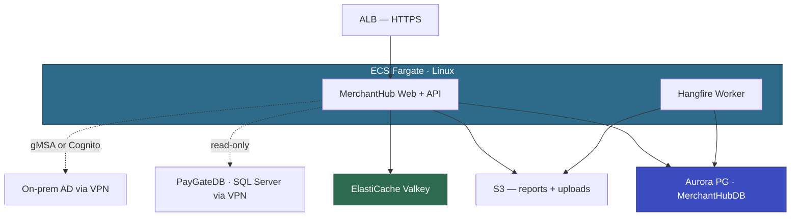

# Voyager MerchantHub (APP-002) — ModAx EBA Plan

| | |
|---|---|
| Customer | Voyager Pte Ltd — David Tan (VP Merchant Services), Priya Sharma (Head of Engineering) |
| Application | MerchantHub — merchant self-service portal (transactions, reports, disputes) |
| Criticality | High |
| Prepared by | AWS Team |
| Prerequisite | PoC-gMSA-Auth must complete before EBA kickoff (see `DEMO-PoC-gMSA-Auth.md`) |

---

## Executive Summary

MerchantHub is an ASP.NET MVC 5 application (.NET Framework 4.8, C#) with 58K LoC, serving ~3000 active merchants across SEA. It runs on a single IIS server with no HA, backed by MerchantHubDB (SQL Server 2019 Enterprise, 45 GB) and read-only access to PayGateDB (850 GB, shared with PayGate and ComplianceReporter).

This is the pilot EBA — it validates the ATX .NET + ATX SQL full-stack pathway, the dual-DB config pattern (Aurora PG + SQL Server via VPN), and the gMSA auth pattern for subsequent waves.

The app layer port is straightforward: MVC + Web API + EF6, all C#, all ATX eligible. Two architecture workshops resolved 3 of 5 decisions. The remaining two have clear paths: gMSA validated by a pre-EBA PoC (see `DEMO-PoC-gMSA-Auth.md`), bank account encryption decision during EBA week 1.

Crystal Reports is replaced with Telerik Reporting (Voyager already licensed). Prototype validated — near-identical output in 6 hours. MerchantHubDB migrates independently to Aurora PG (DMS Schema Conversion: 95% automated). PayGateDB stays on SQL Server via VPN until Wave 2.

---

## Application Profile

| Attribute | Value |
|-----------|-------|
| Technology | ASP.NET MVC 5 (.NET Framework 4.8, C#) + Web API + jQuery/Bootstrap |
| Architecture | N-Tier monolith (7 projects in 1 solution) |
| LoC | ~58K |
| Database | MerchantHubDB: 45 GB, 42 tables, 35 SPs. PayGateDB: read-only (15 tables via EF). |
| Users | ~200 avg / ~800 peak merchants + ~5 internal ops |
| Auth | Forms Auth (merchants) + gMSA or Cognito (internal ops, pending PoC) |
| Tests | MSTest, ~15% coverage |
| CI/CD | Jenkins build, manual deploy |
| Container experience | Minimal |

---

## Modernization Approach

| Component | Approach | Tool | Complexity |
|-----------|----------|------|-----------|
| MerchantHub.Web (MVC) | Port to ASP.NET Core MVC .NET 10 | ATX .NET | Low |
| MerchantHub.Api (Web API) | Port to ASP.NET Core Web API .NET 10 | ATX .NET | Low |
| MerchantHub.Core + Common | Port to .NET 10 | ATX .NET | Low |
| MerchantHub.Data (EF6) | EDMX → Code First + Fluent API, EF Core + dual provider | ATX SQL + Kiro | Medium |
| MerchantHub.Reports | Crystal Reports → Telerik Reporting | Kiro | Medium |
| MerchantHub.Tests | Port to .NET 10 | ATX .NET | Low |
| MerchantHubDB → Aurora PG | Schema + data + 35 SPs (DMS 95% automated) | ATX SQL + DMS | Medium |
| PayGateDB read access | Dual-DB: SqlClient via VPN (temporary) | — | Low |
| Merchant auth | Forms Auth → ASP.NET Core Identity (Aurora PG) | Kiro | Medium |
| Internal admin auth | gMSA (if PoC passes) or Cognito (fallback) | Kiro | Medium |
| Session + cache | ElastiCache Valkey | Kiro | Low |
| Hangfire | Separate ECS worker service | ATX .NET + Kiro | Low |
| Reporting (Telerik) | 7 remaining reports + viewer integration | Kiro | Medium |
| IIS URL Rewrite | ASP.NET Core middleware (20 regex patterns) | Kiro | Low |
| File uploads | S3 + presigned URLs | Kiro | Low |
| Logging | log4net → Serilog + CloudWatch | Kiro | Low |
| Email | Mock (IEmailService), SES post-EBA | Kiro | Low |
| Bank account encryption | Encryption-ready abstraction (decision EBA wk1) | Kiro | Low |

### Target Architecture

Supporting services: ECR, Secrets Manager, SSM Parameter Store, CloudWatch, EventBridge, CodePipeline + CodeBuild.

### Scope Boundaries

**In scope:**
- Port all 7 .NET projects to .NET 10 (ATX .NET)
- Migrate MerchantHubDB to Aurora PG (ATX SQL + DMS full load)
- Dual-DB config: Aurora PG (own tables) + SQL Server via VPN (PayGateDB reads)
- Replace Crystal Reports with Telerik Reporting (8 active reports)
- Merchant auth → ASP.NET Core Identity
- Internal admin auth → gMSA (if PoC passes) or Cognito
- Session + cache → ElastiCache Valkey
- Hangfire → separate ECS worker service
- IIS URL Rewrite → ASP.NET Core middleware
- File uploads → S3
- Logging → Serilog + CloudWatch
- Email → mock (IEmailService)
- Containerize on ECS Fargate (Linux): web+api container + Hangfire worker container
- CI/CD: CodePipeline + CodeBuild → ECR → ECS

**Out of scope:**
- PayGateDB migration (Wave 2 — after all consumers on .NET 10)
- PayGate, ComplianceReporter, ReconcEngine, BackOffice modernization
- Merchant mobile app (2027 roadmap)
- MFA for merchants (stretch goal)
- Full email integration (SES — post-EBA)
- Bank account field-level encryption (decision EBA week 1, implementation may be post-EBA)

---

## Tooling

| Tool | Purpose |
|------|---------|
| ATX .NET | Port all 7 projects from .NET Framework 4.8 → .NET 10. MVC Razor views automated. |
| ATX SQL | MerchantHubDB: schema + SP conversion + EF6 → EF Core migration. |
| DMS | Data migration (45 GB full load, no CDC — Saturday night cutover window). |
| Kiro + AI-DLC | Telerik Reporting integration, EDMX → Fluent API, auth migration, URL Rewrite middleware, S3/Serilog/email integration. |

| AWS Service | Purpose |
|-------------|---------|
| ECS Fargate | Container hosting (Linux). Web+API service + Hangfire worker service. |
| Aurora PostgreSQL | MerchantHubDB target. Multi-AZ in prod. |
| ElastiCache Valkey | Session state + application cache. |
| S3 | Reports, merchant file uploads, generated PDFs. |
| ECR | Container images. |
| Secrets Manager | DB credentials, AD join creds (for gMSA). |
| SSM Parameter Store | Application config (non-sensitive + SecureString). |
| ALB | HTTPS termination, routing. |
| EventBridge | Hangfire job triggers (nightly statement gen, daily cleanup). |
| CloudWatch | Logging (Serilog sink) + monitoring. |
| CodePipeline + CodeBuild | CI/CD: GitHub → build → ECR → ECS. |

---

## Technical Highlights

### 1. Telerik Reporting (replaces Crystal Reports)

Prototype validated: monthly merchant statement built in ~6 hours, near-identical to Crystal original. Telerik Report Designer for layout, .trdp template files. Reports project reduced from 4K to ~2K LoC. 8 active reports to port (7 remaining), 4 retired (David approved). Data layer unchanged — same stored procs, same result sets. Font change: custom Voyager font (Windows-only) → Inter.

### 2. Dual-DB Config (MerchantHubDB + PayGateDB)

MerchantHubDB (45 GB) migrates to Aurora PG independently. PayGateDB (850 GB) stays on SQL Server via VPN until Wave 2. Two EF Core DbContexts: `MerchantHubContext` (Npgsql, read-write, 40 entities) and `PayGateReadContext` (SqlClient, read-only, 15 entities). When PayGate migrates in Wave 2, swap `PayGateReadContext` to Npgsql.

DMS Schema Conversion: 95% automated. 4 flagged SPs (PIVOT + CROSS APPLY + windowing) + 1 function (STRING_AGG ordering). Marcus reviews during EBA week 1, estimates 2–4 hours.

### 3. EF6 EDMX → EF Core Code First

EDMX doesn't work in EF Core. Replace with Code First + Fluent API. Entity classes already generated — mostly adding DbContext configuration. 3 repositories with raw SQL need manual work: MonthlyStatementRepo (PIVOT — goes away with Telerik rewrite), TransactionSearchRepo (dynamic WHERE builder), DisputeReportRepo (GROUP BY with ROLLUP). ~2–3 days manual effort (Wei Lin).

### 4. Authentication (dual model)

Merchants: Forms Auth → ASP.NET Core Identity backed by Aurora PG. Existing bcrypt passwords preserved. MFA as stretch goal.

Internal ops (~5 users): gMSA on Fargate Linux (if PoC passes) or Cognito with AD federation (fallback). Both coexist in ASP.NET Core auth pipeline. Admin role sourced from AD group membership instead of MH_UserRoles table.

### 5. Hangfire → Separate ECS Worker

Hangfire extracted from IIS in-process to a separate ECS service (Wei Lin's preference — don't compete with web requests). EventBridge triggers nightly statement generation and daily cleanup. Hourly cache refresh stays as Hangfire recurring job in the worker. Same container image, different entrypoint.

---

## Development Environment Setup

Voyager developers work on Windows with Visual Studio. App targets Linux containers.

| Software | Purpose |
|----------|---------|
| .NET 10 SDK | Build and run locally |
| Kiro | AI-assisted porting and rewrite |
| Git | Source control (GitHub) |
| AWS CLI v2 | ECR login, S3, Secrets Manager |
| Docker Desktop | Linux containers locally (WSL 2 backend) |
| WSL 2 | Linux kernel for Docker |

Pre-EBA validation (both devs by April 25):
- [ ] .NET 10 SDK installed
- [ ] Docker Desktop + WSL 2 working
- [ ] Can build and run .NET 10 Linux container locally
- [ ] Can connect to dev SQL Server and Aurora PG dev instance
- [ ] Git configured with `core.autocrlf=input`
- [ ] Kiro installed
- [ ] AWS CLI configured

---

## EBA Timeline (6 Weeks — May 5 to June 13, 2026)

### Weeks 1–2: Assessment & Porting

- Run ATX .NET assessment + transformation on all 7 projects
- Run ATX SQL assessment on MerchantHubDB
- Wei Lin: EDMX → Code First + Fluent API (~2–3 days)
- Wei Lin: port remaining 7 Telerik Reporting templates
- Marcus: review 4 flagged SPs + 1 function from DMS conversion
- Marcus: DMS full load to Aurora PG dev instance (45 GB, ~30 min)
- Address ATX .NET NextSteps.md items with Kiro
- TD-005 decision: implement bank account encryption or defer to post-EBA

### Weeks 3–4: Integration & Containerization

- Kiro: IIS URL Rewrite → ASP.NET Core middleware (20 regex patterns)
- Kiro: Forms Auth → ASP.NET Core Identity migration
- Kiro: gMSA integration (from PoC) or Cognito setup (fallback)
- Kiro: InProc session → ElastiCache Valkey
- Kiro: log4net → Serilog + CloudWatch sink
- Kiro: local disk I/O → S3 (reports, uploads) + CloudWatch (logs)
- Kiro: IEmailService mock
- Build Dockerfiles: web+api container, Hangfire worker container
- Deploy to ECS Fargate dev environment
- Kiro: generate integration tests for critical merchant workflows

### Week 5: Validation

- Run MSTest suite (120 tests) against Aurora PG
- Validate Telerik Reporting output (all 8 reports)
- Validate dual-DB config: Aurora PG writes + SQL Server reads via VPN
- Validate auth: merchant login (Identity) + internal admin (gMSA/Cognito)
- Validate Hangfire worker: statement generation, cache refresh, cleanup
- Sarah: CodePipeline + CodeBuild → ECR → ECS
- Prepare EBA Party backlog and demo script

### Week 6: EBA Party (2 Days)

**Day 1 — Build & Deploy**

| Time | Activity | Owner |
|------|----------|-------|
| 09:00 | Kickoff — architecture, backlog, success criteria | AWS + Voyager |
| 09:30 | Fix remaining ATX issues, Kiro cleanup | Wei Lin + Aisha |
| 09:30 | Validate Aurora PG data, test SP conversions | Marcus |
| 12:00 | Lunch | |
| 13:00 | Deploy to ECS Fargate prod — web+api + Hangfire worker | Sarah + AWS |
| 14:00 | Integration — app → Aurora PG + Valkey + S3 | Wei Lin + Marcus |
| 15:00 | Auth — merchant Identity + internal gMSA/Cognito | AWS + Wei Lin |
| 16:00 | Smoke testing — MSTest + manual merchant workflows | All |
| 17:00 | Day 1 retro | All |

**Day 2 — Validate & Demo**

| Time | Activity | Owner |
|------|----------|-------|
| 09:00 | Fix Day 1 issues | All |
| 10:00 | CI/CD — CodePipeline end-to-end | Sarah + AWS |
| 11:00 | Observability — CloudWatch dashboards, Serilog validation | AWS |
| 12:00 | Lunch | |
| 13:00 | End-to-end testing — merchant login, statement download, dispute flow | All |
| 14:00 | Demo prep | All |
| 15:00 | Demo to David + John | All |
| 16:00 | Retro, Wave 1 planning (ComplianceReporter), roadmap discussion | All |
| 17:00 | Close | |

---

## Risk Assessment

| Risk | Severity | Mitigation |
|------|----------|------------|
| gMSA PoC failure delays EBA | High | PoC runs before EBA. Cognito fallback accepted. If PoC blocked by day 8, trigger fallback early. |
| Telerik Reporting — 7 reports to port | Medium | Prototype validated (6 hrs). Wei Lin ports during weeks 1–2. Data layer unchanged. |
| DMS flagged items — 4 SPs + 1 function | Medium | Marcus reviews week 1. PIVOT, CROSS APPLY, windowing — "nothing scary." 2–4 hours. |
| 15% test coverage | High | Run 120 MSTest tests post-port. Kiro generates integration tests weeks 3–4. |
| Dual-DB config | Medium | Temporary. Two DbContexts, clean separation. Resolves Wave 2. |
| Team capacity — 2 devs | Medium | Wei Lin dedicated to MerchantHub. Aisha on front-end. AWS leads infra + DB. |
| Month-end spike during EBA | Low | EBA May 5–Jun 13 avoids month-end (1st–3rd). |

---

## Proof of Value

| Metric | Before | After (EBA Target) |
|--------|--------|-------------------|
| Modernization effort | Voyager: 6–9 months, 2 devs | 6 weeks, 2 devs + AWS |
| Deployment frequency | Weekly (manual RDP) | On-demand (CI/CD → ECS) |
| Availability | Single server, no HA | Multi-AZ (Aurora + ECS), 99.9% target |
| Platform | Windows / IIS / SQL Server | Linux / ECS Fargate / Aurora PG |
| Scalability | Single server, vertical | Auto-scaling, horizontal |
| Reporting | Crystal Reports, COM/GAC | Telerik Reporting, cross-platform |

---

## Pending Decisions

| # | Decision | Options | Impact |
|---|----------|---------|--------|
| 1 | Internal admin auth | gMSA (if PoC passes) or Cognito (fallback) | Determines auth middleware config. PoC result expected before May 5. |
| 2 | Bank account encryption | Implement app-level encryption (EBA wk1) or defer to post-EBA hardening | 3 repos, ~8 queries affected. Encryption-ready abstraction designed regardless. |

---

## Unvalidated Assumptions

| # | Assumption | Impact if Incorrect |
|---|-----------|-------------------|
| 1 | IIS URL Rewrite rules limited to HTTPS redirect, clean URLs, legacy redirects, trailing slash | Complex regex routing increases middleware effort |
| 2 | Hangfire in-process extraction to separate ECS service is straightforward | If Hangfire has tight coupling to web request context, may need refactoring |
| 3 | Telerik Reporting data layer unchanged from Crystal Reports (same SPs, same result sets) | If report data sources differ, porting effort increases |
| 4 | 45 GB MerchantHubDB DMS full load completes within Saturday night window (10pm–6am) | If load takes longer, may need DMS CDC for near-zero downtime |
| 5 | Direct Connect bandwidth sufficient for dual-DB traffic during transition | If PayGateDB reads cause congestion, may need bandwidth upgrade |

Voyager should confirm all assumptions before EBA kickoff. Material changes trigger a plan revision.

---

## Cross-References

- **Prerequisite:** `DEMO-PoC-gMSA-Auth.md` — must complete before this EBA starts
- **Next wave:** ComplianceReporter (Wave 1) — reuses gMSA pattern, Worker Service pattern from this EBA
- **Critical path:** PayGate (Wave 2) — PaymentsDB migration happens after MerchantHub + ComplianceReporter are on .NET 10
- **Separate track:** BackOffice (Full project) — reuses Telerik licensing decision from this EBA