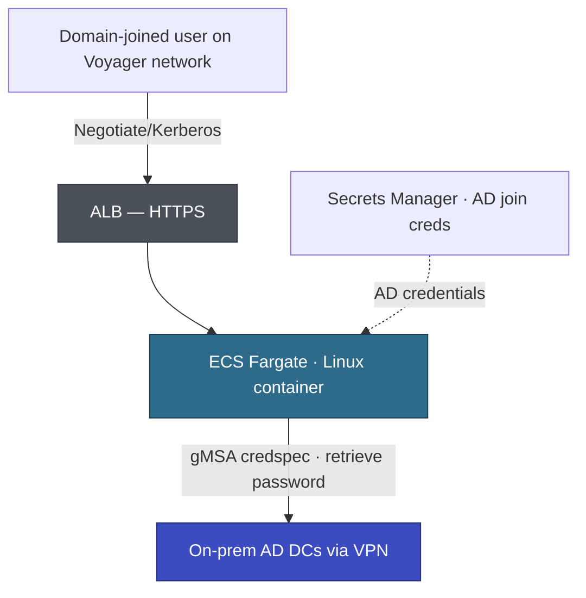

# Voyager — PoC Plan: gMSA Authentication on ECS Fargate Linux

| | |
|---|---|
| Customer | Voyager Pte Ltd |
| Application(s) | APP-002 (MerchantHub), APP-001 (PayGate), APP-003 (BackOffice) — all need AD auth |
| Related decision | TD-001 from MerchantHub Architecture Working Doc |
| Prepared by | AWS Team |
| Duration | 2 weeks (must complete before EBA kickoff May 5) |

---

## Hypothesis

Linux containers on ECS Fargate can authenticate internal users against Voyager's on-premises Active Directory via domainless gMSA over the existing VPN, preserving transparent Negotiate/Kerberos SSO.

## Conceptual Architecture

The PoC validates the path: domain-joined browser → ALB → Linux Fargate container → gMSA credspec → Kerberos ticket from AD DCs reachable via existing VPN/Direct Connect.

---

## Entry Criteria

| # | Criterion | Owner | Status |
|---|-----------|-------|--------|
| 1 | VPN routing from VPC to on-prem AD DCs confirmed | Sarah (DevOps) | ✅ Confirmed (tested from EC2) |
| 2 | Kerberos ticket acquisition from Windows EC2 in VPC confirmed | Sarah | ✅ Confirmed |
| 3 | gMSA account created in Voyager AD | Sarah + Voyager AD admin | Pending |
| 4 | AD join credentials stored in AWS Secrets Manager | Sarah + AWS | Pending |
| 5 | ECS Fargate Platform Version 1.4+ in ap-southeast-1 | AWS | ✅ Available |
| 6 | Domain-joined Windows workstation for testing | Voyager | ✅ Available |
| 7 | AWS account with ECS, ECR, ALB, Secrets Manager, SSM permissions | AWS | ✅ Ready |

## Execution Plan

| Day | Activity | Owner |
|-----|---------|-------|
| 1–2 | Create gMSA account in AD, grant ECS host permissions, store AD join creds in Secrets Manager | Sarah + Voyager AD admin |
| 2–3 | Create credspec JSON, store in SSM Parameter Store, configure ECS task definition with `credentialSpecs` | AWS |
| 3–4 | Build minimal ASP.NET Core .NET 10 test app: `/whoami` (returns `User.Identity.Name` + groups), `/protected` (`[Authorize(Roles="...")]`). Push to ECR. | AWS |
| 4–5 | Deploy ECS Fargate service in Voyager VPC. Configure ALB with HTTPS. | AWS + Sarah |
| 5–7 | Run all exit criteria tests from domain-joined workstation. Troubleshoot. | Joint |
| 7–8 | Restart ECS task, deploy new revision — verify auth survives lifecycle events. | Joint |
| 8–10 | Document results, capture config gotchas, update architecture working docs. | AWS |

## Exit Criteria

| # | Criterion | How to verify | Result |
|---|-----------|--------------|--------|
| 1 | Container obtains Kerberos ticket via gMSA on startup | Container logs show ticket acquisition | Pending |
| 2 | Transparent Negotiate auth — no login prompt | From domain-joined workstation, `/whoami` returns `VOYAGER\username` | Pending |
| 3 | AD group-based authorization works | `/protected` with allowed user → 200, disallowed → 403 | Pending |
| 4 | Auth survives ECS task restart | Stop task, wait for replacement, re-test | Pending |
| 5 | Auth works on fresh task deployment | Deploy new revision, test `/whoami` | Pending |

---

## Go / No-Go Decision

**If PoC succeeds (all 5 criteria pass):**
- Update MerchantHub architecture doc: TD-001 → 🟢 AGREED (gMSA)
- Proceed with MerchantHub EBA using gMSA for internal admin auth
- gMSA credspec config + test app become reusable accelerators for PayGate (Wave 2) and BackOffice (Selective)
- Pattern applies to all Voyager apps needing AD auth

**If PoC fails:**
- Update MerchantHub architecture doc: TD-001 → 🟢 AGREED (Cognito fallback)
- Re-scope MerchantHub EBA to include Cognito with AD federation (SAML/OIDC) for internal admin area
- Priya accepted this fallback: "if it fails we live with Cognito"
- Internal users will see a redirect to Cognito hosted UI instead of transparent SSO

---

## Risks

| Risk | Mitigation |
|------|------------|
| Credspec configuration is complex, limited Linux Fargate documentation | Follow ECS domainless gMSA guide. Allocate extra troubleshooting time days 5–7. |
| Browser falls back to NTLM instead of Kerberos | Ensure SPN registered for ALB hostname. Verify with `klist` on client. |
| VPN latency affects Kerberos ticket acquisition | AD DCs in same region via Direct Connect — sub-ms latency expected. Monitor. |
| PoC overruns 2-week window, delays EBA kickoff May 5 | Start immediately. Days 1–4 are setup (can parallelize). If blocked by day 8, trigger Cognito fallback decision early. |